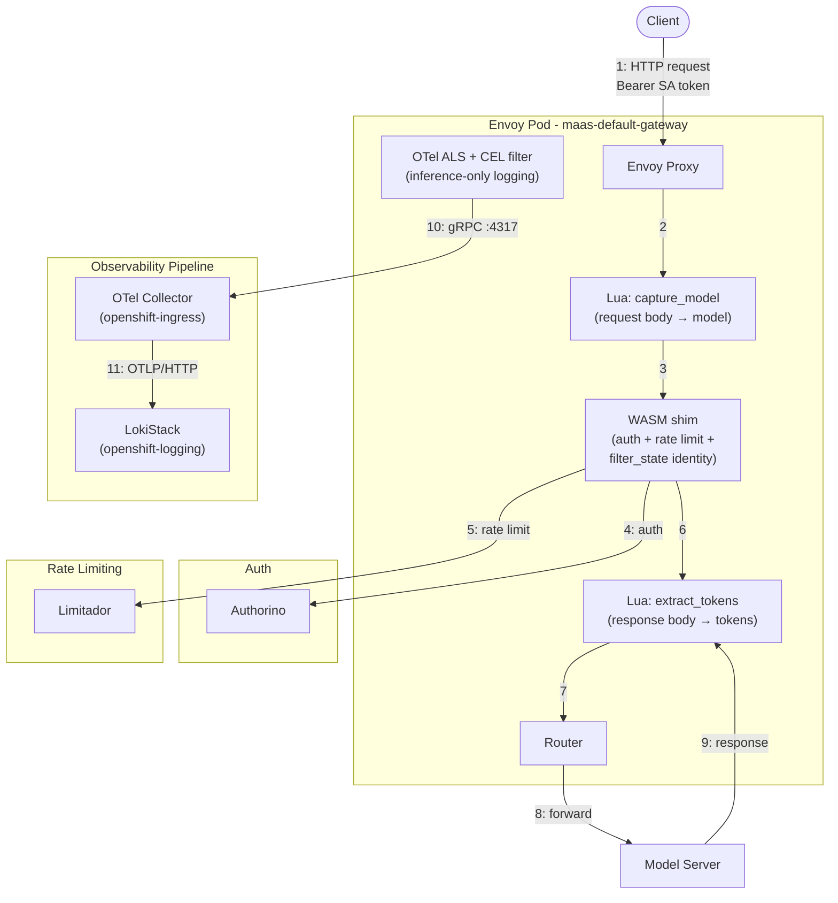
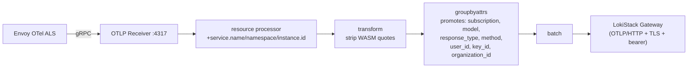
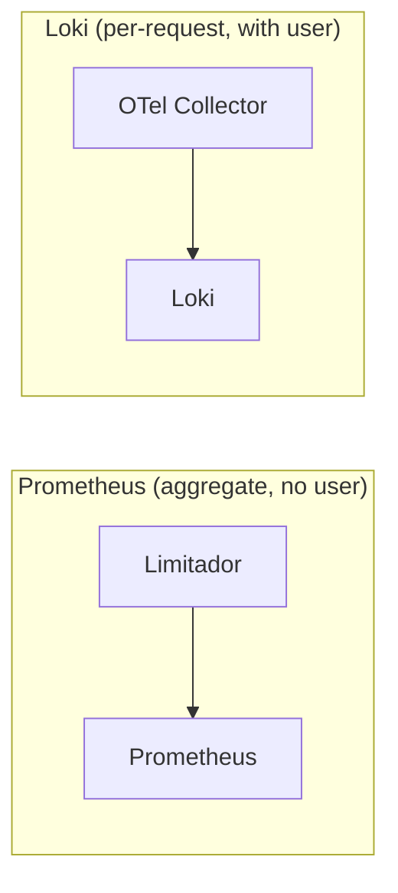

---

name: Envoy OTel Structured Logs
overview: Envoy access logs emitted via OTel Collector to Loki, carrying user_id, subscription, model name, and token counts as structured log records — providing a reliable, independent token accounting channel alongside the existing Limitador-based counters.
todos:

- id: upstream-wasm-shim-tokens
  content: "TODO (deferred): File GitHub issue at kuadrant/wasm-shim requesting set_attribute() for body_values in TokenUsageTask (would eliminate json_to_metadata filter dependency)"
  status: pending
- id: upstream-wasm-shim-429
  content: "TODO (deferred): Request WASM shim to inject model info before rate limit evaluation — currently solved via Lua capture_model (extracts model from request body, available on 429s). Upstream fix would make Lua extraction redundant."
  status: pending
- id: upstream-kuadrant-dual-listener
  content: "TODO (deferred): File issue that HTTP+HTTPS listeners cause duplicate ActionSets leading to 403"
  status: pending
- id: pr-envoyfilter
  content: "PR 3: EnvoyFilter (otel_als_cluster + json_to_metadata + OTel ALS access log with 25 attributes, aligned with upstream maas-envoy-filter branch)"
  status: pending
- id: pr-otel-collector
  content: "PR 4: OTel Collector deployment (Deployment, Service, ConfigMap, RBAC, NetworkPolicy, kustomization) + install-observability.sh changes (sed placeholders, envsubst removal)"
  status: pending
- id: pr-dashboards
  content: "PR 5: Dashboard migration (Perses usage dashboards with Loki LogQL, loki-query-proxy for user isolation)"
  status: pending
- id: integrate-configreconcile
  content: "TODO (future): Integrate headers-based-auth-policy Go template configreconcile pipeline into maas-controller — replace manual EnvoyFilter render with controller-managed lifecycle ({{.Name}}, {{.Namespace}}, {{.OTELHost}}, {{.OTELPort}} from Config CR). Currently manually rendered and deployed as static YAML."
  status: pending
isProject: false

---

# Envoy OTel Structured Usage Logs — Implementation Record

## Status: COMPLETE — Final Hybrid Filter Deployed and Verified (2026-06-22)

All core components deployed and verified on cluster `amit.dev.datahub.redhat.com`. Pipeline: Envoy → OTel Collector → Loki. Single consolidated EnvoyFilter (`maas-usage-logs`) combining best of POC and `headers-based-auth-policy` branch: identity from `FILTER_STATE` (POC approach — internal Envoy state, survives 429), token extraction via Lua with `pcall` error safety and streaming detection (branch approach), model extraction from request body (covers 429s) with response-body overwrite on 200s (authoritative, not user-spoofable), CEL filter for inference-only logging, and `response_type` classification (`hit`/`rate_limit`/`error`). 16 attributes per log record. OTel Collector with `groupbyattrs` promoting 7 keys + `transform` stripping WASM-injected double-quotes. LokiStack patched for explicit stream label control. Two Perses dashboards in `kuadrant-system` using `response_type` stream labels for efficient querying.

---

## Architecture Before Our Changes

Before this work, the MaaS platform had **no independent audit log** for token consumption. All observability relied on **Limitador counters exposed as Prometheus metrics**. No Loki, no OTel Collector, no structured usage logs.

### Pre-Change Request Flow


No OTel ALS, no `json_to_metadata`, no OTel Collector, no Loki. Response body consumed by WASM shim for rate limiting only.

### What Was Missing

| Gap | How We Solved It |
| --- | --- |
| No independent audit log | OTel ALS emits a structured log for every request |
| No per-request data | 25 structured attributes per log record in Loki |
| High-cardinality `user` in Prometheus | Per-user data moved to Loki structured metadata |
| Dead `tier` label | Replaced with `subscription` everywhere |
| No token breakdown | `tokens_prompt` and `tokens_completion` extracted by `json_to_metadata` |

---

## Architecture (Final — Verified)

### Complete Request/Response Flow



### OTel Collector Pipeline



### Dual Data Paths



- **Prometheus**: `authorized_hits`, `authorized_calls`, `limited_calls` with labels `subscription`, `model`, `organization_id`, `cost_center`
- **Loki**: 16 attributes per inference request including `user_id`, `key_id`, `groups`, `organization_id`, `tokens_total`, `duration_ms`, `request_id`, `response_type`

### Data Flow (Step by Step)

1. **Client sends request** with Bearer SA token (or `sk-oai-*` API key)
2. **Lua `capture_model`** (INSERT_FIRST) — parses request body for model name on inference paths, sets dynamic metadata. `pcall`-wrapped; defaults to "unknown" on failure.
3. **WASM shim** calls Authorino (kubernetesTokenReview + subscription-info callout). Stores identity in `filter_state` (userid, selected_subscription, keyId, groups_str, organizationId).
4. **WASM shim** evaluates rate limit (Limitador). On 429, sends local reply — identity `filter_state` is already set and accessible to the access logger.
5. **Lua `extract_tokens`** (INSERT_BEFORE router) — on response, checks content-type: skips `text/event-stream` (streaming). For non-streaming, parses response body for `usage.{total_tokens, prompt_tokens, completion_tokens}` with `pcall` safety.
6. **Request forwarded** to model server (or 429 local reply if rate limited)
7. **Model server responds** with JSON body containing usage tokens
8. **OTel ALS** fires if CEL filter matches (`/v1/chat/completions` or `/v1/completions`). Emits 16 attributes + 2 resource attributes via gRPC to OTel Collector.
9. **OTel Collector** pipeline: resource → transform (strip quotes) → groupbyattrs (promote 7 keys to resource attributes) → batch → Loki via OTLP/HTTP

### Perses Dashboard Architecture

Two dashboards in `kuadrant-system` namespace:
- **`usage-admin-loki-dashboard`** — admin view, all users, uses `loki` datasource (direct to LokiStack). Dynamic dropdowns for User, Subscription, Model via `LokiLabelValuesVariable`.
- **`usage-user-loki-dashboard`** — per-user view, uses `scoped-loki` datasource (through loki-query-proxy). Dynamic dropdowns for Subscription, Model.

Two datasources in `kuadrant-system` namespace:
- **`loki`** — direct to LokiStack gateway (SA token auth + kubernetesAuth + TLS)
- **`scoped-loki`** — routes through loki-query-proxy (kubernetesAuth only, no TLS/secret)

**loki-query-proxy** deployed to `kuadrant-system` namespace (default, overridable via kustomize) — Go service that intercepts Loki queries and injects `user_id="<caller>"` filter based on TokenReview of the caller's Kubernetes token.

**Table panel**: Both dashboards have a "Usage breakdown" table with three Loki queries merged via `MergeSeries` transform. All table queries use `offset -$__range` to compensate for Perses Table taking the first `query_range` step (which otherwise evaluates data before the dashboard window):
- **Q1**: Tokens per model/subscription — `sum by (model, subscription) (sum_over_time(... | unwrap tokens_total [$__range] offset -$__range))`
- **Q2**: Successful requests per model/subscription — `sum by (model, subscription) (count_over_time(... response_type="hit" ... [$__range] offset -$__range))`
- **Q3**: Rate-limited requests per model/subscription — `sum by (model, subscription) (count_over_time(... response_type="rate_limit" ... [$__range] offset -$__range)) or (... response_type="hit" ... * 0)`. The `or (hit * 0)` zero-pads model/subscription pairs with no rate-limited traffic, ensuring Q3 returns the same label sets as Q1/Q2 (required for `MergeSeries` to join correctly — it fails when queries return different numbers of series).

### Deployment Topology

| Namespace | Resources |
|-----------|-----------|
| `kuadrant-system` | loki-query-proxy (deployment, SA, RBAC, service), Perses dashboards (usage-admin-loki-dashboard, usage-user-loki-dashboard), datasources (loki, scoped-loki) |
| `openshift-ingress` | OTel Collector, EnvoyFilter `maas-usage-logs` |
| `openshift-logging` | LokiStack `maas-loki` (patched `streamLabels.resourceAttributes`) |

---

## Design Decisions

| Decision | Rationale |
| --- | --- |
| Lua for token/model extraction | Aligned with `headers-based-auth-policy` branch. `pcall`-wrapped for safety. Streaming detection skips `text/event-stream` to avoid buffering SSE. |
| CEL filter (inference-only) | Only `/v1/chat/completions` and `/v1/completions` logged. Eliminates noise from `/v1/models`, health checks, etc. Aligned with branch convention. |
| `response_type` via CEL | `hit`/`rate_limit`/`error` — low cardinality stream label for Loki. Exact `response_code` still available as structured metadata. All dashboard stat/table queries use `response_type` for filtering (e.g. "Total Successful Requests" counts only `response_type="hit"`, not all requests). |
| Identity from WASM filter_state | Set before rate limiting — available on both 200 and 429. Internal Envoy state, never on wire, not spoofable. |
| EnvoyFilter (not Istio Telemetry CR) | Telemetry API lacks custom OTel attributes; `ConfigMap/istio` owned by ingress-operator |
| `sed` placeholders (not `envsubst`) | Kustomize can't target YAML-in-YAML |
| Red Hat OTel Collector image | `ghcr.io` inaccessible from cluster; pinned Red Hat SHA |
| LokiStack bearer token auth | Gateway requires HTTPS + bearer (not `X-Scope-OrgID` + HTTP) |

### Loki Stream Labels vs Structured Metadata (Verified 2026-06-22)

Controlled by LokiStack `spec.limits.global.otlp.streamLabels.resourceAttributes` + OTel Collector `groupbyattrs` processor. Verified via Loki `/series` endpoint.

| Field | Loki Placement | Source |
| --- | --- | --- |
| `service_name` | **Stream label** | Resource attribute (static) |
| `subscription` | **Stream label** | `groupbyattrs` promoted |
| `model` | **Stream label** | `groupbyattrs` promoted |
| `response_type` | **Stream label** | `groupbyattrs` promoted |
| `method` | **Stream label** | `groupbyattrs` promoted |
| `user_id` | **Stream label** | `groupbyattrs` promoted |
| `key_id` | **Stream label** | `groupbyattrs` promoted |
| `organization_id` | **Stream label** | `groupbyattrs` promoted |
| `kubernetes_namespace_name` | **Stream label** | OpenShift default |
| `log_type` | **Stream label** | OpenShift default |
| `response_code` | Structured metadata | Log attribute (not in `groupbyattrs`) |
| `tokens_total`, `tokens_prompt`, `tokens_completion` | Structured metadata | Log attribute |
| `duration_ms`, `request_id`, `path` | Structured metadata | Log attribute |
| `groups`, `downstream_remote_address` | Structured metadata | Log attribute |

> **10 stream labels** (low cardinality, indexed) — enables `{response_type="rate_limit"}` as a stream selector.
> **Structured metadata** queryable via pipeline filters: `| response_code="200"`, `| json | tokens_total > 100`.

---

## Known Issue: Perses Datasource Prefix Name Collision

The monitoring-console-plugin uses prefix matching on datasource names (`OcpDatasourceApi.getDatasource()` → `list[0]`). If scoped datasource starts with `loki`, it collides with the admin datasource.

**Solution**: Scoped datasource named `scoped-loki` (not `loki-scoped`). Both require `kubernetesAuth: true`.

---

## Implementation Details

### Files Modified/Created

| File | Change |
| --- | --- |
| `deployment/components/observability/otel-collector/envoy-otel-access-log.yaml` | EnvoyFilter `maas-usage-logs`: OTel ALS cluster + 2 Lua filters + CEL-filtered access log (16 attributes). Final consolidated version. |
| `deployment/components/observability/otel-collector/otel-collector-deployment.yaml` | OTel Collector Deployment (pinned Red Hat image SHA, POD_NAME downward API) |
| `deployment/components/observability/otel-collector/otel-collector-service.yaml` | Service (port 4317) |
| `deployment/components/observability/otel-collector/otel-collector-configmap.yaml` | Pipeline: OTLP → resource → transform → groupbyattrs → batch → Loki (sed placeholders) |
| `deployment/components/observability/otel-collector/otel-collector-rbac.yaml` | SA + ClusterRole + ClusterRoleBinding for Loki write access |
| `deployment/components/observability/otel-collector/otel-collector-networkpolicy.yaml` | NetworkPolicy restricting ingress to gateway pods |
| `deployment/components/observability/otel-collector/loki-gateway-ca-configmap.yaml` | Service CA inject for TLS to Loki gateway |
| `deployment/components/observability/otel-collector/kustomization.yaml` | Kustomization for all OTel resources |
| `deployment/components/observability/loki-proxy/` | Loki query proxy (Go source ConfigMap, deployment, RBAC, service) — PR #999 |
| `deployment/components/observability/observability/dashboards/` | Perses dashboards (usage-admin, usage-user), datasources (loki, scoped-loki), kustomization — PRs #995, #988 |
| `deployment/base/observability/telemetry-policy.yaml` | TelemetryPolicy (subscription, model, organization_id, cost_center) |
| `scripts/observability/install-observability.sh` | OTel Collector deploy: kustomize build + sed substitution |

### EnvoyFilter: `maas-usage-logs` (Final — Consolidated)

Four patches applied to `maas-default-gateway` via `targetRefs`:

**Patch 1 — OTel ALS Cluster**: STRICT_DNS cluster to `otel-collector.openshift-ingress.svc.cluster.local:4317` (gRPC/H2, 5s connect timeout).

**Patch 2 — Lua `capture_model` (INSERT_FIRST)**: Parses model name from request JSON body on inference paths (`/v1/chat/completions`, `/v1/completions`). Uses `string.find` with `plain=true` for path matching and `pcall` for body parsing safety. Writes to `envoy.filters.http.json_to_metadata:model` dynamic metadata. Non-inference requests pass through untouched (no body buffering). This value is the initial model name (user-supplied); `extract_tokens` overwrites it from the response body on 200s (authoritative, not user-spoofable). On 429s, the request-body value persists as the fallback.

**Patch 3 — Lua `extract_tokens` (INSERT_BEFORE router)**: Request phase sets `is_completions` flag. Response phase: skips streaming responses (`text/event-stream` content-type check) to avoid buffering SSE. For non-streaming, parses `usage.{total_tokens, prompt_tokens, completion_tokens}` and `model` from response body with `pcall` safety — malformed payloads yield "0", never crash. Writes tokens to dynamic metadata; overwrites `model` with the response-body value (authoritative — set by the model server, not user-spoofable). On 429s, no response body exists so the request-body model from `capture_model` is preserved.

**Patch 4 — OTel Access Log + CEL Filter**: CEL expression restricts logging to inference paths. 16 structured attributes:

| Attribute | Source | Category |
| --- | --- | --- |
| `request_id` | `%REQ(X-REQUEST-ID)%` | Request |
| `method` | `%REQ(:METHOD)%` | Request |
| `path` | `%REQ(:PATH)%` | Request |
| `response_code` | `%RESPONSE_CODE%` | Response |
| `response_type` | `%CEL(response.code >= 200 && response.code < 300 ? "hit" : (response.code == 429 ? "rate_limit" : "error"))%` | Response |
| `duration_ms` | `%DURATION%` | Response |
| `downstream_remote_address` | `%DOWNSTREAM_REMOTE_ADDRESS%` | Network |
| `user_id` | `%FILTER_STATE(wasm.kuadrant.auth.identity.userid:PLAIN)%` | Identity |
| `subscription` | `%FILTER_STATE(wasm.kuadrant.auth.identity.selected_subscription:PLAIN)%` | Identity |
| `groups` | `%FILTER_STATE(wasm.kuadrant.auth.identity.groups_str:PLAIN)%` | Identity |
| `key_id` | `%FILTER_STATE(wasm.kuadrant.auth.identity.keyId:PLAIN)%` | Identity |
| `organization_id` | `%FILTER_STATE(wasm.kuadrant.auth.identity.organizationId:PLAIN)%` | Identity |
| `tokens_total` | `%DYNAMIC_METADATA(envoy.filters.http.json_to_metadata:tokens_total)%` | Usage |
| `tokens_prompt` | `%DYNAMIC_METADATA(envoy.filters.http.json_to_metadata:tokens_prompt)%` | Usage |
| `tokens_completion` | `%DYNAMIC_METADATA(envoy.filters.http.json_to_metadata:tokens_completion)%` | Usage |
| `model` | `%DYNAMIC_METADATA(envoy.filters.http.json_to_metadata:model)%` | Usage |

Resource attributes: `service.name=maas-gateway`, `service.namespace=openshift-ingress`.

**Attributes intentionally excluded** (present in original POC, removed as redundant for usage logging):
- `authority`, `upstream_cluster`, `bytes_received`, `bytes_sent`, `response_code_details`, `route_name` — Envoy operational data, not useful for billing/usage.
- `subscription_labels`, `cost_center`, `auth_error`, `auth_error_msg` — not populated by current upstream AuthPolicy. Can be re-added when upstream supports them.

### OTel Collector Configuration

POC: raw `Deployment` + `ConfigMap`. Upstream: `OpenTelemetryCollector` CR (OTel Operator). Both have equivalent pipeline logic.

```yaml
processors:
  resource:
    attributes:
    - { action: insert, key: log_type, value: application }
    - { action: upsert, key: service.name, value: maas-gateway }
    - { action: upsert, key: service.namespace, value: openshift-ingress }
    - { action: upsert, key: kubernetes_namespace_name, value: openshift-ingress }
    - { action: upsert, key: service.instance.id, value: "${env:POD_NAME}" }
  transform:
    log_statements:
    - context: log
      statements:
      - replace_pattern(attributes["user_id"], "^\"(.*)\"$", "$$1")
      - replace_pattern(attributes["subscription"], "^\"(.*)\"$", "$$1")
      - replace_pattern(attributes["key_id"], "^\"(.*)\"$", "$$1")
      - replace_pattern(attributes["groups"], "^\"(.*)\"$", "$$1")
      - replace_pattern(attributes["organization_id"], "^\"(.*)\"$", "$$1")
  groupbyattrs:
    keys: [subscription, model, response_type, method, user_id, key_id, organization_id]
  batch:
    timeout: 5s
    send_batch_size: 100
    send_batch_max_size: 200
```

**Key configuration points**:
- `transform` strips double-quotes from 5 identity attributes (WASM shim wraps some values in quotes).
- `groupbyattrs` promotes 7 keys from log attributes to resource attributes — these become Loki stream labels (controlled by LokiStack `streamLabels.resourceAttributes`).
- `response_type` (not `response_code`) is a stream label — low cardinality (`hit`/`rate_limit`/`error`), enables efficient Loki filtering.
- Loki endpoint via `sed` placeholder at deploy time.

### Final Envoy Filter Chain

```
[0] envoy.filters.http.lua.capture_model    (INSERT_FIRST — model from request body)
[1] istio.metadata_exchange
[2] kuadrant-maas-default-gateway            (WASM shim — auth + rate limit + filter_state)
[3] envoy.filters.http.grpc_stats
[4] istio.alpn
[5] envoy.filters.http.fault
[6] envoy.filters.http.cors
[7] istio.stats
[8] envoy.filters.http.lua.extract_tokens   (INSERT_BEFORE router — tokens from response body)
[9] envoy.filters.http.router
```

Access log: `envoy.access_loggers.open_telemetry` with CEL filter on NETWORK_FILTER (runs after response, emits to gRPC asynchronously).

---

## Limitations

1. **SSE streaming**: Lua `extract_tokens` detects `text/event-stream` and skips body buffering — streaming UX preserved, but tokens report "0" for streaming responses. Model name IS available (from request body; response-body overwrite skipped for streaming).
2. **429 lack `tokens`**: Rate limiting happens before backend response → `tokens_*` = "-". Model name IS available (from request body). `response_type="rate_limit"` stream label enables dashboard filtering.
3. **`organization_id` not yet populated**: Upstream AuthPolicy does not populate `wasm.kuadrant.auth.identity.organizationId` yet. Pre-wired in filter; will auto-populate when upstream data is available.
4. **Dual-listener 403**: HTTP+HTTPS listeners → duplicate ActionSets. Workaround: remove HTTP listener.
5. **Perses Table has no `calculation` field**: Unlike `StatChart` (which supports `calculation: last`), the Table plugin always uses the first `query_range` step. Since `[$__range]` at the first step looks back before the dashboard window, table queries use `[$__range] offset -$__range` to shift the evaluation forward so the first step covers the correct `[start, end]` window. Stat panels work correctly with `[$__range]` + `calculation: last` (takes the last step).
6. **Lua body buffering**: `capture_model` buffers request body (small for completions API). `extract_tokens` buffers response body for non-streaming responses. Both are `pcall`-wrapped — no crash risk.

---

## Loki Query Proxy

### Architecture

```
Admin: Dashboard → loki datasource → LokiStack Gateway (direct, SA token)
User:  Dashboard → scoped-loki datasource → loki-query-proxy → LokiStack Gateway
                                                    ↓
                                             TokenReview API
                                             (extract username + groups)
                                                    ↓
                                             LogQL rewrite:
                                             inject | user_id="<caller>"
```

### Design: Why Query Proxy (not LokiStack static mode)

| Aspect | Query Proxy (chosen) | Static Mode (rejected) |
| --- | --- | --- |
| User isolation | Enforced by proxy | Storage-level (Loki-native) |
| Admin cluster-wide | Works (admin bypass) | Blocked (can't aggregate tenants) |
| Operational cost | Low (1 deployment) | High (400 tenant defs + OIDC secrets) |
| LokiStack changes | None | Mode change + per-user tenant blocks |
| Scalability | Unlimited users | CR becomes massive |

### Implementation

Go source (~160 lines, stdlib only) mounted as ConfigMap, run with `go run` on stock `ubi9/go-toolset:1.25`. 5 files in `deployment/components/observability/loki-proxy/` (PR #999).

**Key behaviors**: TokenReview-based auth (no JWT parsing), admin bypass for `system:cluster-admins`/`system:masters`, quote-aware LogQL rewriter, GET only, `allowedPaths` whitelist (includes label/series endpoints for COO 1.5+), hardened security context, JSON error responses.

31/31 tests pass: 15 functional, 9 security, 4 rewriter robustness, 3 admin edge cases.

---

## Verified Test Results (2026-06-22)

- **200 inference (`hit`)**: 16 attributes populated — `user_id=kube:admin`, `subscription=simulator-subscription`, `model=facebook/opt-125m`, `key_id=2a56fdd9-...` (no quotes), `groups=system:cluster-admins,system:authenticated` (no quotes), `tokens_total=33`, `tokens_prompt=8`, `tokens_completion=25`, `response_type=hit`, `response_code=200`
- **429 rate-limited (`rate_limit`)**: Identity fully populated (user_id, subscription, key_id, groups — all from filter_state, survives 429). `model=facebook/opt-125m` (from request body; no response body to overwrite). `tokens_*=-` (no backend response). `response_type=rate_limit`.
- **Non-inference** (`/v1/models`, health checks): **NOT logged** — CEL filter restricts to `/v1/chat/completions` and `/v1/completions` only.
- **Loki stream cardinality**: 2 unique streams for mixed 200/429 traffic (one per `response_type` value). 10 stream labels, 14 structured metadata keys.

---

## LogQL Query Patterns

**Total tokens per user (stream selector on `response_type`):**
```logql
sum by (user_id) (sum_over_time({service_name="maas-gateway", response_type="hit"} | unwrap tokens_total [$__range]))
```

**Requests per user:**
```logql
sum by (user_id) (count_over_time({service_name="maas-gateway", response_type="hit"} [$__range]))
```

**Rate-limited count (stream selector — no pipeline filter needed):**
```logql
sum by (model, subscription) (count_over_time({service_name="maas-gateway", response_type="rate_limit"} [$__range]))
```

**Filter by exact response code (structured metadata pipeline filter):**
```logql
{service_name="maas-gateway"} | response_code="500"
```

Stat panels use `[$__range]` + `calculation: last`. Table queries use `[$__range] offset -$__range` (Table plugin lacks `calculation` — takes first `query_range` step; negative offset shifts evaluation so the first step covers the correct window). Table Q3 (rate-limited) uses `or (hit * 0)` zero-padding to ensure MergeSeries can join all queries. Fallbacks: `or vector(0)` on stats, `or vector(1)` on Success Rate. Variables use `LokiLabelValuesVariable` (COO 1.5+). `response_type` as stream label enables fast index-level filtering for hit vs rate_limit vs error.

---

## Deployment Procedure (Current)

```bash
# 1. Deploy OTel Collector + EnvoyFilter (auto-detects LokiStack, configures endpoint)
scripts/observability/install-observability.sh

# 2. Deploy loki-query-proxy (Go compiles on first start, ~60-90s)
kubectl apply -k deployment/components/observability/loki-proxy/
kubectl rollout status deployment/loki-query-proxy-user -n kuadrant-system --timeout=180s

# 3. Deploy Perses dashboards + datasources
kubectl apply -k deployment/components/observability/observability/dashboards/
```

Proxy deploys to `kuadrant-system` by default. `install-observability.sh` auto-detects LokiStack, substitutes `sed` placeholders, applies with `--server-side=true`.

---

## Review and PR Strategy

### Open PRs (upstream `opendatahub-io/models-as-a-service`)

| PR | Branch | Scope | Files | Dependencies |
| --- | --- | --- | --- | --- |
| [#995](https://github.com/opendatahub-io/models-as-a-service/pull/995) Admin Dashboard | `feature-loki-admin-dashboard` | Admin usage dashboard + `loki` datasource (direct to LokiStack). `LokiLabelValuesVariable` (COO 1.5+). Table: `offset -$__range`, zero-padding, `response_type` stream labels. `v1alpha2` API. | 3 files, 477 lines | LokiStack + OTel pipeline deployed. Loki infra (CA, RBAC, secret) provisioned by opendatahub-operator. |
| [#988](https://github.com/opendatahub-io/models-as-a-service/pull/988) User Dashboard | `feature/loki-user-dashboard` | User-scoped dashboard + `scoped-loki` datasource (through proxy). `LokiLabelValuesVariable`. Same table fixes as #995. `v1alpha2` API. | 3 files, 409 lines | Proxy PR (#999). Loki infra provisioned by opendatahub-operator. |
| [#999](https://github.com/opendatahub-io/models-as-a-service/pull/999) Loki Query Proxy | `feature/loki-user-proxy` | Go proxy: ConfigMap source, deployment, RBAC, service, kustomization. AllowedPaths includes label/series endpoints. `LOKI_UPSTREAM_URL` uses `__LOKI_GATEWAY_SVC__` sed placeholder. | 5 files, 672 lines | None (standalone) |
| TBD — EnvoyFilter | `feature/envoy-otel-access-log-filter` | Consolidated EnvoyFilter: OTel ALS cluster + 2 Lua filters (capture_model, extract_tokens) + CEL-filtered access log (16 attrs). Identity from FILTER_STATE. | 1 file, 244 lines | OTel Collector deployed on port 4317 |
| TBD — OTel Collector ConfigMap | `feature/otel-collector` | Pipeline ConfigMap: OTLP → resource → transform (strip WASM quotes) → groupbyattrs (7 stream labels) → batch → Loki. Platform infra (Deployment, Service, RBAC, NetworkPolicy, CA) to be provisioned by operator. | 1 file, 85 lines | EnvoyFilter PR. LokiStack with streamLabels configured. |

**Merge order**: EnvoyFilter → OTel Collector → Proxy (#999) → Admin Dashboard (#995) → User Dashboard (#988).

**Note**: Admin Dashboard and Proxy are independent (no code dependency), but User Dashboard requires Proxy (datasource URL points to proxy service). All three dashboard/proxy PRs require the OTel pipeline to be deployed for Loki data to exist.

### PR #995 Review — Round 1 Resolved, Round 2 Open (2026-06-22)

**Round 1 (resolved)**: 6 comments addressed — Loki infra files (CA, RBAC, secret) removed from MaaS PRs → platform-level resources for `opendatahub-operator`. Datasource URL fixed (`openshift-logging`), moved to `dashboards/`. Variables upgraded to `LokiLabelValuesVariable` (COO 1.5+).

**Round 2 (open — ahadas + CodeRabbit, 2026-06-22)**:

| # | Source | Comment | Status |
| --- | --- | --- | --- |
| 1 | ahadas | Datasource display name `"Loki (Admin)"` → should be `"Usage"` (existing Prometheus dashboard becomes `"Usage (metrics)"` or `"Usage (legacy)"`) | Open |
| 2 | ahadas | Datasource URL should target `opendatahub` namespace (ODH-specific LokiStack), not `openshift-logging` — use DSCI setting | Open |
| 3 | ahadas | Dashboard description "MaaS API usage" → "model usage" | Open |
| 4 | ahadas + CodeRabbit | Missing `model=~"$model"` filter in stat panels (totalRequests, totalRateLimited, successRate, activeUsers) — model dropdown doesn't filter stats | Open |
| 5 | CodeRabbit | Success rate `or vector(1)` returns 100% with no traffic — should be `or vector(0)` | Open |

### PR Description Updates Needed (2026-06-22)

Both #995 and #988 descriptions are **stale** — they reference pre-fix behavior:
- ~~`label_format model="N/A (rate limited)"`~~ → removed; model IS available on 429s (from request body via Lua `capture_model`)
- ~~`response_code="429"` pipeline filter~~ → replaced with `response_type="rate_limit"` stream label
- Missing: `offset -$__range` fix for table queries
- Missing: zero-padding `or (hit * 0)` pattern in Q3
- ~~"Total Requests"~~ → now "Total Successful Requests" filtering `response_type="hit"`
- #988 incorrectly states #995 "provides loki/ infrastructure" — those infra files were removed from #995

---

## Loki Query Proxy — POC Limitations

| # | Limitation | Production path |
| --- | --- | --- |
| A | `go run` on every pod start (~60-90s cold start) | Init container pre-compile or proper image build |
| B | Full response buffering (`io.ReadAll`) | Fine for dashboard queries. Fix: `io.Copy` streaming for `/tail` |
| C | SA token read from disk per request | No real impact (tmpfs). Production: cache with fsnotify |

---

## Remaining / Deferred Work

1. **~~429 model label~~**: **Resolved.** Model name IS available on 429 responses — Lua `capture_model` extracts it from the request body before rate limiting. No `label_format` workaround needed. Rate-limited requests are queried via `response_type="rate_limit"` stream label with full `sum by (model, subscription)` grouping.
2. **Upstream WASM shim — token counts**: `set_attribute()` for `body_values` would eliminate `json_to_metadata` (~5-line PR). Not blocking.
3. **Upstream Kuadrant — dual-listener**: File bug for HTTP+HTTPS duplicate ActionSets → 403.
4. **POC cluster namespace**: Dashboards deployed in `kuadrant-system` (POC). YAML convention is `opendatahub` per ODH/RHOAI. Future deployments should target `opendatahub`.
5. **Loki infra in opendatahub-operator**: CA ConfigMap, ClusterRoleBinding, SA token Secret removed from MaaS PRs — platform-level resources for operator to provision.
6. **~~CR API version~~**: **Resolved.** CRs migrated to `perses.dev/v1alpha2` (`spec.config.*` structure). Both dashboard and datasource CRs updated.
7. **`PersesGlobalDatasource`**: Available in `v1alpha2`. Deploy `loki` and `scoped-loki` as global datasources so dashboards in any namespace can reference them without duplicating datasource CRs per namespace.

---

## Hybrid Filter Alignment Record (2026-06-22)

The final `maas-usage-logs` EnvoyFilter consolidates the original POC (`envoy-otel-access-log-poc-filter-state.yaml`, now deleted) with the `headers-based-auth-policy` branch into a single production-ready filter.

### Key Decisions in Consolidation

| Decision | What changed | Why |
| --- | --- | --- |
| Lua replaces `json_to_metadata` | Switched from C++ native filter to Lua for token/model extraction | Aligns with branch direction; enables request-body model extraction (available on 429s); `pcall` provides error safety |
| CEL filter added | Log only `/v1/chat/completions` and `/v1/completions` | Eliminates `/v1/models`, health check, and other non-inference noise |
| `response_type` via CEL | `hit`/`rate_limit`/`error` computed from response code | Low-cardinality stream label replaces `response_code` for Loki filtering |
| Streaming detection | Lua checks `content-type: text/event-stream` before body buffering | Prevents SSE response corruption; tokens report "0" (accepted trade-off) |
| Attribute reduction (25 → 16) | Removed `authority`, `upstream_cluster`, `bytes_*`, `response_code_details`, `route_name`, `subscription_labels`, `cost_center`, `auth_error`, `auth_error_msg` | Operational attributes not useful for usage logging; identity attributes not populated by upstream |
| `groupbyattrs` updated | `response_code` → `response_type` | Reduces stream cardinality; enables `{response_type="rate_limit"}` as stream selector |
| LokiStack patched | `streamLabels.resourceAttributes` updated | Explicit control over which attributes become stream labels vs structured metadata |

### Files After Consolidation

| File | Status |
| --- | --- |
| `envoy-otel-access-log.yaml` | **Final version** — single consolidated filter |
| `envoy-otel-access-log-poc-filter-state.yaml` | **Deleted** — original POC, no longer needed |

---

## Security Review

### POC observability security (this work)

- **No secrets logged**: `Authorization` header never captured in access logs. `sk-oai-*` API keys never appear in logs. Only `key_id` (database UUID) is logged.
- **Identity source**: All identity attributes read from `FILTER_STATE(wasm.kuadrant.auth.identity.*)` — internal Envoy state that never touches the wire. Not spoofable by clients. Not affected by PR #912's header changes.
- **Header spoofing**: AuthPolicy SET semantics prevent spoofing of `X-MaaS-*` headers. Filter_state not spoofable.
- **OTel Collector**: NetworkPolicy restricts ingress to gateway pods only.
- **Response body trust**: Pre-existing boundary — both WASM shim and json_to_metadata trust same source.
- **Loki access**: Write via SA with `create` on `loki.grafana.com/application`. Read via separate SA.
- **Proxy**: TokenReview API only (no JWT parsing). Hardened container. Gateway-level OPA/RBAC.
- **API key flow**: `sk-oai-*` keys used directly for inference (`Authorization: Bearer sk-oai-*`), configurable expiration. Authorino extracts `keyId` (UUID) → logged. Key itself never logged.

### Platform security state post-PR #912 (upstream)

> **Status as of 2026-06-21**: PR #912 merged 2026-06-11. Two defense-in-depth controls removed. No exit-path stripping mechanism exists.

- **`Authorization` header reaches model backends**: `sk-oai-*` API keys and OpenShift tokens are forwarded to model backends in cleartext. Previously stripped to empty by per-model AuthPolicies. Removed because `FilterModelsByAccess` in maas-api needs the original header for model discovery probes. No alternative stripping mechanism (ext_proc, Lua, Envoy config) exists in the current codebase.
- **Identity headers reach model backends**: `X-MaaS-Username`, `X-MaaS-Group`, `X-MaaS-Tenant`, `X-MaaS-Subscription` are injected by the gateway AuthPolicy and flow to all upstream workloads. Previously deliberately excluded from model routes (defense-in-depth). No Envoy filter or ext_proc strips them on the exit path.
- **Stale documentation**: `README.md` still claims Kuadrant 1.4.2+ is required for "authorization header stripping capability" — the capability is no longer used.
- **Stale test comment**: `TestHeaderSpoofing` comment claims AuthPolicy "strips identity headers before forwarding to the model backend" — test only validates Authorino SET semantics, not actual stripping.
- **`headers-based-auth-policy` branch comparison**: The `bro-adm` fork's approach uses Lua to strip `X-MaaS-Username`, `X-MaaS-Group`, `X-MaaS-Key-Id` before upstream, but does NOT strip `X-MaaS-Subscription`. Our POC avoids the problem entirely by never putting identity on the wire (filter_state only).

---

## Upstream AuthPolicy Security Regression (PR #912, merged 2026-06-11)

### Summary

[PR #912](https://github.com/opendatahub-io/models-as-a-service/pull/912) (`feat: move auth-policy to gateway level for multi-tenancy`, author: ishitasequeira, approved by: jland-redhat) moved authentication from per-model HTTPRoute-scoped AuthPolicies to a single Gateway-scoped AuthPolicy. This architectural change removed two security controls that were previously in place.

### What was removed

**1. Authorization header stripping — REMOVED**

Before PR #912, each per-model AuthPolicy explicitly stripped the `Authorization` header to prevent credential exfiltration to model backends:

```go
// Strip Authorization header to prevent token exfiltration to model backends
// Both API keys and OpenShift tokens are validated by Authorino, but should
// not be forwarded to model services to prevent credential theft
"Authorization": map[string]any{
    "plain": map[string]any{ "value": "" },
    "key":   "authorization",
},
```

This was removed in PR #912. The new test explicitly asserts it must NOT be stripped:

```go
if _, exists := headers["Authorization"]; exists {
    t.Errorf("Authorization header should NOT be stripped (needed by FilterModelsByAccess)")
}
```

The stated reason: `maas-api` calls `FilterModelsByAccess()` (`maas-api/internal/models/discovery.go`), which probes each model's `/v1/models` endpoint using the caller's original `Authorization` header to determine access. A single gateway-level AuthPolicy cannot selectively strip the header for model routes while preserving it for maas-api routes.

**2. Identity headers to model backends — RE-ADDED**

Before PR #912, identity headers were deliberately kept off the wire for model routes (defense-in-depth):

```go
// Identity headers intentionally removed for defense-in-depth:
// User identity, groups, and key IDs are not forwarded to upstream model workloads
// to prevent accidental disclosure in logs or dumps. All identity information remains
// available to TRLP and telemetry via auth.identity and filters.identity below.
// Exception: X-MaaS-Subscription is injected for Istio Telemetry.
```

PR #912 reversed this. The gateway AuthPolicy now injects `X-MaaS-Username`, `X-MaaS-Group`, `X-MaaS-Tenant`, and `X-MaaS-Subscription` as response headers. Since the per-model AuthPolicies (now lightweight, `require-group-membership` only) do not override the response section, these headers flow through to ALL upstream workloads — including model backends.

The test was renamed from `TestMaaSAuthPolicyReconciler_NoIdentityHeadersUpstream` to `TestMaaSAuthPolicyReconciler_IdentityHeadersUpstream`, reversing the assertion.

### Before vs After

| Security control | Before PR #912 (per-model AuthPolicy) | After PR #912 (gateway AuthPolicy) |
| --- | --- | --- |
| `Authorization` header | Stripped to empty (prevents credential exfiltration) | **Not stripped** — `sk-oai-*` API keys and OpenShift tokens reach model backends |
| `X-MaaS-Username` | NOT injected to model backends | **Injected** — flows to model backends |
| `X-MaaS-Group` | NOT injected to model backends | **Injected** — flows to model backends |
| `X-MaaS-Subscription` | Injected (needed for Istio Telemetry) | Injected (unchanged) |
| `X-MaaS-Tenant` | Did not exist | **Injected** — flows to model backends |
| Identity via `filters.identity` | Available (internal filter_state) | Available (unchanged) |

### Why it happened

The move to a single gateway AuthPolicy creates an architectural constraint: response headers set at the Gateway level apply to ALL routes (maas-api + model backends). The old per-model AuthPolicies could selectively strip/inject per route.

`FilterModelsByAccess` in maas-api needs the original `Authorization` header to probe model endpoints. With a single gateway policy, stripping it would break model listing. The PR chose to keep credentials flowing rather than break functionality.

### PR description disclosure

The PR description does NOT mention:
- Removal of `Authorization` header stripping
- Re-addition of identity headers to model backends
- Reversal of the defense-in-depth decision
- The `FilterModelsByAccess` dependency as the reason

The description frames the response headers as a new feature: "Response header injection — sets X-MaaS-Subscription, userId, username, groups". The `README.md` still states Kuadrant 1.4.2+ is required for "authorization header stripping capability" — but the capability is no longer being used.

### No exit-path stripping exists

Verified: there is **no mechanism** (ext_proc, Envoy config, Istio, Lua filter) that strips `Authorization` or `X-MaaS-*` headers before they reach model backends. Checked:

| Component | What it does with headers | Strips identity/auth? |
| --- | --- | --- |
| Authorino (AuthPolicy) | Overwrites client-injected headers with real values (SET semantics) | No — sets real values, doesn't remove them |
| ext_proc pre-processing (Stage 1) | Extracts model from request body → sets `X-Gateway-Model-Name` | No |
| ext_proc post-processing (Stage 2) | Model resolution, API key injection (`apikey-injection` plugin) | No evidence of stripping (source in separate repo/image) |
| EnvoyFilter `envoy-filter.yaml` | `request_header_mode: "SEND"` — sends headers TO ext_proc | No |

The only possible exit-path stripping is in the `apikey-injection` ext_proc plugin (which replaces `Authorization` with provider credentials for `ExternalModel` backends) — but that's a separate image whose source isn't in this repo, and it only applies to `ExternalModel` routes with `credentialRef`.

### What model backends receive post-PR #912

After PR #912, model backends receive all of the following on every request:

| Header | Content | Risk |
| --- | --- | --- |
| `Authorization` | `Bearer sk-oai-*` (API key) or OpenShift token — **the actual credential** | Credential exfiltration if backend is compromised |
| `X-MaaS-Username` | Real username (set by Authorino) | Identity disclosure |
| `X-MaaS-Group` | Real groups as JSON array (set by Authorino) | Group membership disclosure |
| `X-MaaS-Subscription` | Subscription name (set by Authorino) | Subscription info disclosure |
| `X-MaaS-Tenant` | Tenant name (set by Authorino) | Tenant info disclosure |

### Stale E2E test comment

The `TestHeaderSpoofing` test comment (line 69-70 of `maasauthpolicy_controller_test.go`) says:

> "The AuthPolicy is configured to strip identity headers (X-MaaS-Username, X-MaaS-Group, X-MaaS-Key-Id) before forwarding to the model backend."

This comment describes the **pre-PR #912 behavior** and is stale. The test itself only validates that Authorino's SET semantics overwrite attacker-injected values — it does **not** verify that headers are removed before reaching the model backend. The test proves spoofing doesn't affect authorization, but identity headers still flow to backends.

### Impact on this POC

Our OTel access log EnvoyFilter reads identity from `FILTER_STATE(wasm.kuadrant.auth.identity.*)` — internal Envoy state that never touches the wire. This design choice is **unaffected** by PR #912 and remains the more secure approach for observability data extraction.

---

## Comparison: Final Hybrid vs Original POC vs `headers-based-auth-policy` Branch

The final EnvoyFilter (`maas-usage-logs`) is a hybrid combining the best of the original POC and the `headers-based-auth-policy` branch ([bro-adm/models-as-a-service](https://github.com/bro-adm/models-as-a-service/tree/headers-based-auth-policy)).

### What Was Taken From Each

| Feature | Source | Rationale |
| --- | --- | --- |
| `FILTER_STATE` identity | **Original POC** | Internal Envoy state, survives 429, not spoofable, never on wire |
| Lua token/model extraction | **Branch** | Request-side model extraction (available on 429s); aligned with branch direction |
| CEL inference-only filter | **Branch** | Only logs completions — eliminates noise |
| `response_type` classification | **Branch** | Low-cardinality stream label for efficient Loki filtering |
| `targetRefs` gateway targeting | **Original POC** | Works on Gateway API clusters (branch's `workloadSelector` doesn't) |
| `pcall` error safety | **New** | Prevents Lua crashes from malformed payloads |
| Streaming detection | **New** | Skips response body buffering for `text/event-stream` |
| Quote stripping in OTel Collector | **New** | WASM shim wraps some values in quotes; collector strips them |

### Three-Way Comparison

| Aspect | Original POC | `headers-based-auth-policy` branch | **Final hybrid** |
| --- | --- | --- | --- |
| Token extraction | `json_to_metadata` (C++) | Lua (regex) | Lua (regex + pcall) |
| Model extraction | Response body | Request body | **Request body + response body overwrite on 200** (request covers 429) |
| Identity source | `FILTER_STATE` | `DYNAMIC_METADATA(ext_authz)` | **`FILTER_STATE`** |
| Log scope | All requests | Inference only (CEL) | **Inference only (CEL)** |
| `response_type` | No | Yes (CEL) | **Yes (CEL)** |
| Streaming safety | No (buffers SSE) | No | **Yes (skips text/event-stream)** |
| Error safety | N/A (C++ filter) | No pcall | **pcall on all body parsing** |
| Attributes | 25 (many redundant) | ~20 | **16 (focused)** |
| Deployment | Static YAML | Go template (controller) | Static YAML (controller integration TODO) |
| Identity on 429 | Yes | No (ext_authz not populated) | **Yes** |

### Security Comparison

| Aspect | Original POC / Final Hybrid | `headers-based-auth-policy` |
| --- | --- | --- |
| Identity transport | `FILTER_STATE` (internal Envoy state, never on wire) | HTTP headers (on wire, must be stripped per-header) |
| Leak risk to model backends | None | Lua strips 3 headers but `X-MaaS-Subscription` is NOT stripped |
| Spoofing risk | None (filter_state cannot be spoofed by clients) | Depends on Authorino SET semantics overwriting client-injected headers |
