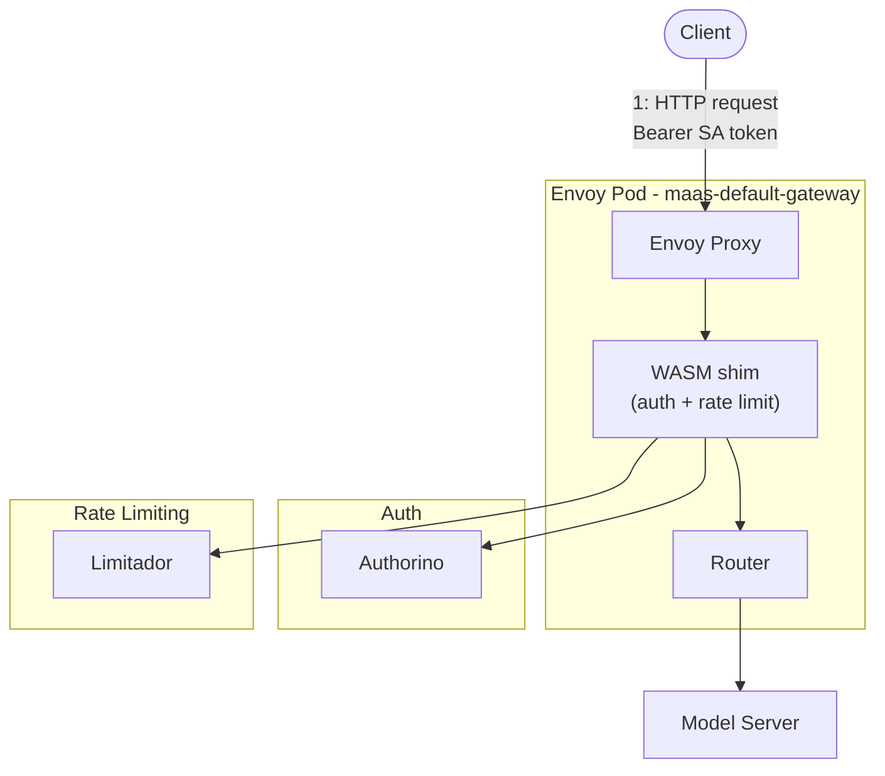
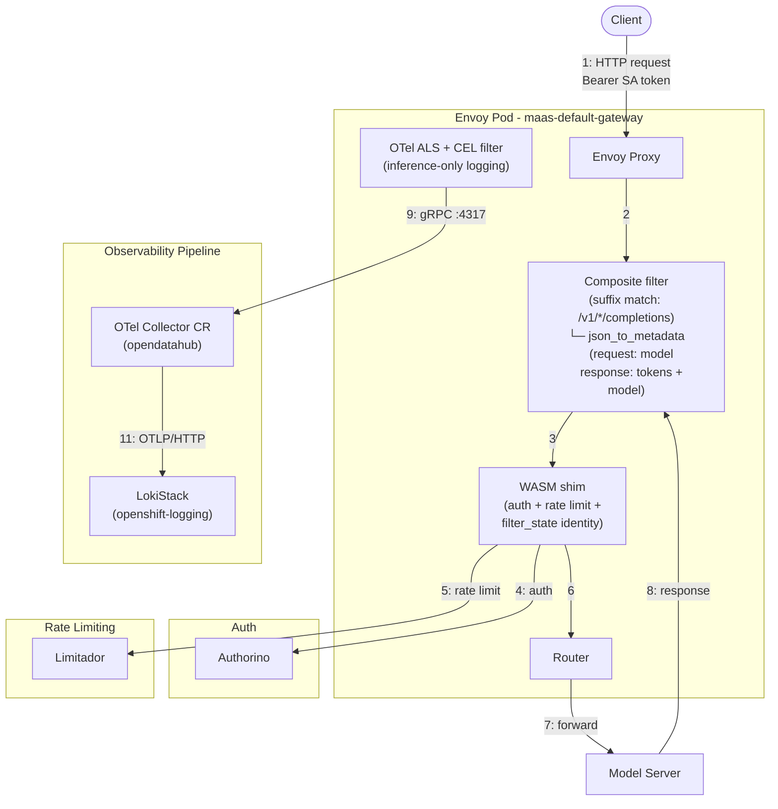
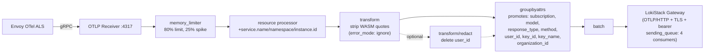
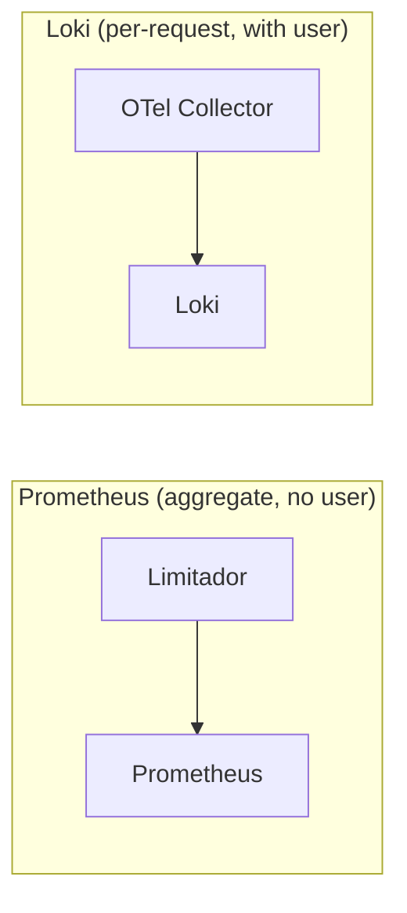

---

name: Envoy OTel Structured Logs
overview: Envoy access logs emitted via OTel Collector to Loki, carrying user_id, subscription, model name, and token counts as structured log records — providing a reliable, independent token accounting channel alongside the existing Limitador-based counters.
todos:

- id: upstream-wasm-shim-tokens
  content: "TODO (deferred): File GitHub issue at kuadrant/wasm-shim requesting set_attribute() for body_values in TokenUsageTask (would eliminate json_to_metadata filter dependency)"
  status: pending
- id: upstream-wasm-shim-429
  content: "TODO (deferred): Request WASM shim to inject model info before rate limit evaluation — currently solved via json_to_metadata INSERT_FIRST (extracts model from request body before rate limiter). Upstream fix would make json_to_metadata request_rules redundant."
  status: pending
- id: upstream-kuadrant-dual-listener
  content: "TODO (deferred): File issue that HTTP+HTTPS listeners cause duplicate ActionSets leading to 403"
  status: pending
- id: pr-envoyfilter
  content: "PR #1035: EnvoyFilter + controller integration. MERGED (2026-07-13). Follow-up: per-tenant gateway EnvoyFilter (jrhyness)."
  status: done
- id: pr-otel-collector
  content: "PR #1032: OTel Collector CR (v1beta1) + RBAC. Branch: feature/otel-collector. Requires Red Hat build of OTel operator. memory_limiter, error_mode:ignore, sending_queue, user_id emission toggle. Needs namespace alignment (openshift-ingress → opendatahub) before merging."
  status: pending
- id: pr-dashboards
  content: "PRs #995 (admin dashboard) + #988 (user dashboard, closed): Perses usage dashboards with Loki LogQL, loki-query-proxy for user isolation"
  status: pending
- id: multitenant-envoyfilter
  content: "Follow-up (jrhyness PR #1035 review): Move EnvoyFilter into tenant reconciler for per-tenant gateway support. ahadas agreed — next PR."
  status: pending
- id: pr999-proxy-fixes
  content: "PR #999 proxy bugs: HTTP/1.0 chunked mismatch, duplicate namespace filter, POST support, kustomize namespace override, RBAC gaps (see Proxy Issues section)"
  status: pending
- id: otel-namespace-alignment
  content: "PR #1032: Update service.namespace and kubernetes_namespace_name from openshift-ingress to opendatahub before merging"
  status: pending
- id: integrate-configreconcile
  content: "DONE: Controller-managed EnvoyFilter lifecycle via `usageLogging` feature gate in Config.Spec (cluster-wide). Integrated into `ensureObservability` method (alongside ensureLimitadorServiceMonitor and ensureUsageDashboard). Controller reads manifest from container filesystem, templates namespace + collector address via structured `patchClusterAddress` helper (unstructured.SetNestedField), applies via SSA with Config ownerReference. Enable/disable toggles create/delete. ObservabilityManifestsPath resolution fixed (traverses up from dashboards dir). Rebased on upstream/main, verified end-to-end on cluster."
  status: done
isProject: false

---

# Envoy OTel Structured Usage Logs — Implementation Record

## Status: COMPLETE — Full Pipeline Deployed and Verified (2026-07-07, updated 2026-07-14)

### Upstream Alignment (2026-07-13)

POC branch rebased on `upstream/main` (42 upstream commits incorporated). All upstream changes now included:

| Area | Upstream change | Status |
|------|----------------|--------|
| **Infra namespace** (#1051, #1120) | `infra-namespace=AUTO` → `odh-ai-gateway-infra` | Included via rebase |
| **MaasTenantConfig** (#1083) | New CRD; reconciler watches MaasTenantConfig | Included via rebase |
| **Config CR** (#1100) | `limitadorScrapeInterval` in ConfigSpec | Merged with `usageLogging` |
| **Monitoring namespace** (#1087) | Explicit `--monitoring-namespace` flag (default `opendatahub`) | Included via rebase |
| **Container hardening** (#1138) | `readOnlyRootFilesystem`, `seccompProfile` | Included via rebase |
| **Privacy** (#1133, #1114) | Hash/redact username, sensitive headers | Included via rebase |
| **EnvoyFilter layout** (#1096) | 8-patch payload-processing in params.go | Included via rebase |

### PR #1035 Merged + Cluster Convention Alignment (2026-07-14)

**PR #1035 merged** (Jul 13) — EnvoyFilter for OTel structured usage logging. Controller-managed via `usageLogging` feature gate. Approved by ahadas + jrhyness.

**Follow-up action** (jrhyness review comment): Move EnvoyFilter into the tenant reconciler for per-tenant gateway support. The current filter hardcodes `maas-default-gateway` by name. Multi-tenancy (each AITenant gets its own gateway) requires per-tenant EnvoyFilter deployment. ahadas agreed — planned for the next PR.

**Cluster aligned to `opendatahub` convention** (Jul 14): The PR #999 user-scoped proxy expects `kubernetes_namespace_name=opendatahub` for security scoping. Aligned the cluster:

| Component | Change |
|-----------|--------|
| OTel Collector resource processor | `kubernetes_namespace_name`: `openshift-ingress` → `opendatahub` |
| OTel Collector resource processor | `service.namespace`: `openshift-ingress` → `opendatahub` |
| EnvoyFilter resource_attributes | `service.namespace`: `openshift-ingress` → `opendatahub` |
| LokiStack | Clean redeployed (deleted PVCs) to flush old-convention data |
| NetworkPolicy | Already had rule for `opendatahub` namespace collectors |

**Note**: EnvoyFilter `service.namespace` is controller-managed (owned by `Config` CR). The OTel Collector's `upsert` processor overrides it regardless, but the controller template should eventually be updated to use `opendatahub`.

### User-scoped Proxy (PR #999) — Deployed and Verified (2026-07-14)

Cherry-picked proxy files from PR #999 (Python rewrite, replaces original Go proxy). Deployed to `kuadrant-system` on `amit.dev.datahub.redhat.com`. User isolation verified end-to-end through dashboards.

**Test results:**

| Test | User | Streams | Users visible | Result |
|------|------|---------|---------------|--------|
| Proxy query | `kube:admin` | 3 | `{'kube:admin'}` | Only admin logs |
| Proxy query | `test-loki-viewer` | 3 | `{'test-loki-viewer'}` | Only viewer logs |
| Cross-isolation | `test-loki-viewer` (limit=50) | 3 | `{'test-loki-viewer'}` | **Cannot see admin logs** |

**Dashboard verification** (logged in as each user via OpenShift console):
- Admin: 291 tokens, 6 successful, 2 rate-limited, 42.9% success rate
- Viewer: 148 tokens, 3 successful, 0 rate-limited, 100% success rate

**Issues found** (see "Proxy Issues" section below for details):
1. HTTP/1.0 + chunked encoding mismatch (code bug)
2. Duplicate `kubernetes_namespace_name` filter injection (code bug)
3. POST method not supported (code limitation)
4. Kustomize namespace override breaks cross-namespace RoleBinding (deployment bug)
5. Missing broader Loki ClusterRole — OPA SAR without `resourceName` (deployment gap)
6. Missing namespace-level view access for OPA matcher (deployment gap)

**Deployment workarounds applied** (no proxy code changes):
- `LOKI_UPSTREAM_URL` overridden to `openshift-logging` (as manifest instructs)
- Created `ClusterRole/loki-application-reader` without `resourceNames` restriction
- Created `RoleBinding/loki-query-proxy-namespace-view` in `opendatahub` for OPA namespace access
- Created `RoleBinding/loki-query-proxy-application-reader` in `opendatahub`

### Dashboard fixes (2026-07-13, updated 2026-07-14)

Active Users panel: added `| user_id!="-"` to exclude Envoy dash sentinel from distinct user count. Verified against Loki — without filter: 3 users (includes `"-"`), with filter: 2 users (correct). Fix applied to `usage-admin-loki-dashboard.yaml` on POC branch and pending on PR #995 branch.

**Naming alignment (2026-07-14)**: Aligned Loki dashboard panel names with upstream Prometheus dashboard (PR #1156 sentence case convention):
- "Total Tokens" → "Total tokens"
- "Total Successful Requests" → "Total requests" (query changed: no `response_type` filter — counts all requests)
- "Total Rate Limited Requests" → "Total rate limited"
- "Success Rate" → "Success rate"
- "Active Users" → "Active users"
- "Token consumption" (panel) → "Token consumption chart"
- "Token consumption" (layout title) → "Token consumption" (matching PR #1156)
- Removed stale "Grafana filled mock" dev note from admin `tokenConsumptionOverTime` description

**"Total requests" counts all**: Query uses no `response_type` filter — counts hit + rate_limit + error. Consistent with upstream Prometheus `Total requests` (`authorized_calls + limited_calls`).

**Verified on fresh LokiStack** (2026-07-14): Wiped all Loki data (deleted PVCs), redeployed LokiStack, generated fresh traffic. Results with clean data (zero pre-CEL entries):
- Total tokens: 647 (from 15 hits across 3 models)
- Total requests: 76 (15 hit + 35 rate_limit + 26 error = 76, math verified)
- Total rate limited: 35
- Success rate: 19.7% (15/76)
- Active users: 1
- Token consumption chart: 3 models (177 + 226 + 244 = 647, matches total)
- Empty `response_type` entries: **0** (confirms all entries have response_type on fresh deploy)

All core components deployed and verified on clusters `amit.dev.datahub.redhat.com` (ODH), `giteltal.dev.datahub.redhat.com` (ODH), and `ahadas-ahadas-rhoai.dev.datahub.redhat.com` (RHOAI). Pipeline: Envoy → OTel Collector (OpenTelemetryCollector CR) → Loki. All identity fields sourced from Kuadrant WASM plugin's FILTER_STATE (`wasm.kuadrant.auth.identity.*`). Composite filter (path-based suffix match) restricts body parsing to inference paths only. Verified on all platforms.

### Controller Feature Gate: `usageLogging` (2026-07-07)

The EnvoyFilter is now controller-managed via `Config.Spec.UsageLogging` (bool, default `false`). Cluster-wide toggle on the singleton `Config/default` CR. Implementation in `self_deployment_controller.go` (`LifecycleReconciler.ensureObservability` → `ensureUsageLogsEnvoyFilter`):

- **Enable** (`usageLogging: true`): reads EnvoyFilter YAML from container filesystem (`/deployment/components/observability/usage-logs/envoy-otel-access-log.yaml`), templates collector address via `patchClusterAddress` helper (uses `unstructured.SetNestedField` for precise YAML patching — no fragile string replacement) + gateway namespace, server-side applies with `Config` ownerReference and `maas-controller` fieldOwner.
- **Disable** (`usageLogging: false` or field absent): deletes the `maas-model-access-logs` EnvoyFilter if it exists.
- **Graceful degradation**: skips if EnvoyFilter CRD not installed, manifest file not found, or `ObservabilityManifestsPath` not configured.

Pattern mirrors existing observability toggles (cluster-wide scope — EnvoyFilter is gateway-scoped, not per-tenant). Integrated into `ensureObservability` alongside `ensureLimitadorServiceMonitor` and `ensureUsageDashboard`.

Files changed:
- `maas-controller/api/maas/v1alpha1/config_types.go` — added `UsageLogging *bool` to `ConfigSpec` (with GDPR warning comment)
- `maas-controller/pkg/controller/maas/self_deployment_controller.go` — `ensureUsageLogsEnvoyFilter`, `applyUsageLogsEnvoyFilter`, `deleteEnvoyFilterIfExists`, `patchClusterAddress` (unstructured nested field patching), integrated into `ensureObservability`
- `maas-controller/pkg/controller/maas/self_deployment_controller_test.go` — unit tests for all paths (create, delete, address patching, Config CR lookup)
- `maas-controller/cmd/manager/main.go` — wires `GatewayNamespace`
- `deployment/base/maas-controller/crd/bases/maas.opendatahub.io_configs.yaml` — added `usageLogging` field
- `deployment/components/observability/usage-logs/envoy-otel-access-log.yaml` — Composite filter wrapping `json_to_metadata` with path suffix match
- Generated: `zz_generated.deepcopy.go`

**EnvoyFilter** (`maas-model-access-logs`): Composite filter wrapping native `json_to_metadata` with path-based suffix matching (`:path` ends with `/v1/chat/completions` or `/v1/completions`) + companion Lua SSE filter. Non-inference requests skip body parsing entirely. Non-streaming: `json_to_metadata` extracts model/tokens from JSON body. Streaming SSE: companion Lua filter uses `bodyChunks()` to iterate chunks without buffering, extracts tokens from the final SSE event (requires model server to provide `usage` in final chunk via `stream_options.include_usage=true` or `--enable-force-include-usage`). `INSERT_FIRST` for 429 model preservation. CEL filter for inference-only POST logging. `response_type` classification (`hit`/`rate_limit`/`error`). All identity from FILTER_STATE (`wasm.kuadrant.auth.identity.*`). 12 attributes per log record.

**OTel Collector**: `OpenTelemetryCollector` CR (v1beta1) in `opendatahub` namespace via Red Hat build of OpenTelemetry operator. Replaces raw Deployment+ConfigMap+Service. Pipeline: `memory_limiter` → `resource` → `transform` (strip WASM quotes, `error_mode: ignore`) → `transform/redact` → `groupbyattrs` (8 stream labels) → `batch` → Loki (`sending_queue` enabled). `user_id` sensitive data emission disabled by default (toggleable via 2-line comment swap in CR).

**Dashboards**: Two Perses dashboards in `kuadrant-system` using `response_type` stream labels for efficient querying. LokiStack patched for explicit stream label control.

---

## Architecture Before Our Changes

Before this work, the MaaS platform had **no independent audit log** for token consumption. All observability relied on **Limitador counters exposed as Prometheus metrics**. No Loki, no OTel Collector, no structured usage logs.

### Pre-Change Request Flow



No OTel ALS, no `json_to_metadata`, no OTel Collector, no Loki. Response body consumed by WASM shim for rate limiting only.

### What Was Missing

| Gap | How We Solved It |
| --- | --- |
| No independent audit log | OTel ALS emits a structured log for every request |
| No per-request data | 12 structured attributes per log record in Loki |
| High-cardinality `user` in Prometheus | Per-user data moved to Loki structured metadata |
| Dead `tier` label | Replaced with `subscription` everywhere |
| No token breakdown | `tokens_prompt` and `tokens_completion` extracted by `json_to_metadata` |

---

## Architecture (Final — Verified)

### Complete Request/Response Flow



### OTel Collector Pipeline



### Dual Data Paths



- **Prometheus**: `authorized_hits`, `authorized_calls`, `limited_calls` with labels `subscription`, `model`, `organization_id`, `cost_center`
- **Loki**: 12 attributes per inference request — `response_code`, `response_type`, `user_id`, `subscription`, `groups`, `key_id`, `key_name`, `organization_id`, `tokens_total`, `tokens_prompt`, `tokens_completion`, `model`. All identity from FILTER_STATE. `key_name` stored as structured metadata (high cardinality); remaining identity fields as stream labels.

### Data Flow (Step by Step)

1. **Client sends request** with Bearer SA token (or `sk-oai-*` API key)
2. **Composite filter (INSERT_FIRST)** — `:path` suffix matching (`/v1/chat/completions`, `/v1/completions`). If matched, `json_to_metadata` `request_rules` extract model from JSON request body (`on_present` only — missing model simply doesn't set metadata, no "unknown" fallback). Non-inference requests skip entirely.
3. **WASM shim** calls Authorino (kubernetesTokenReview + subscription-info callout). Stores identity in `filter_state` (userid, keyId, keyName, selected_subscription, groups). Access log uses FILTER_STATE for ALL 6 identity fields (`user_id`, `subscription`, `groups`, `key_id`, `key_name`, `organization_id`). FILTER_STATE survives 429 (set before rate limit evaluation).
4. **WASM shim** evaluates rate limit (Limitador). On 429, sends local reply — `filter_state` is already set (all identity fields available). Model already extracted from request body.
5. **Request forwarded** to model server (or 429 local reply if rate limited)
6. **Model server responds** — Non-streaming: `json_to_metadata` `response_rules` extract tokens and authoritative model from JSON body. Streaming SSE: `json_to_metadata` fires `on_error` (content-type mismatch, zero buffering), then companion Lua filter iterates `bodyChunks()` to extract tokens from the last SSE event without buffering. On 429, `on_missing` fires but model not overwritten (only `on_present` configured for response model rule).
7. **OTel ALS** fires if CEL filter matches (POST to `/v1/chat/completions` or `/v1/completions`). Emits 12 attributes + 2 resource attributes via gRPC to OTel Collector.
8. **OTel Collector** pipeline: memory_limiter → resource → transform (strip quotes, `error_mode: ignore`) → [optional: transform/redact (delete user_id)] → groupbyattrs (promote 8 keys to resource attributes) → batch → Loki via OTLP/HTTP (sending_queue enabled)

### Perses Dashboard Architecture

Two dashboards in `kuadrant-system` namespace:
- **`usage-admin-loki-dashboard`** — admin view, all users, uses `loki` datasource (direct to LokiStack). Dynamic dropdowns for User, Subscription, Model via `LokiLabelValuesVariable`. `key_name` shown in table via structured metadata grouping (not a dropdown — high cardinality).
- **`usage-user-loki-dashboard`** — per-user view, uses `scoped-loki` datasource (through loki-query-proxy). Dynamic dropdowns for Subscription, Model. `key_name` shown in table via structured metadata grouping.

Two datasources in `kuadrant-system` namespace:
- **`loki`** — direct to LokiStack gateway (SA token auth + kubernetesAuth + TLS)
- **`scoped-loki`** — routes through loki-query-proxy (kubernetesAuth only, no TLS/secret)

**loki-query-proxy** deployed to `kuadrant-system` namespace (default, overridable via kustomize) — Python service that intercepts Loki queries and injects `kubernetes_namespace_name="opendatahub"` + `user_id="<caller>"` filter based on TokenReview of the caller's Kubernetes token. Uses the pod's service account token for upstream authentication to Loki gateway.

**Table panel**: Both dashboards have a "Usage breakdown" table with three Loki queries merged via `MergeSeries` transform. All table queries use `[$__range]` (negative offset removed — not supported by this Loki version). Table columns group by `model`, `subscription`, `key_name` (structured metadata):
- **Q1**: Tokens per model/subscription/key_name — `sum by (model, subscription, key_name) (sum_over_time(... | unwrap tokens_total [$__range]))`
- **Q2**: Successful requests per model/subscription/key_name — `sum by (model, subscription, key_name) (count_over_time(... response_type="hit" ... [$__range]))`
- **Q3**: Rate-limited requests per model/subscription/key_name — `sum by (model, subscription, key_name) (count_over_time(... response_type="rate_limit" ... [$__range])) or (... response_type="hit" ... * 0)`. The `or (hit * 0)` zero-pads model/subscription/key_name tuples with no rate-limited traffic, ensuring Q3 returns the same label sets as Q1/Q2 (required for `MergeSeries` to join correctly — it fails when queries return different numbers of series).

**`key_name` as structured metadata**: `key_name` is intentionally NOT a Loki stream label (high cardinality — every API key has a unique name). It is stored as structured metadata but is still queryable in `sum by` clauses and pipeline filters (`| key_name="my-key"`). The `key_id` UUID is present in Loki logs but deliberately excluded from dashboard display — `key_name` is the human-readable identifier shown to users.

### Deployment Topology

| Namespace | Resources |
|-----------|-----------|
| `kuadrant-system` | loki-query-proxy (deployment, SA, RBAC, service), Perses dashboards (usage-admin-loki-dashboard, usage-user-loki-dashboard), datasources (loki, scoped-loki) |
| `opendatahub` | OpenTelemetryCollector CR `usage-logs` (operator-managed → service `usage-logs-collector`), SA `usage-logs-collector`, ClusterRoleBinding `maas-otel-loki-writer` |
| `openshift-ingress` | EnvoyFilter `maas-model-access-logs` |
| `openshift-logging` | LokiStack `maas-loki` (patched `streamLabels.resourceAttributes`), NetworkPolicy allowing collector from `opendatahub` |
| `openshift-operators` | Red Hat build of OpenTelemetry operator (Subscription `opentelemetry-product`) |

---

## Design Decisions

| Decision | Rationale |
| --- | --- |
| `json_to_metadata` + Lua SSE companion | Native Envoy filter for JSON responses — replaced Lua after ahadas review (PR #1031). Wrapped in Composite filter with `:path` suffix matching to restrict body parsing to inference paths only. Companion Lua filter handles SSE via `bodyChunks()` (zero-buffering chunk iteration). `on_present` only for model prevents "unknown" log pollution. See "Why json_to_metadata replaced Lua" section below. |
| Composite filter (path matching) | Wraps `json_to_metadata` in `ExtensionWithMatcher` with `HttpRequestHeaderMatchInput` suffix match on `:path`. Only `/v1/chat/completions` and `/v1/completions` trigger body parsing. Eliminates unnecessary buffering of non-inference traffic (`/v1/models`, `/maas-api/*`, health checks). Resolves the "body buffering scope tradeoff" that existed with bare `json_to_metadata`. |
| CEL filter (inference-only) | Only `/v1/chat/completions` and `/v1/completions` logged. POST only. Eliminates noise from `/v1/models`, health checks, etc. |
| `response_type` via CEL | `hit`/`rate_limit`/`error` — low cardinality stream label for Loki. Exact `response_code` still available as structured metadata. Dashboard stat queries use `response_type` for filtering (e.g. "Total rate limited" = `response_type="rate_limit"`). "Total requests" counts all response types. Success rate = `hit / all`. |
| Identity: All from FILTER_STATE | All 6 identity fields sourced from `%FILTER_STATE(wasm.kuadrant.auth.identity.*:PLAIN)%`. FILTER_STATE is internal Envoy state (never on wire, not spoofable, survives 429). Per ahadas review (2026-07-01): simplifies architecture, single source of truth. |
| EnvoyFilter (not Istio Telemetry CR) | Telemetry API lacks custom OTel attributes; `ConfigMap/istio` owned by ingress-operator |
| `sed` placeholders (not `envsubst`) | Kustomize can't target YAML-in-YAML |
| OpenTelemetryCollector CR (not raw Deployment) | Upstream alignment with Red Hat build of OTel operator. Operator manages Deployment, Service, health probes, config volume. Replaces raw ConfigMap+Deployment+Service. Requires `opentelemetry-product` operator from OperatorHub. |
| `memory_limiter` first in pipeline | OTel Collector best practice — prevents OOM under burst. 80% limit, 25% spike limit, 5s check interval. |
| `error_mode: ignore` on transform | Malformed attributes (missing field, wrong type) silently skip the statement instead of dropping the entire log record. |
| `sending_queue` on exporter | Decouples collection from export. 4 consumers, 500-item queue. Prevents backpressure from Loki slowdowns from blocking the receiver. |
| `user_id` emission toggle (off by default) | `user_id` sensitive data emission disabled by default — deleted before Loki via `transform/redact`. To enable, uncomment `delete_key` in `transform/redact` and `user_id` in `groupbyattrs.keys` (2-line toggle). Dashboard queries use `customAllValue: ".*"` so `user_id=~".*"` matches entries with or without user_id. Only `user_id` is considered sensitive; `groups` is not. |
| Red Hat OTel Collector image | `ghcr.io` inaccessible from cluster; pinned Red Hat SHA |
| LokiStack bearer token auth | Gateway requires HTTPS + bearer (not `X-Scope-OrgID` + HTTP) |
| `key_name` as structured metadata (not stream label) | High cardinality — every API key has a unique user-provided name. Promoted to resource attribute via `groupbyattrs` but NOT included in LokiStack `streamLabels.resourceAttributes`. Queryable in `sum by` and pipeline filters but does not pollute Loki index. `key_id` (UUID) IS a stream label (indexed for fast filtering) but hidden from dashboards (human readability). |
| Dashboard: `key_name` in table, not dropdown | `key_name` as structured metadata can't populate `LokiLabelValuesVariable` (requires stream label for Loki `/label/values` API). Shown in table via `sum by (key_name)` grouping instead. |

### Loki Stream Labels vs Structured Metadata (Verified 2026-07-06)

Controlled by LokiStack `spec.limits.global.otlp.streamLabels.resourceAttributes` + OTel Collector `groupbyattrs` processor. Verified via Loki `/series` endpoint.

**Key decision**: `key_name` is in `groupbyattrs` (promoted to resource attribute) but NOT in LokiStack's `streamLabels.resourceAttributes`. This means it becomes **structured metadata** (not an indexed stream label). Reason: high cardinality — every API key has a unique user-provided name, making it unsuitable as a stream label (would explode Loki's index). As structured metadata, `key_name` is still queryable in `sum by` clauses and pipeline filters.

| Field | Loki Placement | Source |
| --- | --- | --- |
| `service_name` | **Stream label** | Resource attribute (static) |
| `subscription` | **Stream label** | `groupbyattrs` promoted |
| `model` | **Stream label** | `groupbyattrs` promoted |
| `response_type` | **Stream label** | `groupbyattrs` promoted |
| `method` | **Stream label** | `groupbyattrs` promoted |
| `user_id` | **Stream label** | `groupbyattrs` promoted |
| `key_id` | **Stream label** | `groupbyattrs` promoted |
| `key_name` | **Structured metadata** | `groupbyattrs` promoted (high cardinality — not in LokiStack streamLabels) |
| `organization_id` | **Stream label** | `groupbyattrs` promoted |
| `kubernetes_namespace_name` | **Stream label** | OpenShift default |
| `log_type` | **Stream label** | OpenShift default |
| `response_code` | Structured metadata | Log attribute (not in `groupbyattrs`) |
| `tokens_total`, `tokens_prompt`, `tokens_completion` | Structured metadata | Log attribute |
| `groups` | Structured metadata | Log attribute |

> **10 stream labels** (low cardinality, indexed) — enables `{response_type="rate_limit"}` as a stream selector.
> **Structured metadata** queryable via pipeline filters: `| response_code="200"`, `| key_name="my-key"`, `| json | tokens_total > 100`.
> `key_name` deliberately NOT a stream label despite being in `groupbyattrs` — high cardinality (every API key has a unique name). LokiStack `streamLabels.resourceAttributes` does not include `key_name`.
> **Dropped** (per ahadas review #1031): `request_id`, `path`, `duration_ms`, `downstream_remote_address` — operational data not needed for usage logging. `method` retained in `groupbyattrs` (always "POST" due to CEL filter, but useful for OTel Collector pipeline consistency).

---

## Known Issue: Perses Datasource Prefix Name Collision

The monitoring-console-plugin uses prefix matching on datasource names (`OcpDatasourceApi.getDatasource()` → `list[0]`). If scoped datasource starts with `loki`, it collides with the admin datasource.

**Solution**: Scoped datasource named `scoped-loki` (not `loki-scoped`). Both require `kubernetesAuth: true`.

---

## Implementation Details

### Files Modified/Created

| File | Change |
| --- | --- |
| `deployment/components/observability/usage-logs/envoy-otel-access-log.yaml` | EnvoyFilter `maas-model-access-logs`: OTel ALS cluster + `json_to_metadata` + Lua SSE companion (`bodyChunks()`) + CEL-filtered access log (12 attributes). |
| `deployment/components/observability/otel-collector/otel-collector-cr.yaml` | `OpenTelemetryCollector` CR (v1beta1) — replaces raw Deployment+ConfigMap+Service. Pipeline: `memory_limiter` → `resource` → `transform` → `groupbyattrs` → `batch` → Loki. Includes `transform/redact` (toggleable user_id removal), `sending_queue`, `error_mode: ignore`. Requires Red Hat build of OTel operator. |
| `deployment/components/observability/otel-collector/otel-collector-rbac.yaml` | SA `usage-logs-collector` + ClusterRole + ClusterRoleBinding for Loki write access (namespace: `opendatahub`) |
| `deployment/components/observability/otel-collector/kustomization.yaml` | Kustomization: otel-collector-rbac.yaml + otel-collector-cr.yaml + envoy-otel-access-log.yaml |
| `deployment/components/observability/usage-logs/` | Loki query proxy (Python source ConfigMap, deployment, RBAC, service) — PR #999 (replaces `loki-proxy/` Go version) |
| `deployment/components/observability/observability/dashboards/` | Perses dashboards (usage-admin, usage-user), datasources (loki, scoped-loki), kustomization — PRs #995, #988 |
| `deployment/base/observability/telemetry-policy.yaml` | TelemetryPolicy (subscription, model, organization_id, cost_center) |
| `scripts/observability/install-observability.sh` | OTel Collector deploy: kustomize build + sed substitution |

### EnvoyFilter: `maas-model-access-logs` (Final — json_to_metadata)

Four patches applied to `maas-default-gateway` via `targetRefs`:

**Patch 1 — OTel ALS Cluster**: STRICT_DNS cluster to `usage-logs-collector.opendatahub.svc.cluster.local:4317` (gRPC/H2, 5s connect timeout).

**Patch 2 — Composite filter wrapping `json_to_metadata` (INSERT_FIRST)**: Envoy Composite filter (`ExtensionWithMatcher`) conditionally executes `json_to_metadata` only on inference paths. Uses `HttpRequestHeaderMatchInput` on `:path` with `or_matcher` for suffix matching (`/v1/chat/completions`, `/v1/completions`). Non-inference requests (`/v1/models`, `/maas-api/*`, health checks) skip body parsing entirely.
- `request_rules`: extracts `model` from JSON request body. `on_present` only — if body has no model field or parsing fails, metadata is simply not set (no "unknown" fallback). INSERT_FIRST position ensures model extraction before rate limiter can short-circuit with 429.
- `response_rules`: extracts `usage.{total_tokens, prompt_tokens, completion_tokens}` with `"0"` fallback (`on_missing`/`on_error`). Extracts authoritative `model` from response (`on_present` only — overwrites request-extracted model on 200 JSON; on SSE/429 the request model stays untouched).
- **SSE pass-through**: Content-Type `text/event-stream` doesn't match `allow_content_types` (default: `application/json`), so response_rules fire `on_error` immediately — zero body buffering, tokens default to "0". The companion Lua SSE filter (Patch 3) then overwrites these with real token values.
- **429 handling**: Error JSON body lacks usage/model, so `on_missing` fires. Tokens default to "0". Response model rule has `on_present` only, so request-extracted model is preserved.
- **Path matching**: Suffix match covers all MaaS routing conventions — `/<ns>/<model>/v1/chat/completions` (path-based, current), `/<ns>/<model>/v1/completions` (legacy), `/v1/chat/completions` (body-based, future).

**Patch 3 — Lua SSE Token Extraction (INSERT_BEFORE router)**: Companion to `json_to_metadata` for streaming SSE responses. Request phase sets `is_completions` flag on inference paths. Response phase:
- Returns early for non-inference requests (no `is_completions` flag) and non-SSE responses (handled by `json_to_metadata`).
- For `text/event-stream`: iterates `bodyChunks()` — Envoy Lua API that yields response chunks as they arrive without buffering. Each chunk scanned for `usage.{total_tokens, prompt_tokens, completion_tokens}` and `model`; last-seen values win (token info is in the final SSE event).
- `pcall` wraps the loop for crash safety. No `break` in the `bodyChunks()` loop (Envoy constraint — loop must complete naturally).
- Writes extracted values to dynamic metadata, overwriting `json_to_metadata`'s "0" defaults.
- Future: `sse_to_metadata` (Envoy 1.38+, not yet in OSSM) will replace this Lua filter with a native filter.

**Patch 4 — OTel Access Log + CEL Filter**: CEL expression restricts logging to POST requests on inference paths. 12 structured attributes:

| Attribute | Source | Category |
| --- | --- | --- |
| `response_code` | `%RESPONSE_CODE%` | Response |
| `response_type` | `%CEL(response.code >= 200 && response.code < 300 ? "hit" : (response.code == 429 ? "rate_limit" : "error"))%` | Response |
| `user_id` | `%FILTER_STATE(wasm.kuadrant.auth.identity.userid:PLAIN)%` | Identity |
| `subscription` | `%FILTER_STATE(wasm.kuadrant.auth.identity.selected_subscription:PLAIN)%` | Identity |
| `groups` | `%FILTER_STATE(wasm.kuadrant.auth.identity.groups:PLAIN)%` | Identity |
| `key_id` | `%FILTER_STATE(wasm.kuadrant.auth.identity.keyId:PLAIN)%` | Identity |
| `key_name` | `%FILTER_STATE(wasm.kuadrant.auth.identity.keyName:PLAIN)%` | Identity |
| `organization_id` | `%FILTER_STATE(wasm.kuadrant.auth.identity.organizationId:PLAIN)%` | Identity |
| `tokens_total` | `%DYNAMIC_METADATA(envoy.filters.http.json_to_metadata:tokens_total)%` | Usage |
| `tokens_prompt` | `%DYNAMIC_METADATA(envoy.filters.http.json_to_metadata:tokens_prompt)%` | Usage |
| `tokens_completion` | `%DYNAMIC_METADATA(envoy.filters.http.json_to_metadata:tokens_completion)%` | Usage |
| `model` | `%DYNAMIC_METADATA(envoy.filters.http.json_to_metadata:model)%` | Usage |

Resource attributes: `service.name=maas-gateway`, `service.namespace=opendatahub` (aligned from `openshift-ingress` on 2026-07-14 to match proxy convention).

**Patch 4** emits **12 structured attributes** per log record.

**Attributes intentionally excluded** (present in original POC or Lua version, removed per ahadas review #1031):
- `request_id`, `method`, `path`, `duration_ms`, `downstream_remote_address` — operational data, not needed for usage dashboards.
- `authority`, `upstream_cluster`, `bytes_received`, `bytes_sent`, `response_code_details`, `route_name` — Envoy operational data, not useful for billing/usage.
- `subscription_labels`, `cost_center`, `auth_error`, `auth_error_msg` — not populated by current upstream AuthPolicy. Can be re-added when upstream supports them.

### OTel Collector Configuration

Deployed as `OpenTelemetryCollector` CR (`v1beta1`) named `usage-logs` via Red Hat build of OpenTelemetry operator. The operator manages Deployment, Service (`usage-logs-collector`, convention: `<cr-name>-collector`), health probes, and config volume automatically.

**Prerequisite**: Red Hat build of OpenTelemetry operator installed via OperatorHub (`opentelemetry-product` Subscription in `openshift-operators`).

```yaml
processors:
  memory_limiter:
    check_interval: 5s
    limit_percentage: 80
    spike_limit_percentage: 25
  resource:
    attributes:
    - { action: insert, key: log_type, value: application }
    - { action: upsert, key: service.name, value: maas-gateway }
    - { action: upsert, key: service.namespace, value: opendatahub }
    - { action: upsert, key: kubernetes_namespace_name, value: opendatahub }
    - { action: upsert, key: service.instance.id, value: "${env:POD_NAME}" }
  transform:
    error_mode: ignore
    log_statements:
    - context: log
      statements:
      - replace_pattern(attributes["user_id"], "^\"(.*)\"$$", "$$1")
      - replace_pattern(attributes["subscription"], "^\"(.*)\"$$", "$$1")
      - replace_pattern(attributes["key_id"], "^\"(.*)\"$$", "$$1")
      - replace_pattern(attributes["key_name"], "^\"(.*)\"$$", "$$1")
      - replace_pattern(attributes["groups"], "^\"(.*)\"$$", "$$1")
      - replace_pattern(attributes["organization_id"], "^\"(.*)\"$$", "$$1")
  transform/redact:
    error_mode: ignore
    log_statements:
    - context: log
      statements:
      - delete_key(attributes, "user_id")
  groupbyattrs:
    keys: [subscription, model, response_type, method, user_id, key_id, key_name, organization_id]
  batch:
    timeout: 5s
    send_batch_size: 100
    send_batch_max_size: 200
exporters:
  otlphttp/loki:
    sending_queue:
      enabled: true
      num_consumers: 4
      queue_size: 500
```

**Key configuration points**:
- `memory_limiter` is FIRST in the pipeline — OTel Collector best practice to prevent OOM under burst traffic.
- `error_mode: ignore` on `transform` processors — malformed attributes silently skip the statement instead of dropping the entire log record.
- `transform` strips double-quotes from 6 identity attributes (WASM shim wraps some values in quotes).
- `user_id` emission (**disabled by default**) — `transform/redact` deletes `user_id` from log attributes before Loki. To enable emission, uncomment `delete_key` in `transform/redact` and `user_id` in `groupbyattrs.keys` (2-line toggle in CR). Dashboard variables use `customAllValue: ".*"` so `user_id=~".*"` matches all entries regardless of whether `user_id` is present — admin "All" returns correct totals.
- `groupbyattrs` promotes 8 keys from log attributes to resource attributes — these become Loki stream labels (controlled by LokiStack `streamLabels.resourceAttributes`).
- `response_type` (not `response_code`) is a stream label — low cardinality (`hit`/`rate_limit`/`error`), enables efficient Loki filtering.
- `sending_queue` decouples collection from export — Loki slowdowns don't backpressure the receiver.
- Loki endpoint via `sed` placeholder at deploy time.
- CR named `usage-logs` deployed in `opendatahub` namespace. Operator generates service named `usage-logs-collector` (convention: `<cr-name>-collector`).

### Final Envoy Filter Chain

```
[0]  composite (ExtensionWithMatcher)               (INSERT_FIRST — wraps json_to_metadata, suffix match on :path)
       └─ json_to_metadata                          (executes only on /v1/chat/completions, /v1/completions)
[1]  istio.metadata_exchange
[2]  envoy.filters.http.ext_proc.bbr-pre
[3]  kuadrant-maas-default-gateway               (WASM shim — auth + rate limit + filter_state)
[4]  envoy.filters.http.ext_proc.bbr
[5]  envoy.filters.http.grpc_stats
[6]  istio.alpn
[7]  envoy.filters.http.fault
[8]  envoy.filters.http.cors
[9]  istio.stats
[10] envoy.filters.http.lua.sse_tokens           (INSERT_BEFORE router — SSE bodyChunks() token extraction)
[11] envoy.filters.http.router
```

Access log: `envoy.access_loggers.open_telemetry` with CEL filter on NETWORK_FILTER (runs after response, emits to gRPC asynchronously).

---

## Limitations

1. **SSE streaming tokens**: Handled by companion Lua filter using `bodyChunks()` API. Response filters run in reverse chain order: Lua SSE (later in chain) processes the response FIRST and writes real token values, then `json_to_metadata` (first in chain) processes the response LAST. Without `preserve_existing_metadata_value: true` on `on_error`/`on_missing`, `json_to_metadata` would overwrite the Lua-extracted tokens with "0". The `preserve_existing_metadata_value` flag ensures Lua-set values survive. Stream passes through untouched to the client. Model preserved from request body. **Requires** the model server to provide `usage` in the final SSE chunk — either the client sends `stream_options: {"include_usage": true}`, or the server is started with `--enable-force-include-usage` (vLLM/llm-d). Without either, tokens will be "0" per the OpenAI API spec. Future: `sse_to_metadata` (Envoy 1.38+, not yet in OSSM) will replace the Lua companion with a native filter.
2. **429 lack `tokens`**: Rate limiting happens before backend response → `tokens_*` = "0". Model name IS available (from request body via `json_to_metadata` INSERT_FIRST — runs before rate limiter). `response_type="rate_limit"` stream label enables dashboard filtering.
3. **`organization_id` not yet populated**: AuthPolicy `response.success.filters.identity.json.properties` does not include `organizationId`. WASM shim only populates FILTER_STATE keys defined in the identity filter. Requires adding `organizationId` expression to `maasauthpolicy_controller.go`. Pre-wired in EnvoyFilter; will auto-populate when controller is updated.
4. **Dual-listener 403**: HTTP+HTTPS listeners → duplicate ActionSets. Workaround: remove HTTP listener.
5. **Perses Table queries**: Table queries use `[$__range]` without `offset`. Negative offset (`offset -$__range`) was removed — not supported by the deployed Loki version (requires Loki 3.0+). Stat panels work correctly with `[$__range]` + `calculation: last` (takes the last step).
6. **Success rate definition inconsistency** (TODO): Three dashboards define "Success Rate" differently:
   - **Perses Prometheus** (`usage-dashboard.yaml`): `authorized_calls / (authorized_calls + limited_calls)` — 429s count as failures. Upstream `main` has the same formula.
   - **Loki admin/user** (`usage-admin-loki-dashboard.yaml`, `usage-user-loki-dashboard.yaml`): `count(hit) / count(all)` — 429s count as failures. Consistent with upstream Perses.
   - **Grafana** (`dashboard-platform-admin.yaml`): `vllm:request_success_total / vllm:e2e_request_latency_seconds_count` — 429s **excluded** (never reach model). Description: "Rate-limited requests (429) are excluded — they never reach the model and are tracked separately."
   
   **Analysis**: These measure two different things. `authorized / total` = "what % of requests got through" (authorization/throughput rate). `model_success / model_total` = "is the model healthy" (inference success rate). Rate limiting is policy enforcement, not failure — 429 means the system is working correctly. Proposal: rename current panel to "Authorization Rate" and add separate "Inference Success Rate" excluding 429s. Or at minimum, update the description to clarify that 429s are included.

---

## Loki Query Proxy

### Architecture

```
Admin: Dashboard → loki datasource → LokiStack Gateway (direct, SA token)
User:  Dashboard → scoped-loki datasource → loki-query-proxy → LokiStack Gateway
                                                    ↓
                                             TokenReview API
                                             (extract username + groups)
                                                    ↓
                                             LogQL rewrite:
                                             inject | user_id="<caller>"
```

### Design: Why Query Proxy (not LokiStack static mode)

| Aspect | Query Proxy (chosen) | Static Mode (rejected) |
| --- | --- | --- |
| User isolation | Enforced by proxy (user-scoped only) | Storage-level (Loki-native) |
| Admin cluster-wide | Decoupled — admin dashboard uses direct `loki` datasource, NOT the proxy | Blocked (can't aggregate tenants) |
| Operational cost | Low (1 deployment) | High (400 tenant defs + OIDC secrets) |
| LokiStack changes | None | Mode change + per-user tenant blocks |
| Scalability | Unlimited users | CR becomes massive |

### Implementation (Python rewrite — PR #999 latest)

Python source (~400 lines, stdlib only) mounted as ConfigMap, run with `python3` on stock `ubi9/python-312:1`. 4 files in `deployment/components/observability/usage-logs/` (PR #999).

**Key behaviors**: TokenReview-based auth (`auth.py`), **no admin bypass** (correct — admin dashboard uses direct `loki` datasource, not the user-scoped proxy), hardcoded `kubernetes_namespace_name=opendatahub` security scope, `user_id` injection into LogQL queries, GET/POST support (POST fails — see issues), hardened security context (read-only root, non-root, seccomp), JSON error responses.

**Modules**: `main.py` (HTTP server, request handling), `auth.py` (TokenReview + group extraction), `rewriter.py` (LogQL query rewriting), `config.py` (configuration from env vars).

---

## Verified Test Results

### json_to_metadata + SSE companion via OTel Collector CR (2026-06-24, previous)

- **200 non-streaming (`hit`)**: 12 attributes populated — `model=test/e2e-distinct-model` (from response body, authoritative), `tokens_total=38`, `tokens_prompt=8`, `tokens_completion=30`, `response_type=hit`. Data flows through CR-managed collector (`usage-logs-collector` in `opendatahub`) to Loki.
- **200 streaming SSE (`hit`)**: `model=test/e2e-distinct-model-2`, `tokens_total=76`, `tokens_prompt=8`, `tokens_completion=68` — extracted by Lua SSE companion from final SSE chunk (requires `stream_options.include_usage=true`). `preserve_existing_metadata_value: true` prevents `json_to_metadata` from overwriting Lua-set values. Stream passed through untouched.
- **429 rate-limited (`rate_limit`)**: `model=test/e2e-distinct-model` (from request body — INSERT_FIRST runs before rate limiter). `tokens_total=0`, `tokens_prompt=0`, `tokens_completion=0`. On ODH: `user_id=kube:admin` (CEL FILTER_STATE), `key_id` populated. `subscription`/`groups` = `-` (X-MaaS headers not available on 429). On RHOAI: all identity fields `-` (platform limitation).

### Composite filter + Loki datasource fix (2026-07-07, current)

Composite filter deployed, wrapping `json_to_metadata` with `:path` suffix matching. Non-inference requests skip body parsing. Loki datasource placeholder (`__LOKI_GATEWAY_SVC__`) fixed — dashboard queries now work.

| Scenario | Code | Model | Tokens | response_type | In Loki |
| --- | --- | --- | --- | --- | --- |
| Normal 200 inference | 200 | facebook/opt-125m (from response) | prompt=6, completion=1, total=7 | hit | Yes |
| Streaming WITH `include_usage` | 200 | facebook/opt-125m (from SSE chunk) | prompt=6, completion=5, total=11 | hit | Yes |
| Streaming WITHOUT `include_usage` | 200 | facebook/opt-125m (from request) | 0/0/0 (expected — OpenAI spec) | hit | Yes |
| 429 rate-limited (quota exhausted) | 429 | test/e2e-distinct-model (from request) | 0/0/0 | rate_limit | Yes |
| 401 unauthorized | 401 | facebook/opt-125m (from request) | 0/0/0 | error | Yes |
| 403 subscription mismatch | 403 | facebook/opt-125m (from request) | 0/0/0 | error | Yes |
| Non-inference (GET /v1/models) | 200 | N/A | N/A | N/A | **NOT logged** (correct) |
| API key auth (key_id, key_name) | 200 | test/e2e-distinct-model | extracted | hit | Yes — key_id=dc2f254c-..., key_name=verify-test-* |

Infrastructure verified:
- Composite filter accepted by Envoy (2 listeners: port 80 + 443)
- Suffix matchers: 4 (2 per listener for chat/completions + completions)
- Lua SSE filter present in both listeners
- Gateway proxy errors: 0
- Collector export errors: 0
- Loki datasource URL: fixed (no placeholder)
- Perses dashboard: queries return data

### All-FILTER_STATE + key_name structured metadata (2026-07-06, current)

Identity extraction updated per ahadas review: ALL identity fields now sourced exclusively from FILTER_STATE (`wasm.kuadrant.auth.identity.*`). No X-MaaS-* headers used in access log. `key_name` stored as Loki structured metadata (high cardinality — not promoted to stream label). Dashboard updated to show `key_name` in table grouping without dropdown filter.

- **200 non-streaming (`hit`)**: `user_id`, `subscription`, `groups`, `key_id`, `key_name` all populated from FILTER_STATE. Tokens extracted. `key_name` visible in dashboard table.
- **200 streaming SSE (`hit`)**: Same identity. Tokens extracted by Lua SSE companion. Streaming requests correctly counted. Token counts verified accurate across multiple requests.
- **429 rate-limited (`rate_limit`)**: All identity fields populated (FILTER_STATE survives 429). `key_id=<uuid>`, `key_name=<user-provided-name>`. Tokens `0`.
- **`key_name` in Loki**: Present as structured metadata (not indexed stream label). Queryable in `sum by (key_name)` and `| key_name="..."` pipeline filters. Quotes stripped by OTel Collector `transform` processor.
- **`key_id` in Loki**: Present as stream label. UUID value logged but NOT shown in dashboards (only `key_name` displayed for human readability).
- **Dashboard table**: "Usage breakdown" correctly groups by `model`, `subscription`, `key_name`. Token totals, successful requests, and rate-limited requests all populated.
- **Streaming token accuracy**: Verified with dedicated streaming key — multiple streaming requests counted correctly, `tokens_total`, `tokens_prompt`, `tokens_completion` all populated from final SSE chunk.

---

## LogQL Query Patterns

**Total tokens per user (stream selector on `response_type`):**
```logql
sum by (user_id) (sum_over_time({service_name="maas-gateway", response_type="hit"} | unwrap tokens_total [$__range]))
```

**Total requests (all response types):**
```logql
sum(count_over_time({service_name="maas-gateway"} [$__range]))
```

**Success rate (hit / all):**
```logql
(sum(count_over_time({service_name="maas-gateway", response_type="hit"} [$__range])) / sum(count_over_time({service_name="maas-gateway"} [$__range]))) or vector(1)
```

**Rate-limited count (stream selector — no pipeline filter needed):**
```logql
sum by (model, subscription) (count_over_time({service_name="maas-gateway", response_type="rate_limit"} [$__range]))
```

**Filter by exact response code (structured metadata pipeline filter):**
```logql
{service_name="maas-gateway"} | response_code="500"
```

Stat panels use `[$__range]` + `calculation: last`. Table queries use `[$__range]` (negative offset removed — not supported by deployed Loki). Table Q3 (rate-limited) uses `or (hit * 0)` zero-padding to ensure MergeSeries can join all queries. All stat panels include `model=~"$model"` filter (model is available on all entries including 429s via Lua `capture_model`). Fallbacks: `or vector(0)` on count stats, `or vector(1)` on Success Rate (no traffic = no failures = 100% correct by vacuous truth; `vector(0)` would falsely suggest outage during idle periods). Variables use `LokiLabelValuesVariable` (COO 1.5+). `response_type` as stream label enables fast index-level filtering for hit vs rate_limit vs error.

---

## Deployment Procedure (Current)

```bash
# 0. Prerequisites: Red Hat build of OpenTelemetry operator
#    Install via OperatorHub: Subscription "opentelemetry-product" in openshift-operators
#    Verify: oc get crd opentelemetrycollectors.opentelemetry.io

# 1. Deploy OTel Collector CR + RBAC + EnvoyFilter
#    (resolve LOKI_OTLP_ENDPOINT_PLACEHOLDER and LOKI_TLS_INSECURE_SKIP_VERIFY_PLACEHOLDER
#     in otel-collector-cr.yaml before applying)
kubectl apply -k deployment/components/observability/otel-collector/

# 2. Deploy loki-query-proxy (Python — starts in seconds)
kubectl apply -k deployment/components/observability/usage-logs/
kubectl rollout status deployment/usage-logs-tenancy-proxy -n kuadrant-system --timeout=60s

# 3. Deploy Perses dashboards + datasources
kubectl apply -k deployment/components/observability/observability/dashboards/

# 4. Verify NetworkPolicy allows collector → Loki gateway
#    The Loki gateway NetworkPolicy in openshift-logging must allow ingress from
#    opendatahub namespace, pod label app.kubernetes.io/name=usage-logs-collector
```

Proxy deploys to `kuadrant-system` by default. OTel Collector CR `usage-logs` generates service `usage-logs-collector` in `opendatahub` namespace — EnvoyFilter's cluster endpoint must match.

---

## Review and PR Strategy

### PRs (upstream `opendatahub-io/models-as-a-service`)

| PR | Branch | Status | Scope | Files | Dependencies |
| --- | --- | --- | --- | --- | --- |
| [#1035](https://github.com/opendatahub-io/models-as-a-service/pull/1035) EnvoyFilter | `feature/envoy-otel-log-jsontometa` | **Merged** (Jul 13) | Composite filter + Lua SSE + controller integration (`usageLogging` feature gate). 12 attributes, all identity from FILTER_STATE. **Follow-up**: per-tenant gateway EnvoyFilter (jrhyness). | 7 files, 682 lines | OTel Collector on port 4317 |
| [#1032](https://github.com/opendatahub-io/models-as-a-service/pull/1032) OTel Collector CR | `feature/otel-collector` | Open (draft) | `OpenTelemetryCollector` CR + RBAC. **Note**: `service.namespace` and `kubernetes_namespace_name` in CR still default to `openshift-ingress` — should update to `opendatahub` before merging. | 2 files (CR + RBAC) | EnvoyFilter PR (merged). OTel operator. LokiStack. |
| [#999](https://github.com/opendatahub-io/models-as-a-service/pull/999) Loki Query Proxy | `feature/loki-user-proxy` | Open | Python proxy (stdlib-only, ubi9): TokenReview auth, `inject_user_filter` (`kubernetes_namespace_name=opendatahub` + `user_id`). **Deployed and verified** on amit dev — user isolation works. See "Proxy Issues" section. | 4 files, 684 lines | None (standalone) |
| [#995](https://github.com/opendatahub-io/models-as-a-service/pull/995) Admin Dashboard | `feature-loki-admin-dashboard` | Open | Admin usage dashboard + `loki` datasource (direct to LokiStack). `LokiLabelValuesVariable` (COO 1.5+). `customAllValue: ".*"` for absent-label matching. `response_type` stream labels. | 3 files | LokiStack + OTel pipeline deployed. Loki infra provisioned by opendatahub-operator. |
| [#988](https://github.com/opendatahub-io/models-as-a-service/pull/988) User Dashboard | `feature/loki-user-dashboard` | **Closed** | User-scoped dashboard + `scoped-loki` datasource (through proxy). `LokiLabelValuesVariable`. `customAllValue: ".*"`. | 3 files | Proxy PR (#999). |
| [#1031](https://github.com/opendatahub-io/models-as-a-service/pull/1031) EnvoyFilter (Lua) | `feature/envoy-otel-access-log-filter` | **Closed** | Superseded by #1035 (json_to_metadata). Original Lua-only implementation. | — | — |

**Merge order**: ~~EnvoyFilter~~ (merged) → OTel Collector → Proxy (#999) → Admin Dashboard (#995) → User Dashboard (#988).

**Note**: Admin Dashboard and Proxy are independent (no code dependency), but User Dashboard requires Proxy (datasource URL points to proxy service). All three dashboard/proxy PRs require the OTel pipeline to be deployed for Loki data to exist.

### PR #1035 Review — Resolved and Merged (2026-07-13)

All review comments addressed, PR merged:
1. Comment cleanup (4 items) — resolved
2. FILTER_STATE vs headers — **resolved**: ahadas agreed to switch ALL identity fields to FILTER_STATE (single source of truth)
3. Per-tenant granularity question — **resolved**: `usageLogging` moved to `Config` CR (cluster-wide, matching existing metrics/observability toggles)
4. Incorrect conflict resolution in `main.go` — **fixed** (removed stale `GatewayName` field)
5. Move `ensureUsageLogsEnvoyFilter` into `ensureObservability` — **done** (post-rebase)
6. Removed comment question — **explained** and restored

### PR #995 Review — Resolved (2026-06-22)

All review rounds complete. Key changes: datasource display name → "Usage", namespace → `opendatahub`, dashboard description fix, `model=~"$model"` in stat panels, kept `or vector(1)` for vacuous truth.

---

## Loki Query Proxy — Proxy Issues (PR #999 Python rewrite)

Found during deployment/testing on amit dev (2026-07-14). **No proxy code was modified** — all workarounds are deployment-side.

### Code Bugs (need fixes in PR #999)

| # | Issue | Severity | Detail |
| --- | --- | --- | --- |
| 1 | **HTTP/1.0 + chunked encoding mismatch** | High | `BaseHTTPRequestHandler` responds with HTTP/1.0 but forwards upstream's `Transfer-Encoding: chunked` header unchanged. HTTP/1.0 does not support chunked encoding → `curl` fails with "Illegal or missing hexadecimal sequence in chunked-encoding". Workaround: `curl --raw`. Fix: switch to HTTP/1.1 (`self.protocol_version = "HTTP/1.1"`) or strip `Transfer-Encoding` and set `Content-Length`. |
| 2 | **Duplicate `kubernetes_namespace_name` filter** | Medium | `inject_user_filter` always appends `kubernetes_namespace_name="opendatahub"` without checking if the query already contains that label. A broad query like `{kubernetes_namespace_name=~".+"}` becomes `{kubernetes_namespace_name=~".+", kubernetes_namespace_name="opendatahub"}` → Loki rejects with 400 (contradictory matchers for the same label). Fix: check for existing matcher before injecting. |
| 3 | **POST method not handled** | Medium | `do_POST` is not implemented. Perses datasource sends POST for some query types. The proxy responds with "Method Not Allowed". Fix: add `do_POST = do_GET` or equivalent. |
| 4 | **Single-threaded HTTP server** | Low | `BaseHTTPRequestHandler` processes one request at a time. Under concurrent dashboard loads this will block. Acceptable for POC/testing. Production: `ThreadingHTTPServer` or WSGI. |

### Deployment / RBAC Gaps (need fixes in PR #999 manifests)

| # | Issue | Detail |
| --- | --- | --- |
| 5 | **Kustomize `namespace:` override breaks cross-namespace RoleBinding** | `kustomization.yaml` sets `namespace: kuadrant-system` globally, which also overrides the `opendatahub` namespace in the `RoleBinding` for `cluster-logging-application-view`. The binding ends up in `kuadrant-system` instead of `opendatahub` → proxy SA has no Loki access. Fix: use kustomize `replacements` to selectively set namespace, or move the cross-namespace binding out. |
| 6 | **Missing broader Loki ClusterRole** | The proxy SA is bound to `cluster-logging-application-view`, but that ClusterRole restricts `resourceNames: ["logs"]`. Loki gateway's OPA performs SubjectAccessReview on `loki.grafana.com/application` without `resourceName` → SAR fails. Workaround: created `ClusterRole/loki-application-reader` without `resourceNames` restriction. This should be added to the proxy's RBAC manifest. |
| 7 | **Missing namespace-level view access** | OPA checks the proxy SA has access to the namespace named in `kubernetes_namespace_name`. Without a `RoleBinding` in `opendatahub`, OPA denies access. Workaround: created `RoleBinding/loki-query-proxy-namespace-view` binding proxy SA to `view` in `opendatahub`. This should be in the RBAC manifest. |

### Not Issues

| Item | Why it's fine |
| --- | --- |
| No admin bypass | **Correct by design** — admin dashboard routes through direct `loki` datasource (not proxy). User-scoped proxy should filter ALL users, including admins. |
| `kubernetes_namespace_name=opendatahub` hardcoded | Security scoping mechanism — restricts proxy users to logs from the platform namespace only. Could be made configurable via env var. |

---

## Remaining / Deferred Work

1. **Upstream WASM shim — token counts**: `set_attribute()` for `body_values` would eliminate `json_to_metadata` (~5-line PR). Not blocking.
2. **Upstream Kuadrant — dual-listener**: File bug for HTTP+HTTPS duplicate ActionSets → 403.
3. **Loki infra in opendatahub-operator**: CA ConfigMap, ClusterRoleBinding, SA token Secret — platform-level resources for operator to provision.
4. **`organization_id` not yet populated**: AuthPolicy missing `organizationId` property. Requires `maasauthpolicy_controller.go` change.
5. **`PersesGlobalDatasource`**: Available in `v1alpha2`. Deploy `loki` and `scoped-loki` as global datasources.
6. **Multi-tenant EnvoyFilter** (jrhyness, PR #1035 review): Move EnvoyFilter creation into tenant reconciler. Current implementation hardcodes `maas-default-gateway` — when tenants get their own gateways, each needs its own EnvoyFilter. ahadas agreed to handle in next PR.
7. **PR #999 proxy bug fixes**: Address HTTP/1.0 chunked mismatch, duplicate namespace filter injection, POST support, kustomize namespace override, and RBAC gaps (see "Proxy Issues" section).
8. **OTel Collector CR namespace alignment**: Update `service.namespace` and `kubernetes_namespace_name` in PR #1032 from `openshift-ingress` to `opendatahub` before merging.

---

## RHOAI Platform Gap

**FILTER_STATE identity fields return `-` on RHOAI** (3.5.0-ea.2 with RHCL 1.3.4). Root cause: RHOAI's WASM plugin version doesn't populate `wasm.kuadrant.auth.identity.*` keys the same way as ODH with Kuadrant 1.4.2+. The `json_to_metadata` (model/tokens), Lua SSE companion, CEL filter, and OTel ALS structure work identically on both platforms — only identity field population differs.

---

## Security Review

### POC observability security (this work)

- **No secrets logged**: `Authorization` header never captured in access logs. `sk-oai-*` API keys never appear in logs. Only `key_id` (database UUID) and `key_name` (user-provided label) are logged.
- **Identity source**: All identity attributes read from `FILTER_STATE(wasm.kuadrant.auth.identity.*)` — internal Envoy state that never touches the wire. Not spoofable by clients.
- **OTel Collector**: NetworkPolicy restricts ingress to gateway pods only.
- **Loki access**: Write via SA with `create` on `loki.grafana.com/application`. Read via separate SA.
- **Proxy**: TokenReview API only (no JWT parsing). Hardened container.
- **API key flow**: `sk-oai-*` keys used directly for inference, Authorino extracts `keyId` (UUID) → logged. Key itself never logged.

---

## Upstream Security Note (PR #912)

PR #912 moved auth to gateway-level, removing `Authorization` header stripping and re-adding identity headers to model backends. Our POC avoids this entirely by using `FILTER_STATE` (internal Envoy state, never on wire) for all identity extraction.
