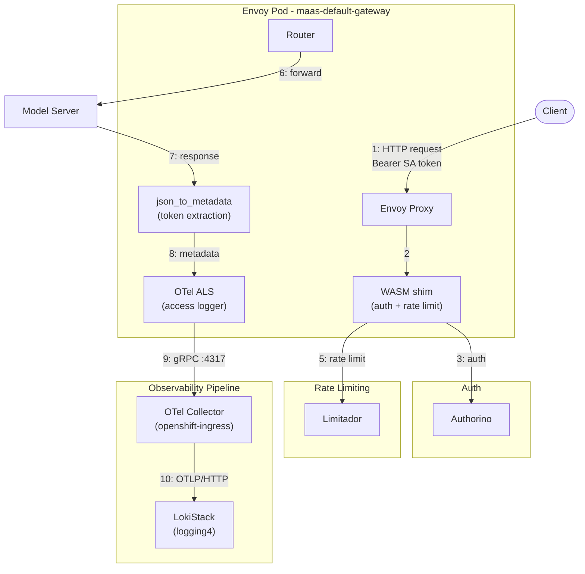
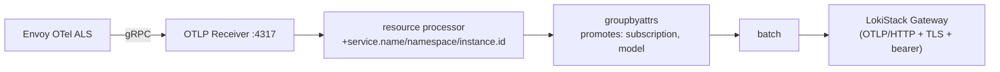
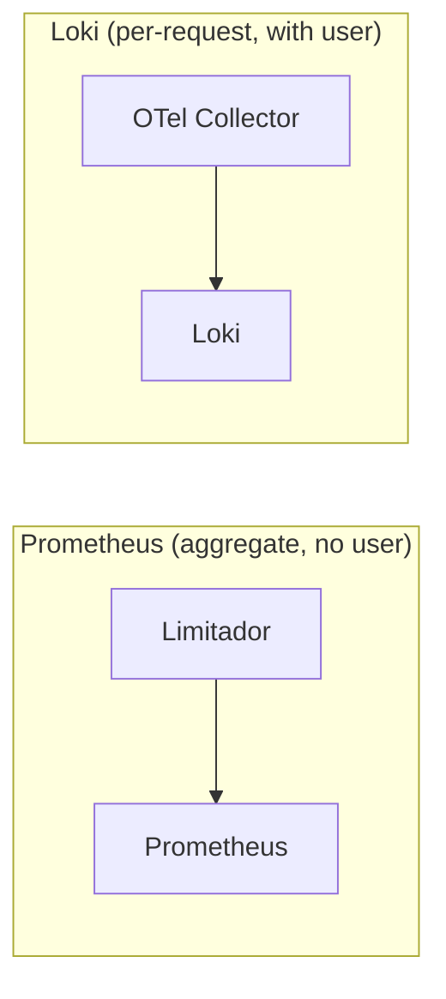

---

name: Envoy OTel Structured Logs
overview: Envoy access logs emitted via OTel Collector to Loki, carrying user_id, subscription, model name, and token counts as structured log records — providing a reliable, independent token accounting channel alongside the existing Limitador-based counters.
todos:

- id: upstream-wasm-shim-tokens
  content: "TODO (deferred): File GitHub issue at kuadrant/wasm-shim requesting set_attribute() for body_values in TokenUsageTask (would eliminate json_to_metadata filter dependency)"
  status: pending
- id: upstream-wasm-shim-429
  content: "TODO (deferred): Request WASM shim to inject model info before rate limit evaluation, so model label appears in 429 logs (currently worked around with label_format model=\"N/A (rate limited)\")"
  status: pending
- id: upstream-kuadrant-dual-listener
  content: "TODO (deferred): File issue that HTTP+HTTPS listeners cause duplicate ActionSets leading to 403"
  status: pending
- id: pr-envoyfilter
  content: "PR 3: EnvoyFilter (otel_als_cluster + json_to_metadata + OTel ALS access log with 25 attributes, aligned with upstream maas-envoy-filter branch)"
  status: pending
- id: pr-otel-collector
  content: "PR 4: OTel Collector deployment (Deployment, Service, ConfigMap, RBAC, NetworkPolicy, kustomization) + install-observability.sh changes (sed placeholders, envsubst removal)"
  status: pending
- id: pr-dashboards
  content: "PR 5: Dashboard migration (Perses usage dashboards with Loki LogQL, loki-query-proxy for user isolation)"
  status: pending
isProject: false

---

# Envoy OTel Structured Usage Logs — Implementation Record

## Status: COMPLETE — Deployed and Verified (Phase 19, 2026-06-18)

All core components deployed and verified on cluster `amit.dev.datahub.redhat.com`. Pipeline: Envoy → OTel Collector → Loki. Log structure aligned with upstream `maas-envoy-filter` branch (25 attributes per log record). EnvoyFilter uses native `json_to_metadata` (C++ filter, no Lua) for token/model extraction from response body. Identity attributes read from Kuadrant WASM filter_state. Two Perses dashboards in `kuadrant-system`: admin (direct Loki, dynamic user/subscription/model dropdowns) and user-scoped (via loki-query-proxy). Rate Limited column added to table panels using `label_format model="N/A (rate limited)"` + MergeSeries. All dashboard variables now use `LokiLabelValuesVariable` for dynamic population from Loki.

---

## Architecture Before Our Changes

Before this work, the MaaS platform had **no independent audit log** for token consumption. All observability relied on **Limitador counters exposed as Prometheus metrics**. No Loki, no OTel Collector, no structured usage logs.

### Pre-Change Request Flow


No OTel ALS, no `json_to_metadata`, no OTel Collector, no Loki. Response body consumed by WASM shim for rate limiting only.

### What Was Missing

| Gap | How We Solved It |
| --- | --- |
| No independent audit log | OTel ALS emits a structured log for every request |
| No per-request data | 25 structured attributes per log record in Loki |
| High-cardinality `user` in Prometheus | Per-user data moved to Loki structured metadata |
| Dead `tier` label | Replaced with `subscription` everywhere |
| No token breakdown | `tokens_prompt` and `tokens_completion` extracted by `json_to_metadata` |

---

## Architecture (Final — Verified)

### Complete Request/Response Flow



### OTel Collector Pipeline



### Dual Data Paths



- **Prometheus**: `authorized_hits`, `authorized_calls`, `limited_calls` with labels `subscription`, `model`, `organization_id`, `cost_center`
- **Loki**: 25 attributes per request including `user_id`, `key_id`, `groups`, `organization_id`, `cost_center`, `tokens_total`, `duration_ms`, `request_id`

### Data Flow (Step by Step)

1. **Client sends request** with Bearer SA token
2. **WASM shim** calls Authorino (kubernetesTokenReview + subscription-info callout)
3. **Authorino returns** `auth.identity.user.username` + subscription metadata
4. **WASM shim** injects `X-MaaS-Username` (upstream) + stores filter_state (`userid`, `selected_subscription`)
5. **WASM shim** evaluates rate limit (Limitador, `hits_addend = responseBodyJSON("/usage/total_tokens")`)
6. **Request forwarded** (or 429 local reply if rate limited)
7. **Model server responds** with JSON body containing `usage.{total_tokens, prompt_tokens, completion_tokens}`
8. **`json_to_metadata` filter** extracts tokens + model from response body into dynamic metadata
9. **OTel ALS** emits structured log (25 attributes) to OTel Collector via gRPC
10. **OTel Collector** processes and exports to Loki via OTLP/HTTP

### Perses Dashboard Architecture

Two dashboards in `kuadrant-system` namespace:
- **`usage-admin-loki-dashboard`** — admin view, all users, uses `loki` datasource (direct to LokiStack). Dynamic dropdowns for User, Subscription, Model via `LokiLabelValuesVariable`.
- **`usage-user-loki-dashboard`** — per-user view, uses `scoped-loki` datasource (through loki-query-proxy). Dynamic dropdowns for Subscription, Model.

Two datasources in `kuadrant-system` namespace:
- **`loki`** — direct to LokiStack gateway (SA token auth + kubernetesAuth + TLS)
- **`scoped-loki`** — routes through loki-query-proxy (kubernetesAuth only, no TLS/secret)

**loki-query-proxy** deployed to `kuadrant-system` namespace (default, overridable via kustomize) — Go service that intercepts Loki queries and injects `user_id="<caller>"` filter based on TokenReview of the caller's Kubernetes token.

**Table panel**: Both dashboards have a "Usage breakdown" table with three Loki queries merged via `MergeSeries` transform:
- **Q1**: Tokens per model/subscription — `sum by (model, subscription) (sum_over_time(... | unwrap tokens_total [$__range]))`
- **Q2**: Requests (2xx) per model/subscription — `sum by (model, subscription) (count_over_time(... | response_code=~"2.." ...))`
- **Q3**: Rate Limited (429) per subscription with placeholder model — `sum by (model, subscription) (count_over_time({..., response_code="429"} ... | label_format model="N/A (rate limited)" [$__range]))`. Uses `label_format model="N/A (rate limited)"` because 429 entries lack the `model` label (rate limiting happens before backend routing). MergeSeries displays these as separate rows with a descriptive placeholder.

### Deployment Topology

| Namespace | Resources |
|-----------|-----------|
| `kuadrant-system` | loki-query-proxy (deployment, SA, RBAC, service), Perses dashboards (usage-admin-loki-dashboard, usage-user-loki-dashboard), datasources (loki, scoped-loki) |
| `openshift-ingress` | OTel Collector (2 replicas), EnvoyFilter `maas-otel-access-log` |
| `logging4` | LokiStack |

---

## Design Decisions

| Decision | Rationale |
| --- | --- |
| `json_to_metadata` (not Lua) | Native C++ filter, aligned with upstream `maas-envoy-filter` branch |
| EnvoyFilter (not Istio Telemetry CR) | Telemetry API lacks custom OTel attributes; `ConfigMap/istio` owned by ingress-operator |
| `sed` placeholders (not `envsubst`) | Kustomize can't target YAML-in-YAML |
| Identity from WASM filter_state | Same data as upstream `ext_authz` dynamic metadata, different Envoy variable |
| Red Hat OTel Collector image | `ghcr.io` inaccessible from cluster; pinned Red Hat SHA |
| LokiStack bearer token auth | Gateway requires HTTPS + bearer (not `X-Scope-OrgID` + HTTP) |

### Loki Stream Labels vs Structured Metadata

| Field | Loki Placement |
| --- | --- |
| `service_name`, `subscription`, `model`, `user_id`, `key_id`, `organization_id` | **Stream label** (promoted by `groupbyattrs`) |
| `kubernetes_namespace_name`, `log_type` | **Stream label** (OpenShift default) |
| `response_code`, `method` | **Structured metadata** (despite `groupbyattrs`, NOT promoted on cluster) |
| `tokens_*`, `request_id`, `groups`, `cost_center`, etc. | **Structured metadata** |

> `response_code`/`method` = structured metadata → use pipeline filters (`| response_code=~"2.."`), not stream selectors.

---

## Known Issue: Perses Datasource Prefix Name Collision

The monitoring-console-plugin uses prefix matching on datasource names (`OcpDatasourceApi.getDatasource()` → `list[0]`). If scoped datasource starts with `loki`, it collides with the admin datasource.

**Solution**: Scoped datasource named `scoped-loki` (not `loki-scoped`). Both require `kubernetesAuth: true`.

---

## Implementation Details

### Files Modified/Created

| File | Change |
| --- | --- |
| `deployment/components/observability/otel-collector/envoy-otel-access-log.yaml` | EnvoyFilter: OTel ALS cluster + json_to_metadata + access log (25 attributes, aligned with upstream `maas-envoy-filter` branch) |
| `deployment/components/observability/otel-collector/otel-collector-deployment.yaml` | OTel Collector Deployment (pinned Red Hat image SHA, POD_NAME downward API) |
| `deployment/components/observability/otel-collector/otel-collector-service.yaml` | Service (port 4317) |
| `deployment/components/observability/otel-collector/otel-collector-configmap.yaml` | Pipeline: OTLP → resource → transform → groupbyattrs → batch → Loki (sed placeholders) |
| `deployment/components/observability/otel-collector/otel-collector-rbac.yaml` | SA + ClusterRole + ClusterRoleBinding for Loki write access |
| `deployment/components/observability/otel-collector/otel-collector-networkpolicy.yaml` | NetworkPolicy restricting ingress to gateway pods |
| `deployment/components/observability/otel-collector/loki-gateway-ca-configmap.yaml` | Service CA inject for TLS to Loki gateway |
| `deployment/components/observability/otel-collector/kustomization.yaml` | Kustomization for all OTel resources |
| `deployment/components/observability/loki-proxy/` | Loki query proxy (Go source ConfigMap, deployment, RBAC, service) — PR #999 |
| `deployment/components/observability/observability/dashboards/` | Perses dashboards (usage-admin, usage-user), datasources (loki, scoped-loki), kustomization — PRs #995, #988 |
| `deployment/base/observability/telemetry-policy.yaml` | TelemetryPolicy (subscription, model, organization_id, cost_center) |
| `scripts/observability/install-observability.sh` | OTel Collector deploy: kustomize build + sed substitution |

### EnvoyFilter: `maas-otel-access-log`

Three patches applied to `maas-default-gateway`:

**Patch 1 — OTel ALS Cluster**: STRICT_DNS cluster to `otel-collector.openshift-ingress.svc.cluster.local:4317`.

**Patch 2 — `json_to_metadata` HTTP Filter (token + model extraction)**: Native Envoy C++ filter (available since Envoy 1.28; OpenShift Gateway ships 1.35). Parses JSON response body and sets fields as dynamic metadata for the access log:

| JSON Path | Metadata Key | on_missing |
| --- | --- | --- |
| `usage.total_tokens` | `tokens_total` | "0" |
| `usage.prompt_tokens` | `tokens_prompt` | "0" |
| `usage.completion_tokens` | `tokens_completion` | "0" |
| `model` | `model` | "" |

On 429 responses, `on_missing`/`on_error` fires for all fields (rate limiting happens before backend response). Dashboard handles this via `label_format model="N/A (rate limited)"`.

**Patch 3 — OTel Access Log**: 25 structured attributes (aligned with upstream `maas-envoy-filter` branch):

| Attribute | Source | Category |
| --- | --- | --- |
| `request_id` | `%REQ(X-REQUEST-ID)%` | Request |
| `method` | `%REQ(:METHOD)%` | Request |
| `path` | `%REQ(:PATH)%` | Request |
| `authority` | `%REQ(:AUTHORITY)%` | Request |
| `response_code` | `%RESPONSE_CODE%` | Response |
| `upstream_cluster` | `%UPSTREAM_CLUSTER%` | Response |
| `duration_ms` | `%DURATION%` | Response |
| `bytes_received` | `%BYTES_RECEIVED%` | Response |
| `bytes_sent` | `%BYTES_SENT%` | Response |
| `response_code_details` | `%RESPONSE_CODE_DETAILS%` | Response |
| `downstream_remote_address` | `%DOWNSTREAM_REMOTE_ADDRESS%` | Network |
| `route_name` | `%ROUTE_NAME%` | Network |
| `user_id` | `%FILTER_STATE(wasm.kuadrant.auth.identity.userid:PLAIN)%` | Identity |
| `subscription` | `%FILTER_STATE(wasm.kuadrant.auth.identity.selected_subscription:PLAIN)%` | Identity |
| `subscription_labels` | `%FILTER_STATE(wasm.kuadrant.auth.identity.subscription_labels:PLAIN)%` | Identity |
| `organization_id` | `%FILTER_STATE(wasm.kuadrant.auth.identity.organizationId:PLAIN)%` | Identity |
| `groups` | `%FILTER_STATE(wasm.kuadrant.auth.identity.groups_str:PLAIN)%` | Identity |
| `cost_center` | `%FILTER_STATE(wasm.kuadrant.auth.identity.costCenter:PLAIN)%` | Identity |
| `key_id` | `%FILTER_STATE(wasm.kuadrant.auth.identity.keyId:PLAIN)%` | Identity |
| `auth_error` | `%FILTER_STATE(wasm.kuadrant.auth.identity.subscription_error:PLAIN)%` | Identity |
| `auth_error_msg` | `%FILTER_STATE(wasm.kuadrant.auth.identity.subscription_error_message:PLAIN)%` | Identity |
| `tokens_total` | `%DYNAMIC_METADATA(envoy.filters.http.json_to_metadata:tokens_total)%` | Usage |
| `tokens_prompt` | `%DYNAMIC_METADATA(envoy.filters.http.json_to_metadata:tokens_prompt)%` | Usage |
| `tokens_completion` | `%DYNAMIC_METADATA(envoy.filters.http.json_to_metadata:tokens_completion)%` | Usage |
| `model` | `%DYNAMIC_METADATA(envoy.filters.http.json_to_metadata:model)%` | Usage |

Resource attributes: `service.name=maas-gateway`, `service.namespace=openshift-ingress`, `log_type=access-log`.

### OTel Collector Configuration

POC: raw `Deployment` + `ConfigMap`. Upstream: `OpenTelemetryCollector` CR (OTel Operator). Both have equivalent pipeline logic.

```yaml
receivers:
  otlp:
    protocols:
      grpc:
        endpoint: 0.0.0.0:4317

processors:
  resource:
    attributes:
    - { action: insert, key: log_type, value: application }
    - { action: upsert, key: service.name, value: maas-gateway }
    - { action: upsert, key: service.namespace, value: openshift-ingress }
    - { action: upsert, key: kubernetes_namespace_name, value: openshift-ingress }
    - { action: upsert, key: service.instance.id, value: "${env:POD_NAME}" }
  transform:
    log_statements:
    - context: log
      statements:
      - replace_pattern(attributes["user_id"], "^\"(.*)\"$", "$$1")
      - replace_pattern(attributes["subscription"], "^\"(.*)\"$", "$$1")
  groupbyattrs:
    keys: [subscription, model, response_code, method, user_id, key_id, organization_id]
  batch:
    timeout: 5s
    send_batch_size: 100
    send_batch_max_size: 200

exporters:
  otlphttp/loki:
    endpoint: <LOKI_OTLP_ENDPOINT>
    timeout: 45s
    retry_on_failure:
      enabled: true
      initial_interval: 2s
      max_interval: 30s
      max_elapsed_time: 10m
    auth:
      authenticator: bearertokenauth
    tls:
      ca_file: /etc/loki-ca/service-ca.crt

service:
  extensions: [health_check, bearertokenauth]
  pipelines:
    logs:
      receivers: [otlp]
      processors: [resource, transform, groupbyattrs, batch]
      exporters: [otlphttp/loki]
```

**Notes**: `response_code`/`method` in `groupbyattrs` but NOT promoted to stream labels on this cluster (remain structured metadata). `transform` strips double-quotes from `user_id`/`subscription` (WASM shim quotes). Loki endpoint via `sed` placeholder at deploy time.

### Final Envoy Filter Chain

```
[0] istio.metadata_exchange
[1] kuadrant-maas-default-gateway       (WASM shim — auth + rate limit)
[2] envoy.filters.http.grpc_stats
[3] istio.alpn
[4] envoy.filters.http.fault
[5] envoy.filters.http.cors
[6] istio.stats
[7] envoy.filters.http.json_to_metadata (token + model extraction from response body)
[8] envoy.filters.http.router
```

---

## Limitations

1. **SSE streaming**: `json_to_metadata` requires complete body. SSE responses → tokens=0. Same as WASM shim.
2. **WASM shim token exposure**: Shim uses filter_state (not dynamic metadata) → `json_to_metadata` independently parses body.
3. **429 lack `model`**: Rate limiting before routing → no model in response. Workaround: `label_format model="N/A (rate limited)"` + MergeSeries.
4. **Dual-listener 403**: HTTP+HTTPS listeners → duplicate ActionSets. Workaround: remove HTTP listener.
5. **Perses no instant query**: Plugin always calls `query_range`. Workaround: `[$__range]` + `calculation: last`.
6. **`response_code` is structured metadata**: Despite `groupbyattrs`, NOT a stream label. Use pipeline filters (`| response_code=~"2.."`), not stream selectors.

---

## Loki Query Proxy

### Architecture

```
Admin: Dashboard → loki datasource → LokiStack Gateway (direct, SA token)
User:  Dashboard → scoped-loki datasource → loki-query-proxy → LokiStack Gateway
                                                    ↓
                                             TokenReview API
                                             (extract username + groups)
                                                    ↓
                                             LogQL rewrite:
                                             inject | user_id="<caller>"
```

### Design: Why Query Proxy (not LokiStack static mode)

| Aspect | Query Proxy (chosen) | Static Mode (rejected) |
| --- | --- | --- |
| User isolation | Enforced by proxy | Storage-level (Loki-native) |
| Admin cluster-wide | Works (admin bypass) | Blocked (can't aggregate tenants) |
| Operational cost | Low (1 deployment) | High (400 tenant defs + OIDC secrets) |
| LokiStack changes | None | Mode change + per-user tenant blocks |
| Scalability | Unlimited users | CR becomes massive |

### Implementation

Go source (~160 lines, stdlib only) mounted as ConfigMap, run with `go run` on stock `ubi9/go-toolset:1.25`. 5 files in `deployment/components/observability/loki-proxy/` (PR #999).

**Key behaviors**: TokenReview-based auth (no JWT parsing), admin bypass for `system:cluster-admins`/`system:masters`, quote-aware LogQL rewriter, GET only, `allowedPaths` whitelist (includes label/series endpoints for COO 1.5+), hardened security context, JSON error responses.

31/31 tests pass: 15 functional, 9 security, 4 rewriter robustness, 3 admin edge cases.

---

## Verified Test Results

- **200 inference**: All 25 attributes populated (user_id, subscription, model, tokens_total/prompt/completion, key_id, organization_id, groups, cost_center)
- **200 non-inference** (`/v1/models`): tokens_total=0, model empty
- **429 rate-limited**: Identity attrs populated, model empty, tokens=0

---

## LogQL Query Patterns

**Total tokens per user:**
```logql
sum by (user_id) (sum_over_time({service_name="maas-gateway"} | response_code=`200` | unwrap tokens_total [$__range]))
```

**Requests per user:**
```logql
sum by (user_id) (count_over_time({service_name="maas-gateway"} | response_code != `429` [$__range]))
```

**Rate-limited (table Q3 — placeholder model for MergeSeries):**
```logql
sum by (model, subscription) (count_over_time(
{service_name="maas-gateway", subscription=~"$subscription", response_code="429"}
| user_id!="-" | label_format model="N/A (rate limited)" [$__range]))
```

All panels use `[$__range]` + `calculation: last`. Fallbacks: `or vector(0)` on stats, `or vector(1)` on Success Rate. Variables use `LokiLabelValuesVariable` (COO 1.5+).

---

## Deployment Procedure (Current)

```bash
# 1. Deploy OTel Collector + EnvoyFilter (auto-detects LokiStack, configures endpoint)
scripts/observability/install-observability.sh

# 2. Deploy loki-query-proxy (Go compiles on first start, ~60-90s)
kubectl apply -k deployment/components/observability/loki-proxy/
kubectl rollout status deployment/loki-query-proxy-user -n kuadrant-system --timeout=180s

# 3. Deploy Perses dashboards + datasources
kubectl apply -k deployment/components/observability/observability/dashboards/
```

Proxy deploys to `kuadrant-system` by default. `install-observability.sh` auto-detects LokiStack, substitutes `sed` placeholders, applies with `--server-side=true`.

---

## Review and PR Strategy

### Open PRs (upstream `opendatahub-io/models-as-a-service`)

| PR | Branch | Scope | Files | Dependencies |
| --- | --- | --- | --- | --- |
| [#995](https://github.com/opendatahub-io/models-as-a-service/pull/995) Admin Dashboard | `feature-loki-admin-dashboard` | Admin usage dashboard + `loki` datasource (direct to LokiStack). `LokiLabelValuesVariable` (COO 1.5+), Rate Limited column. | 3 files, 472 lines | LokiStack + OTel pipeline deployed. Loki infra (CA, RBAC, secret) provisioned by opendatahub-operator. |
| [#988](https://github.com/opendatahub-io/models-as-a-service/pull/988) User Dashboard | `feature/loki-user-dashboard` | User-scoped dashboard + `scoped-loki` datasource (through proxy). `LokiLabelValuesVariable`, Rate Limited column. | 3 files, 407 lines | Proxy PR (#999). Loki infra provisioned by opendatahub-operator. |
| [#999](https://github.com/opendatahub-io/models-as-a-service/pull/999) Loki Query Proxy | `feature/loki-user-proxy` | Go proxy: ConfigMap source, deployment, RBAC, service, kustomization. AllowedPaths includes label/series endpoints. | 5 files, 672 lines | None (standalone) |
| TBD — EnvoyFilter | TBD | OTel ALS cluster + json_to_metadata + access log (25 attrs, aligned with upstream) | TBD | None |
| TBD — OTel Collector | TBD | Deployment, Service, ConfigMap, RBAC, NetworkPolicy + install-observability.sh | TBD | EnvoyFilter PR |

**Merge order**: EnvoyFilter → OTel Collector → Proxy (#999) → Admin Dashboard (#995) → User Dashboard (#988).

**Note**: Admin Dashboard and Proxy are independent (no code dependency), but User Dashboard requires Proxy (datasource URL points to proxy service). All three dashboard/proxy PRs require the OTel pipeline to be deployed for Loki data to exist.

### PR #995 Review — All Resolved

All 6 review comments addressed: Loki infra files (CA, RBAC, secret) removed from MaaS PRs → platform-level resources for `opendatahub-operator`. Datasource URL fixed (`openshift-logging`), moved to `dashboards/`. Variables upgraded to `LokiLabelValuesVariable` (COO 1.5+).

---

## Loki Query Proxy — POC Limitations

| # | Limitation | Production path |
| --- | --- | --- |
| A | `go run` on every pod start (~60-90s cold start) | Init container pre-compile or proper image build |
| B | Full response buffering (`io.ReadAll`) | Fine for dashboard queries. Fix: `io.Copy` streaming for `/tail` |
| C | SA token read from disk per request | No real impact (tmpfs). Production: cache with fsnotify |

---

## Remaining / Deferred Work

1. **429 model label**: Workaround deployed (`label_format model="N/A (rate limited)"`). Per-model breakdown requires upstream fix (WASM shim or route-level model resolution).
2. **Upstream WASM shim — token counts**: `set_attribute()` for `body_values` would eliminate `json_to_metadata` (~5-line PR). Not blocking.
3. **Upstream Kuadrant — dual-listener**: File bug for HTTP+HTTPS duplicate ActionSets → 403.
4. **POC cluster namespace**: Dashboards deployed in `kuadrant-system` (POC). YAML convention is `opendatahub` per ODH/RHOAI. Future deployments should target `opendatahub`.
5. **Loki infra in opendatahub-operator**: CA ConfigMap, ClusterRoleBinding, SA token Secret removed from MaaS PRs — platform-level resources for operator to provision.
6. **CR API version**: CRs use `perses.dev/v1alpha1` — COO 1.5 warns deprecated, update to `v1alpha2` next cycle.

---

## Log Structure Alignment with Upstream `maas-envoy-filter` Branch (Phase 19)

Aligned our EnvoyFilter and OTel Collector configuration with the upstream `opendatahub-operator:maas-envoy-filter` branch. The upstream branch introduces a MaaS-specific OTel Collector managed via the OTel Operator (`OpenTelemetryCollector` CR) and uses `ext_authz` dynamic metadata for identity attributes. Our POC uses WASM filter_state for the same data.

### Key Changes

| Component | Before (18 attrs) | After (25 attrs) |
| --- | --- | --- |
| **Token extraction** | Lua HTTP filter | Native `json_to_metadata` C++ filter |
| **Identity source** | `FILTER_STATE` (2 attrs: `user_id`, `subscription`) | `FILTER_STATE` (9 attrs: +`subscription_labels`, `organization_id`, `groups`, `cost_center`, `key_id`, `auth_error`, `auth_error_msg`) |
| **Resource attributes** | `log_type`, `service_name`, `kubernetes_namespace_name` | +`service.namespace`, `service.instance.id` |
| **`groupbyattrs` keys** | `subscription`, `model`, `response_code`, `method` | +`user_id`, `key_id`, `organization_id` |
| **Access log body** | Static format string | Updated to include all 25 attributes as key-value pairs |

7 new identity attributes added: `subscription_labels`, `organization_id`, `groups`, `cost_center`, `key_id`, `auth_error`, `auth_error_msg` — all from `FILTER_STATE(wasm.kuadrant.auth.identity.*)`. See [25-attribute table](#patch-3--otel-access-log) for sources.

### Upstream vs POC Comparison

| Aspect | Upstream (`maas-envoy-filter`) | POC (this branch) |
| --- | --- | --- |
| Identity source | `DYNAMIC_METADATA(envoy.filters.http.ext_authz)` | `FILTER_STATE(wasm.kuadrant.auth.identity)` |
| Token extraction | `json_to_metadata` (response body) | `json_to_metadata` (response body) — **aligned** |
| OTel Collector | `OpenTelemetryCollector` CR (OTel Operator) | Raw `Deployment` + `ConfigMap` |
| Config source | `MaaSConfig` CR → controller template | `sed` placeholders at deploy time |
| Attribute set | 25 attributes | 25 attributes — **aligned** |

**Dashboard compatibility**: Existing dashboards use only `service_name`, `subscription`, `model`, `user_id`, `response_code`, `tokens_*` — all present in both old and new attribute sets. No dashboard changes required. The 7 new identity attributes are available for future enhancements.

---

## Security Review

- **No secrets logged**: `Authorization` header never captured. `sk-oai-*` API keys never appear in logs. Only `key_id` (database UUID) is logged.
- **Header spoofing**: AuthPolicy SET semantics prevent spoofing. Filter_state not spoofable.
- **OTel Collector**: NetworkPolicy restricts ingress to gateway pods only.
- **Response body trust**: Pre-existing boundary — both WASM shim and json_to_metadata trust same source.
- **Loki access**: Write via SA with `create` on `loki.grafana.com/application`. Read via separate SA.
- **Proxy**: TokenReview API only (no JWT parsing). Hardened container. Gateway-level OPA/RBAC.
- **API key flow**: `sk-oai-*` keys used directly for inference (`Authorization: Bearer sk-oai-*`), configurable expiration. Authorino extracts `keyId` (UUID) → logged. Key itself never logged.
