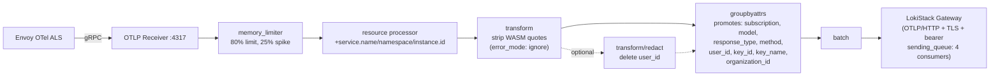
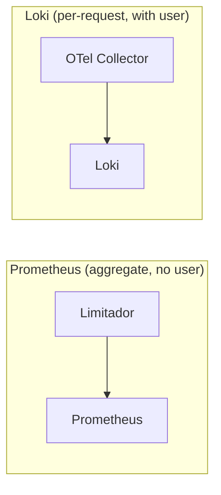

---

name: Envoy OTel Structured Logs
overview: Envoy access logs emitted via OTel Collector to Loki, carrying user_id, subscription, model name, and token counts as structured log records — providing a reliable, independent token accounting channel alongside the existing Limitador-based counters.
todos:

- id: upstream-wasm-shim-tokens
  content: "TODO (deferred): File GitHub issue at kuadrant/wasm-shim requesting set_attribute() for body_values in TokenUsageTask (would eliminate json_to_metadata filter dependency)"
  status: done
- id: upstream-wasm-shim-429
  content: "TODO (deferred): Request WASM shim to inject model info before rate limit evaluation — currently solved via json_to_metadata INSERT_FIRST (extracts model from request body before rate limiter). Upstream fix would make json_to_metadata request_rules redundant."
  status: done
- id: upstream-kuadrant-dual-listener
  content: "TODO (deferred): File issue that HTTP+HTTPS listeners cause duplicate ActionSets leading to 403"
  status: done
- id: pr-envoyfilter
  content: "PR #1035: EnvoyFilter + controller integration. MERGED (2026-07-13). Follow-up: per-tenant gateway EnvoyFilter (jrhyness)."
  status: done
- id: pr-otel-collector
  content: "PR #1032: OTel Collector CR (v1beta1) + RBAC. Branch: feature/otel-collector. Requires Red Hat build of OTel operator. memory_limiter, error_mode:ignore, sending_queue, user_id emission toggle. Needs namespace alignment (openshift-ingress → opendatahub) before merging."
  status: done
- id: pr-dashboards
  content: "PR #995 superseded by PR #1203 (dashboards + proxy + OTel combined). PR #1203 MERGED (2026-07-23). Follow-up PRs: feature/step-fix (chart [2h] fix), feature/user-dropdown-pop (LokiLogQLVariable user dropdown)."
  status: done
- id: multitenant-envoyfilter
  content: "Per-tenant EnvoyFilter: PR #1251 (supersedes #1172). Clean reimplementation from upstream/main with all review feedback incorporated. Moved from LifecycleReconciler to AITenantReconciler. Each tenant gets maas-model-access-logs-<tenant> targeting its gateway. envoyFilterTenantID helper, RBAC get verb, cross-namespace OwnerRef documented, transient delete errors returned. 228 lines of tests."
  status: done
- id: pr999-proxy-fixes
  content: "PR #999 proxy bugs: HTTP/1.0 chunked mismatch, duplicate namespace filter, POST support, kustomize namespace override, RBAC gaps (see Proxy Issues section)"
  status: done
- id: otel-namespace-alignment
  content: "PR #1032: Update service.namespace and kubernetes_namespace_name from openshift-ingress to opendatahub before merging"
  status: done
- id: loki-split-queries-interval
  content: "Loki Operator hardcodes split_queries_by_interval: 30m — breaks time-series chart with unwrap range vectors <= 1h. Workaround applied: graph query changed from [30m] to [2h]. Proper fix: change to 24h on LokiStack (CRD doesn't expose this field — requires Unmanaged mode + configmap patch, or upstream enhancement)."
  status: done
- id: rhoaieng-78515-dropdown-bug
  content: "RHOAIENG-78515: Perses variable dropdown bug affecting LokiLabelValuesVariable (Subscription, Model) on usage dashboards."
  status: done
- id: lokiLogQLVariable-user-dropdown
  content: "Admin dashboard user dropdown: replaced TextVariable (regex input) with LokiLogQLVariable (auto-populated from structured metadata via count by user_id, follows time picker via $__range). Verified on amit.dev cluster (2026-07-22). Shipped with COO 1.5.0 stock Perses image (Loki plugin 0.6.0-beta.0)."
  status: done
- id: pr-step-fix
  content: "Branch feature/step-fix pushed (2026-07-22). PR #1242 created. Increases tokenConsumptionOverTime range vector from [30m] to [2h] on both dashboards. Workaround for Loki split_queries_by_interval: 30m. Also adds response_type!=error filter on subscription/model dropdowns (both dashboards) — error logs have inconsistent model names and unresolved subscriptions. Panel description cleaned up (implementation details moved to YAML comments)."
  status: done
- id: pr-user-dropdown-pop
  content: "Branch feature/user-dropdown-pop pushed (2026-07-22). PR #1243 created. Replaces admin dashboard user TextVariable with LokiLogQLVariable dropdown (admin dashboard only). Auto-populates from structured metadata via count by (user_id). User dropdown is independent (decoupled from subscription/model — no cascading). Uses | keep user_id to prevent series explosion. response_type!=error filter moved to PR #1242."
  status: done
- id: perses-table-values0-bug
  content: "Perses panel bugs — 3 upstream issues filed in perses/perses, 3 PRs submitted to perses/plugins: (1) perses/perses#4270 Table values[0]→values[lastIdx] (PR #736, fix/table-use-last-value). (2) perses/perses#4276 Loki plugin ignores context.mode — always sends query_range; fix dispatches to client.query() for instant mode (PR #737, fix/loki-instant-query-mode). (3) perses/perses#4277 StatChart missing queryOptions:{mode:'instant'} — defaults to range queries; fix adds instant mode matching TimeSeriesTable/HistogramChart pattern (PR #738, fix/statchart-instant-query-mode). All 3 issues cross-linked. Patched image: quay.io/rh-ee-tgitelma/perses-patched:v4-all-fixes (all 3 fixes). Verified on amit.dev — Loki query-frontend logs confirm all stat/table panels arrive as type=instant, time series chart correctly uses type=range."
  status: done
- id: integrate-configreconcile
  content: "DONE: Controller-managed EnvoyFilter lifecycle via `usageLogging` feature gate in Config.Spec (cluster-wide). Integrated into `ensureObservability` method (alongside ensureLimitadorServiceMonitor and ensureUsageDashboard). Controller reads manifest from container filesystem, templates namespace + collector address via structured `patchClusterAddress` helper (unstructured.SetNestedField), applies via SSA with Config ownerReference. Enable/disable toggles create/delete. ObservabilityManifestsPath resolution fixed (traverses up from dashboards dir). Rebased on upstream/main, verified end-to-end on cluster."
  status: done
isProject: false

---

# Envoy OTel Structured Usage Logs — Implementation Record

## Status: COMPLETE — Full Pipeline Deployed and Verified (2026-07-07, updated 2026-07-23)

### Upstream Alignment (2026-07-13)

POC branch rebased on `upstream/main` (42 upstream commits incorporated). All upstream changes now included:

| Area | Upstream change | Status |
|------|----------------|--------|
| **Infra namespace** (#1051, #1120) | `infra-namespace=AUTO` → `odh-ai-gateway-infra` | Included via rebase |
| **MaasTenantConfig** (#1083) | New CRD; reconciler watches MaasTenantConfig | Included via rebase |
| **Config CR** (#1100) | `limitadorScrapeInterval` in ConfigSpec | Merged with `usageLogging` |
| **Monitoring namespace** (#1087) | Explicit `--monitoring-namespace` flag (default `opendatahub`) | Included via rebase |
| **Container hardening** (#1138) | `readOnlyRootFilesystem`, `seccompProfile` | Included via rebase |
| **Privacy** (#1133, #1114) | Hash/redact username, sensitive headers | Included via rebase |
| **EnvoyFilter layout** (#1096) | 8-patch payload-processing in params.go | Included via rebase |

### PR #1035 Merged + Cluster Convention Alignment (2026-07-14)

**PR #1035 merged** (Jul 13) — EnvoyFilter for OTel structured usage logging. Controller-managed via `usageLogging` feature gate. Approved by ahadas + jrhyness.

**Per-tenant EnvoyFilter** (PR #1251, supersedes #1172): Clean reimplementation from `upstream/main` with all review feedback. Moved EnvoyFilter lifecycle from `LifecycleReconciler` into `AITenantReconciler`. Each AITenant gets its own EnvoyFilter (`maas-model-access-logs-<tenant>`) targeting its specific gateway. `AITenantReconciler` reads `Config` CR directly for `usageLogging` flag and watches Config changes to propagate toggles via `mapConfigToAITenants` (namespace-scoped). Changes vs #1172: `envoyFilterTenantID` helper centralizes default→"" mapping, RBAC includes `get` verb, `deleteEnvoyFilterIfExists` takes `efName string` (not `*unstructured`), `applyUsageLogsEnvoyFilter` separated from `ensureUsageLogsEnvoyFilter`, cross-namespace OwnerRef documented, transient cleanup errors returned for retry, collector address uses `.svc` (not `.svc.cluster.local`). 228 lines of tests covering disabled/enabled/named-tenant/delete/targetRefs/naming.

**Cluster aligned to `opendatahub` convention** (Jul 14): The PR #999 user-scoped proxy expects `kubernetes_namespace_name=opendatahub` for security scoping. Aligned the cluster:

| Component | Change |
|-----------|--------|
| OTel Collector resource processor | `kubernetes_namespace_name`: `openshift-ingress` → `opendatahub` |
| OTel Collector resource processor | `service.namespace`: `openshift-ingress` → `opendatahub` |
| EnvoyFilter resource_attributes | `service.namespace`: `openshift-ingress` → `opendatahub` |
| LokiStack | Clean redeployed (deleted PVCs) to flush old-convention data |
| NetworkPolicy | Already had rule for `opendatahub` namespace collectors |

**Note**: EnvoyFilter `service.namespace` is controller-managed (owned by `Config` CR). The OTel Collector's `upsert` processor overrides it regardless, but the controller template should eventually be updated to use `opendatahub`.

### User-scoped Proxy (PR #999) — Deployed and Verified (2026-07-14)

Cherry-picked proxy files from PR #999 (Python rewrite, replaces original Go proxy). Deployed to `kuadrant-system` on `amit.dev.datahub.redhat.com`. User isolation verified end-to-end through dashboards.

**Test results:**

| Test | User | Streams | Users visible | Result |
|------|------|---------|---------------|--------|
| Proxy query | `kube:admin` | 3 | `{'kube:admin'}` | Only admin logs |
| Proxy query | `test-loki-viewer` | 3 | `{'test-loki-viewer'}` | Only viewer logs |
| Cross-isolation | `test-loki-viewer` (limit=50) | 3 | `{'test-loki-viewer'}` | **Cannot see admin logs** |

**Dashboard verification** (logged in as each user via OpenShift console):
- Admin: 291 tokens, 6 successful, 2 rate-limited, 42.9% success rate
- Viewer: 148 tokens, 3 successful, 0 rate-limited, 100% success rate

**Issues found** (see "Proxy Issues" section below for details):
1. HTTP/1.0 + chunked encoding mismatch (code bug)
2. Duplicate `kubernetes_namespace_name` filter injection (code bug)
3. POST method not supported (code limitation)
4. Kustomize namespace override breaks cross-namespace RoleBinding (deployment bug)
5. Missing broader Loki ClusterRole — OPA SAR without `resourceName` (deployment gap)
6. Missing namespace-level view access for OPA matcher (deployment gap)

**Deployment workarounds applied** (no proxy code changes):
- `LOKI_UPSTREAM_URL` overridden to `openshift-logging` (as manifest instructs)
- Created `ClusterRole/loki-application-reader` without `resourceNames` restriction
- Created `RoleBinding/loki-query-proxy-namespace-view` in `opendatahub` for OPA namespace access
- Created `RoleBinding/loki-query-proxy-application-reader` in `opendatahub`

### POC Rebuild and Full Alignment (2026-07-16)

Clean `poc-rebuild` branch created from `upstream/main`, merging all PR branches one-by-one:
1. `origin/feature/otel-collector` (PR #1032) — OTel Collector CR
2. `origin/feature/loki-user-proxy` (PR #999) — Loki tenancy proxy
3. `origin/feature/aitenant-envoy-filter-v2` (PR #1251, supersedes #1172) — Per-tenant EnvoyFilter
4. `origin/feature-loki-admin-dashboard` (PR #995) — Admin dashboard + fixes
5. `origin/feature/loki-user-dashboard` (PR #988) — User dashboard

**Key change**: `self_deployment_controller.go` — removed all EnvoyFilter management code (moved to `AITenantReconciler` per PR #1251), retained OTel Collector + Proxy deployment logic.

**Admin dashboard fixes** (PR #995, `bab47092`):
- **File reorganization**: All Loki dashboards and datasources moved from `deployment/components/observability/observability/dashboards/` to `deployment/components/observability/usage-logs/` (colocated with OTel collector and proxy)
- **Scoped datasource URL fixed**: `kuadrant-system` → `opendatahub.svc.cluster.local` (proxy is deployed in `opendatahub`)

**Deployed and verified on amit.dev cluster**: Controller image built from poc-rebuild, pushed to quay.io, deployed. All components healthy. E2E traffic across 4 models / 3 subscriptions confirmed data flowing to Loki. Rate limiting verified (429s after token budget exhausted).

### Dashboard fixes (2026-07-13, updated 2026-07-14)

Active Users panel: added `| user_id!="-"` to exclude Envoy dash sentinel from distinct user count. Verified against Loki — without filter: 3 users (includes `"-"`), with filter: 2 users (correct). Fix applied to `usage-admin-loki-dashboard.yaml` on POC branch and pending on PR #995 branch.

**Naming alignment (2026-07-14)**: Aligned Loki dashboard panel names with upstream Prometheus dashboard (PR #1156 sentence case convention):
- "Total Tokens" → "Total tokens"
- "Total Successful Requests" → "Total requests" (query changed: no `response_type` filter — counts all requests)
- "Total Rate Limited Requests" → "Total rate limited"
- "Success Rate" → "Success rate"
- "Active Users" → "Active users"
- "Token consumption" (panel) → "Token consumption chart"
- "Token consumption" (layout title) → "Token consumption" (matching PR #1156)
- Removed stale "Grafana filled mock" dev note from admin `tokenConsumptionOverTime` description

**"Total requests" counts all**: Query uses no `response_type` filter — counts hit + rate_limit + error. Consistent with upstream Prometheus `Total requests` (`authorized_calls + limited_calls`).

**Verified on fresh LokiStack** (2026-07-14): Wiped all Loki data (deleted PVCs), redeployed LokiStack, generated fresh traffic. Results with clean data (zero pre-CEL entries):
- Total tokens: 647 (from 15 hits across 3 models)
- Total requests: 76 (15 hit + 35 rate_limit + 26 error = 76, math verified)
- Total rate limited: 35
- Success rate: 19.7% (15/76)
- Active users: 1
- Token consumption chart: 3 models (177 + 226 + 244 = 647, matches total)
- Empty `response_type` entries: **0** (confirms all entries have response_type on fresh deploy)

All core components deployed and verified on clusters `amit.dev.datahub.redhat.com` (ODH), `giteltal.dev.datahub.redhat.com` (ODH), and `ahadas-ahadas-rhoai.dev.datahub.redhat.com` (RHOAI). Pipeline: Envoy → OTel Collector (OpenTelemetryCollector CR) → Loki. All identity fields sourced from Kuadrant WASM plugin's FILTER_STATE (`wasm.kuadrant.auth.identity.*`). Composite filter (path-based suffix match) restricts body parsing to inference paths only. Verified on all platforms.

### Controller Feature Gate: `usageLogging` (2026-07-07)

The EnvoyFilter is controller-managed via `Config.Spec.UsageLogging` (bool, default `false`). Cluster-wide toggle on the singleton `Config/default` CR.

**Per-tenant EnvoyFilter (PR #1251, updated 2026-07-23)**: Each `AITenant` gets its own EnvoyFilter (`maas-model-access-logs-<tenant>`) managed by `AITenantReconciler`:

- **Enable** (`usageLogging: true`): reads EnvoyFilter YAML from container filesystem (`/deployment/components/observability/usage-logs/envoy-otel-access-log.yaml`), templates collector address via `patchClusterAddress`, patches `spec.targetRefs[0].name` to the tenant's gateway (`patchEnvoyFilterTargetGateway`), names the resource via `UsageLogsEnvoyFilterName(envoyFilterTenantID(aitenant))`, sets Config ownerReference (cross-namespace, documented), server-side applies with `maas-controller` fieldOwner.
- **Disable** (`usageLogging: false` or field absent): deletes the per-tenant EnvoyFilter if it exists.
- **Config watch**: `SetupWithManager` watches `Config` with `GenerationChangedPredicate`. `mapConfigToAITenants` lists AITenants in the configured namespace and enqueues them — propagates `usageLogging` toggles immediately.
- **Config NotFound**: deletes existing EnvoyFilter via `deleteEnvoyFilterIfExists` — cleans up stale resources if Config is removed.
- **Cleanup on AITenant delete**: `reconcileAITenantDelete` removes the per-tenant EnvoyFilter. Transient errors are returned for retry; only NotFound/CRD-not-installed are swallowed.
- **Cross-namespace ownership**: Config is cluster-scoped, EnvoyFilter is namespaced. Kubernetes GC does not enforce cross-namespace owner refs. Documented as intentional: Config is managed by a higher-level operator, reconcileAITenantDelete cleans up explicitly, and ensureUsageLogsEnvoyFilter deletes on disable.
- **Graceful degradation**: skips if EnvoyFilter CRD not installed, manifest file not found, or `gatewayRef` not yet populated.
- **RBAC**: `get;create;patch;delete` (defensive — `get` added even though SSA doesn't require reads).
- **`envoyFilterTenantID` helper**: default AITenant maps to `""` (producing base name `maas-model-access-logs`); named tenants get suffix (`maas-model-access-logs-<name>`).

`LifecycleReconciler.ensureObservability` no longer manages EnvoyFilters directly — only `ensureLimitadorServiceMonitor` and `ensureUsageDashboard` remain.

Files changed (original EnvoyFilter PR #1035, merged):
- `maas-controller/api/maas/v1alpha1/config_types.go` — added `UsageLogging *bool` to `ConfigSpec` (with GDPR warning comment)
- `maas-controller/pkg/controller/maas/self_deployment_controller.go` — `ensureObservability` no longer calls `ensureUsageLogsEnvoyFilter`; `patchClusterAddress` moved to `aitenant_controller.go`
- `maas-controller/cmd/manager/main.go` — wires `GatewayNamespace`
- `deployment/base/maas-controller/crd/bases/maas.opendatahub.io_configs.yaml` — added `usageLogging` field

Files changed (per-tenant EnvoyFilter, PR #1251):
- `maas-controller/pkg/controller/maas/aitenant_controller.go` — `envoyFilterTenantID`, `ensureUsageLogsEnvoyFilter`, `deleteEnvoyFilterIfExists`, `applyUsageLogsEnvoyFilter`, `patchEnvoyFilterTargetGateway`; Config watch in `SetupWithManager` + `mapConfigToAITenants` (namespace-scoped); EnvoyFilter cleanup in `reconcileAITenantDelete` (transient errors returned); RBAC marker `get;create;patch;delete`
- `maas-controller/pkg/controller/maas/aitenant_controller_test.go` — 228 lines: `efManifestPath` helper, `TestAITenantEnsureUsageLogsEnvoyFilter` (disabled, default tenant, named tenant, delete), `TestPatchEnvoyFilterTargetGateway`, `TestUsageLogsEnvoyFilterName`
- `maas-controller/pkg/platform/tenantreconcile/constants.go` — `UsageLogsEnvoyFilterName` naming function
- `maas-controller/pkg/controller/maas/self_deployment_controller.go` — removed `ensureUsageLogsEnvoyFilter`, `applyUsageLogsEnvoyFilter`, `deleteEnvoyFilterIfExists`, `envoyFilterManifestPath` const, `envoyFilterName` const, `EnvoyFilterManifestPath` struct field, RBAC marker for envoyfilters
- `maas-controller/pkg/controller/maas/self_deployment_controller_test.go` — removed `TestEnsureUsageLogsEnvoyFilter`
- `maas-controller/cmd/manager/main.go` — wired `MonitoringNamespace` into `AITenantReconciler`

**EnvoyFilter** (`maas-model-access-logs`): Composite filter wrapping native `json_to_metadata` with path-based suffix matching (`:path` ends with `/v1/chat/completions` or `/v1/completions`) + companion Lua SSE filter. Non-inference requests skip body parsing entirely. Non-streaming: `json_to_metadata` extracts model/tokens from JSON body. Streaming SSE: companion Lua filter uses `bodyChunks()` to iterate chunks without buffering, extracts tokens from the final SSE event (requires model server to provide `usage` in final chunk via `stream_options.include_usage=true` or `--enable-force-include-usage`). `INSERT_FIRST` for 429 model preservation. CEL filter for inference-only POST logging. `response_type` classification (`hit`/`rate_limit`/`error`). All identity from FILTER_STATE (`wasm.kuadrant.auth.identity.*`). 12 attributes per log record.

**OTel Collector**: `OpenTelemetryCollector` CR (v1beta1) in `opendatahub` namespace via Red Hat build of OpenTelemetry operator (PR #1032). Files in `usage-logs/otel-collector.yaml` + `otel-collector-rbac.yaml`. Pipeline: `resource` → `batch` → `transform` (strip WASM quotes, `error_mode: ignore`) → `groupbyattrs` (5 stream labels) → Loki.

**Dashboards**: Two Perses dashboards in `opendatahub` namespace (PR #995, combined) using `response_type` stream labels for efficient querying. All files in `observability/dashboards/`. LokiStack patched for explicit stream label control.

---

## Architecture Before Our Changes

Before this work, the MaaS platform had **no independent audit log** for token consumption. All observability relied on **Limitador counters exposed as Prometheus metrics**. No Loki, no OTel Collector, no structured usage logs.

### Pre-Change Request Flow


No OTel ALS, no `json_to_metadata`, no OTel Collector, no Loki. Response body consumed by WASM shim for rate limiting only.

### What Was Missing

| Gap | How We Solved It |
| --- | --- |
| No independent audit log | OTel ALS emits a structured log for every request |
| No per-request data | 12 structured attributes per log record in Loki |
| High-cardinality `user` in Prometheus | Per-user data moved to Loki structured metadata |
| Dead `tier` label | Replaced with `subscription` everywhere |
| No token breakdown | `tokens_prompt` and `tokens_completion` extracted by `json_to_metadata` |

---

## Architecture (Final — Verified)

### Complete Request/Response Flow


### OTel Collector Pipeline



### Dual Data Paths



- **Prometheus**: `authorized_hits`, `authorized_calls`, `limited_calls` with labels `subscription`, `model`, `organization_id`, `cost_center`
- **Loki**: 12 attributes per inference request — `response_code`, `response_type`, `user_id`, `subscription`, `groups`, `key_id`, `key_name`, `organization_id`, `tokens_total`, `tokens_prompt`, `tokens_completion`, `model`. All identity from FILTER_STATE. `key_name` stored as structured metadata (high cardinality); remaining identity fields as stream labels.

### Data Flow (Step by Step)

1. **Client sends request** with Bearer SA token (or `sk-oai-*` API key)
2. **Composite filter (INSERT_FIRST)** — `:path` suffix matching (`/v1/chat/completions`, `/v1/completions`). If matched, `json_to_metadata` `request_rules` extract model from JSON request body (`on_present` only — missing model simply doesn't set metadata, no "unknown" fallback). Non-inference requests skip entirely.
3. **WASM shim** calls Authorino (kubernetesTokenReview + subscription-info callout). Stores identity in `filter_state` (userid, keyId, keyName, selected_subscription, groups). Access log uses FILTER_STATE for ALL 6 identity fields (`user_id`, `subscription`, `groups`, `key_id`, `key_name`, `organization_id`). FILTER_STATE survives 429 (set before rate limit evaluation).
4. **WASM shim** evaluates rate limit (Limitador). On 429, sends local reply — `filter_state` is already set (all identity fields available). Model already extracted from request body.
5. **Request forwarded** to model server (or 429 local reply if rate limited)
6. **Model server responds** — Non-streaming: `json_to_metadata` `response_rules` extract tokens and authoritative model from JSON body. Streaming SSE: `json_to_metadata` fires `on_error` (content-type mismatch, zero buffering), then companion Lua filter iterates `bodyChunks()` to extract tokens from the last SSE event without buffering. On 429, `on_missing` fires but model not overwritten (only `on_present` configured for response model rule).
7. **OTel ALS** fires if CEL filter matches (POST to `/v1/chat/completions` or `/v1/completions`). Emits 12 attributes + 2 resource attributes via gRPC to OTel Collector.
8. **OTel Collector** pipeline: memory_limiter → resource → transform (strip quotes, `error_mode: ignore`) → [optional: transform/redact (delete user_id)] → groupbyattrs (promote 8 keys to resource attributes) → batch → Loki via OTLP/HTTP (sending_queue enabled)

### Perses Dashboard Architecture

Two dashboards in `opendatahub` namespace (PR #1203). All files in `deployment/components/observability/usage-logs/`:
- **`dashboard-4-maas-usage-logs-admin`** — admin view, all users, uses `usage-logs-all` datasource (direct to LokiStack). User filter via `LokiLogQLVariable` (auto-populated dropdown from structured metadata via `count by (user_id) | keep user_id`, independent of subscription/model, follows dashboard time picker via `[$__range]`). Subscription/Model dropdowns via `LokiLabelValuesVariable` (stream labels), filtered `response_type!="error"`.
- **`dashboard-5-maas-usage-logs`** — per-user view, uses `usage-logs-multi-tenancy` datasource (through `usage-logs-tenancy-proxy`). Auto-filtered by user identity. Subscription/Model dropdowns also filter `response_type!="error"`.

**Important**: These dashboards are NOT controller-managed. They must be applied manually via `oc apply`. The controller only manages the old `dashboard-3` (which should be deleted as stale). The Perses operator must be running for the conversion webhook during `oc apply`.

Two datasources in `opendatahub` namespace (PR #1203). Files in `deployment/components/observability/usage-logs/`:
- **`usage-logs`** — direct to LokiStack gateway (SA token auth + kubernetesAuth + TLS). URL: `https://usage-gateway-http:8080/api/logs/v1/application`
- **`usage-logs-multi-tenancy`** — routes through `usage-logs-tenancy-proxy` at `https://usage-logs-tenancy-proxy:8443` (kubernetesAuth + TLS + Perses secret)

**Datasource FQDN requirement**: The datasource URLs in the source files use short service names (e.g. `usage-gateway-http:8080`). These resolve only if Perses runs in the same namespace as the services (`opendatahub`). When Perses runs in a different namespace (e.g. `openshift-operators`), the Perses internal DB must be patched with FQDNs (e.g. `usage-gateway-http.opendatahub.svc:8080`) via the Perses REST API. The controller handles this FQDN substitution when it deploys datasources.

**usage-logs-tenancy-proxy** deployed to `opendatahub` namespace (controller-managed) — Python service that intercepts Loki queries and injects `user_id="<caller>"` filter based on TokenReview of the caller's Kubernetes token. Builds upstream URL dynamically from pod namespace: `https://usage-gateway-http.{namespace}.svc:8080/api/logs/v1/application`.

**Table panel**: Both dashboards have a "Usage breakdown" table with three Loki queries merged via `MergeSeries` transform. All table queries use `[$__range]` (negative offset removed — not supported by this Loki version). Table columns group by `model`, `subscription`, `key_name` (structured metadata):
- **Q1**: Tokens per model/subscription/key_name — `sum by (model, subscription, key_name) (sum_over_time(... | unwrap tokens_total [$__range]))`
- **Q2**: Successful requests per model/subscription/key_name — `sum by (model, subscription, key_name) (count_over_time(... response_type="hit" ... [$__range]))`
- **Q3**: Rate-limited requests per model/subscription/key_name — `sum by (model, subscription, key_name) (count_over_time(... response_type="rate_limit" ... [$__range])) or (... response_type="hit" ... * 0)`. The `or (hit * 0)` zero-pads model/subscription/key_name tuples with no rate-limited traffic, ensuring Q3 returns the same label sets as Q1/Q2 (required for `MergeSeries` to join correctly — it fails when queries return different numbers of series).

**`key_name` as structured metadata**: `key_name` is intentionally NOT a Loki stream label (high cardinality — every API key has a unique name). It is stored as structured metadata but is still queryable in `sum by` clauses and pipeline filters (`| key_name="my-key"`). The `key_id` UUID is present in Loki logs but deliberately excluded from dashboard display — `key_name` is the human-readable identifier shown to users.

### Deployment Topology

| Namespace | Resources |
|-----------|-----------|
| `opendatahub` | usage-logs-tenancy-proxy (deployment, SA, RBAC, service), Perses dashboards + datasources, OpenTelemetryCollector CR `usage-logs` + service-ca ConfigMap + ClusterRoleBinding `usage-logs-writer`, LokiStack `usage` (gateway service: `usage-gateway-http`) — all files in `usage-logs/` |
| `openshift-ingress` | EnvoyFilter `maas-model-access-logs` (lifecycle), `maas-model-access-logs-<tenant>` (per-tenant) |
| `openshift-operators` | Red Hat build of OpenTelemetry operator (Subscription `opentelemetry-product`), Perses server + operator |

---

## Design Decisions

| Decision | Rationale |
| --- | --- |
| `json_to_metadata` + Lua SSE companion | Native Envoy filter for JSON responses — replaced Lua after ahadas review (PR #1031). Wrapped in Composite filter with `:path` suffix matching to restrict body parsing to inference paths only. Companion Lua filter handles SSE via `bodyChunks()` (zero-buffering chunk iteration). `on_present` only for model prevents "unknown" log pollution. See "Why json_to_metadata replaced Lua" section below. |
| Composite filter (path matching) | Wraps `json_to_metadata` in `ExtensionWithMatcher` with `HttpRequestHeaderMatchInput` suffix match on `:path`. Only `/v1/chat/completions` and `/v1/completions` trigger body parsing. Eliminates unnecessary buffering of non-inference traffic (`/v1/models`, `/maas-api/*`, health checks). Resolves the "body buffering scope tradeoff" that existed with bare `json_to_metadata`. |
| CEL filter (inference-only) | Only `/v1/chat/completions` and `/v1/completions` logged. POST only. Eliminates noise from `/v1/models`, health checks, etc. |
| `response_type` via CEL | `hit`/`rate_limit`/`error` — low cardinality stream label for Loki. Exact `response_code` still available as structured metadata. Dashboard stat queries use `response_type` for filtering (e.g. "Total rate limited" = `response_type="rate_limit"`). "Total requests" counts all response types. Success rate = `hit / all`. |
| Identity: All from FILTER_STATE | All 6 identity fields sourced from `%FILTER_STATE(wasm.kuadrant.auth.identity.*:PLAIN)%`. FILTER_STATE is internal Envoy state (never on wire, not spoofable, survives 429). Per ahadas review (2026-07-01): simplifies architecture, single source of truth. |
| EnvoyFilter (not Istio Telemetry CR) | Telemetry API lacks custom OTel attributes; `ConfigMap/istio` owned by ingress-operator |
| `sed` placeholders (not `envsubst`) | Kustomize can't target YAML-in-YAML |
| OpenTelemetryCollector CR (not raw Deployment) | Upstream alignment with Red Hat build of OTel operator. Operator manages Deployment, Service, health probes, config volume. Replaces raw ConfigMap+Deployment+Service. Requires `opentelemetry-product` operator from OperatorHub. |
| `memory_limiter` first in pipeline | OTel Collector best practice — prevents OOM under burst. 80% limit, 25% spike limit, 5s check interval. |
| `error_mode: ignore` on transform | Malformed attributes (missing field, wrong type) silently skip the statement instead of dropping the entire log record. |
| `sending_queue` on exporter | Decouples collection from export. 4 consumers, 500-item queue. Prevents backpressure from Loki slowdowns from blocking the receiver. |
| `user_id` emission toggle (off by default) | `user_id` sensitive data emission disabled by default — deleted before Loki via `transform/redact`. To enable, uncomment `delete_key` in `transform/redact` and `user_id` in `groupbyattrs.keys` (2-line toggle). Dashboard queries use `customAllValue: ".*"` so `user_id=~".*"` matches entries with or without user_id. Only `user_id` is considered sensitive; `groups` is not. |
| Red Hat OTel Collector image | `ghcr.io` inaccessible from cluster; pinned Red Hat SHA |
| LokiStack bearer token auth | Gateway requires HTTPS + bearer (not `X-Scope-OrgID` + HTTP) |
| `key_name` as structured metadata (not stream label) | High cardinality — every API key has a unique user-provided name. Promoted to resource attribute via `groupbyattrs` but NOT included in LokiStack `streamLabels.resourceAttributes`. Queryable in `sum by` and pipeline filters but does not pollute Loki index. `key_id` (UUID) IS a stream label (indexed for fast filtering) but hidden from dashboards (human readability). |
| Dashboard: `key_name` in table only | `key_name` appears in the "Usage breakdown" table via `sum by (key_name)` grouping. It is NOT a dropdown variable and does not need to be — it is a per-row detail, not a filter. Unrelated to the `user` dropdown variable. |
| Dashboard: `user` dropdown via `LokiLogQLVariable` | Admin dashboard auto-populates the user dropdown via `LokiLogQLVariable` with `count by (user_id) (count_over_time({service_name="models-as-a-service"} | user_id!="" | user_id!="-" | keep user_id [$__range]))`. This bypasses `/label/values` (which requires stream labels) by running a LogQL metric query that works on structured metadata. Uses `[$__range]` to follow the dashboard time picker. Independent of subscription/model (decoupled — no cascading). Variable declared first in the YAML. `| keep user_id` drops other structured metadata before aggregation to prevent series explosion at scale. |
| Dashboard: `response_type!="error"` on dropdowns | Subscription and model `LokiLabelValuesVariable` matchers filter `response_type!="error"` on both dashboards. Error logs can have different model name formats (e.g. KServe routing name vs vLLM backend name) — filtering prevents polluted dropdown options. |

### Loki Stream Labels vs Structured Metadata (Updated 2026-07-20, aligned to PR #1203)

Controlled by LokiStack `spec.limits.global.otlp.streamLabels.resourceAttributes` + OTel Collector `groupbyattrs` processor.

**Alignment principle**: LokiStack `streamLabels` must match exactly what the OTel Collector `groupbyattrs` promotes + the static resource attributes (`service.name`, `kubernetes_namespace_name`). Nothing more.

**OTel Collector `groupbyattrs` keys** (source of truth, PR #1032): `subscription`, `model`, `response_type` — only 3 keys.

**LokiStack `streamLabels.resourceAttributes`** (must match): `service.name`, `subscription`, `model`, `response_type`, `kubernetes_namespace_name` — 5 total (3 from groupbyattrs + 2 static resource attributes).

**`service.name` changed** (PR #1203): `maas-gateway` → `models-as-a-service`. Both the OTel Collector `resource` processor and the EnvoyFilter `resource_attributes` use `models-as-a-service`. All dashboard queries use `{service_name="models-as-a-service", ...}`.

| Field | Loki Placement | Source | In `groupbyattrs` | In LokiStack `streamLabels` |
| --- | --- | --- | --- | --- |
| `service_name` | **Stream label** | Resource attribute (static, `models-as-a-service`) | No (static) | Yes |
| `subscription` | **Stream label** | `groupbyattrs` promoted | **Yes** | Yes |
| `model` | **Stream label** | `groupbyattrs` promoted | **Yes** | Yes |
| `response_type` | **Stream label** | `groupbyattrs` promoted | **Yes** | Yes |
| `kubernetes_namespace_name` | **Stream label** | Resource attribute (static, `${env:NAMESPACE}`) | No (static) | Yes |
| `log_type` | **Stream label** | Resource attribute (static, `application`) | No (static) | Auto |
| `user_id` | **Structured metadata** | Log attribute | No | No |
| `key_id` | **Structured metadata** | Log attribute | No | No |
| `key_name` | **Structured metadata** | Log attribute (high cardinality) | No | No |
| `organization_id` | **Structured metadata** | Log attribute | No | No |
| `method` | **Structured metadata** | Log attribute | No | No |
| `response_code` | **Structured metadata** | Log attribute | No | No |
| `tokens_total`, `tokens_prompt`, `tokens_completion` | **Structured metadata** | Log attribute | No | No |
| `groups` | **Structured metadata** | Log attribute | No | No |

> **5 stream labels** (low cardinality, indexed) — enables `{response_type="rate_limit"}` as a stream selector. Aligned to OTel Collector `groupbyattrs` + static resource attributes only.
> **Structured metadata** queryable via pipeline filters (`| user_id=~"user-1"`) and `sum by` clauses (`sum by (user_id, model, subscription) (...)`). Verified working on Loki 3.x — `sum by` on structured metadata returns correct results.
> **User variable** (updated 2026-07-26): Admin dashboard now uses `LokiLogQLVariable` (auto-populated dropdown) instead of the previous `TextVariable` (regex input). The `LokiLogQLVariable` runs `count by (user_id) (count_over_time({service_name="models-as-a-service"} | user_id!="" | user_id!="-" | keep user_id [$__range]))` via Loki's `/loki/api/v1/query` (instant) endpoint — works on structured metadata without requiring `user_id` to be a stream label. Uses `[$__range]` to follow the dashboard time picker. Independent of subscription/model (decoupled — no cascading). Variable declared first in the YAML (before subscription/model). `| keep user_id` drops all other structured metadata before aggregation to prevent series explosion from high-cardinality metadata fields (Loki 3.x feature). `customAllValue: ".*"` enables "All" to match all users. Subscription/model dropdowns filter `response_type!="error"` to exclude error-only entries (error logs have inconsistent model names and unresolved subscriptions). User dropdown does NOT filter errors — `user_id!="-"` already handles garbage values. Verified on cluster: returns distinct `user_id` values (`kube:admin`, `test-loki-viewer`, etc.).
> **Previous state**: Earlier POC had `user_id`, `key_id`, `organization_id`, `method` as stream labels via manual LokiStack additions. These were removed (2026-07-20) to align with the OTel Collector PR definition.

### LokiStack Naming Convention (Updated 2026-07-20)

LokiStack must be named `usage` to produce the gateway service `usage-gateway-http` — matching the OTel Collector exporter endpoint (`usage-gateway-http.${env:NAMESPACE}.svc:8080`) and the proxy's dynamic URL construction (`usage-gateway-http.{namespace}.svc:8080`). Previous POC used `maas-loki` (service: `maas-loki-gateway-http`) which was a deviation.

### `verify-models-and-limits.sh` Script Fix (2026-07-20)

The script originally used the API key (`$TOKEN`) for model discovery and inference. Two issues:
1. `/maas-api/v1/models` endpoint only accepts OC bearer tokens, not API keys (returns 401).
2. API key is bound to a single subscription (highest priority), causing 403 on models outside that subscription.

Fix: Changed model discovery, inference, and rate limit test calls to use `$OC_TOKEN` (OpenShift bearer token). This allows the gateway to use the user's full identity to select the appropriate subscription per model, matching the production flow.

### `aitenant_controller.go` EnvoyFilter Constants (2026-07-23)

PR #1251: `envoyFilterManifestPath` const now lives in `aitenant_controller.go` (moved from `self_deployment_controller.go` which no longer manages EnvoyFilters). `patchClusterAddress` remains in `self_deployment_controller.go` (shared across both controllers — same Go package).

---

## Known Issue: Perses Panel Query Mode Bugs (3 Fixes, 3 Issues)

**Upstream issues filed** (2026-07-17, updated 2026-07-20):
- [perses/perses#4270](https://github.com/perses/perses/issues/4270) — Table `values[0]` (stale data) → PR #736
- [perses/perses#4276](https://github.com/perses/perses/issues/4276) — Loki plugin ignores `context.mode` → PR #737
- [perses/perses#4277](https://github.com/perses/perses/issues/4277) — StatChart missing instant mode → PR #738

Three interacting bugs in Perses cause incorrect or empty dashboard values, especially with Loki datasources on large time ranges (14d+).

### Bug 1: Table always picks `values[0]` (stale data)

**Root cause** in `table/src/table-data-utils.ts`: `buildRawTableData()` hardcodes `ts.values[0][1]` — always the **first** data point from range query results, never the last.

```typescript
// The bug:
columnValue = ts.values[0][1];  // ALWAYS index [0], first data point
```

**Impact**: `query_range` returns multiple steps. The first step covers a stale window; the last step is current. Table shows stale values.

### Bug 2: Loki plugin ignores `context.mode`

`getLokiTimeSeriesData()` always calls `client.queryRange()` regardless of `context.mode`. When a panel requests instant mode (e.g. Table without column plugins), the Loki plugin ignores it and sends `query_range` — unlike the Prometheus plugin which checks `context.mode` and dispatches to `instantQuery()` vs `rangeQuery()`.

### Bug 3: StatChart never requests instant mode

StatChart plugin definition has no `queryOptions` property. Without it, `context.mode` defaults to `'range'`. Even after fixing the Loki plugin (Bug 2), StatChart panels still get range queries because no panel sets the mode.

Other Perses panels already set this correctly: `TimeSeriesTable` and `HistogramChart` both declare `queryOptions: { mode: 'instant' }`. `HeatMapChart` explicitly declares `{ mode: 'range' }`. `TimeSeriesChart` omits it (defaults to range — correct for time series). StatChart was the only aggregate-value panel missing the declaration.

### Why range queries fail on large time ranges

Loki's `split_queries_by_interval` splits `query_range` requests into sub-queries (e.g. 14d → 336 hourly splits). Each sub-query evaluates the range vector independently, producing fragmented or empty results. The instant query endpoint (`/loki/api/v1/query`) does **not** split — it evaluates the full range vector (e.g. `count_over_time(... [14d])`) at a single point in time.

Reference: [Grafana Loki HTTP API — instant queries](https://grafana.com/docs/loki/latest/reference/loki-http-api/#query-loki) — the `/loki/api/v1/query` endpoint accepts a `query` parameter with range vectors and a `time` parameter for the evaluation timestamp. This evaluates the entire range vector in one pass, unlike `/loki/api/v1/query_range` which evaluates at each step.

### Fixes submitted (2026-07-19, issues filed 2026-07-20)

Three upstream PRs to [`perses/plugins`](https://github.com/perses/plugins), each with a dedicated tracking issue in [`perses/perses`](https://github.com/perses/perses):

1. **[PR #736](https://github.com/perses/plugins/pull/736): Table fix** ([#4270](https://github.com/perses/perses/issues/4270)) — branch `fix/table-use-last-value`: `ts.values[0]` → `ts.values[ts.values.length - 1]` in `table/src/table-data-utils.ts`. Added empty array guard.

2. **[PR #737](https://github.com/perses/plugins/pull/737): Loki instant query** ([#4276](https://github.com/perses/perses/issues/4276)) — branch `fix/loki-instant-query-mode`: Check `context.mode` in `loki/src/queries/loki-time-series-query/get-loki-time-series-data.ts` — dispatch to `client.query()` for instant mode. Added `convertVectorToTimeSeries()` for vector responses. Updated `LokiTimeSeriesQueryResponse` type.

3. **[PR #738](https://github.com/perses/plugins/pull/738): StatChart instant mode** ([#4277](https://github.com/perses/perses/issues/4277)) — branch `fix/statchart-instant-query-mode`: Add `queryOptions: { mode: 'instant' }` to the StatChart plugin definition in `statchart/src/StatChart.ts`. Consistent with `TimeSeriesTable` and `HistogramChart`.

### Patched image

**Current**: `quay.io/rh-ee-tgitelma/perses-patched:v4-all-fixes` — all 3 fixes baked into a single image. Built with `ubi-micro` base, Perses binary + plugins extracted from upstream image. Custom `entrypoint.sh` starts Perses, waits for plugin extraction, then copies 5 patched JS files over the extracted plugins:

| Patched file | Plugin path | Fix |
|---|---|---|
| `federation-patched.js` | `Table-0.11.2/__mf/js/async/__federation_expose_Table.*.js` | `values[lastIdx]` |
| `lib-esm-patched.js` | `Table-0.11.2/lib/table-data-utils.js` | `values[lastIdx]` |
| `lib-cjs-patched.js` | `Table-0.11.2/lib/cjs/table-data-utils.js` | `values[lastIdx]` |
| `loki-query-patched.js` | `Loki-0.6.0-beta.0/__mf/js/async/__federation_expose_LokiTimeSeriesQuery.*.js` | `context.mode` dispatch |
| `statchart-patched.js` | `StatChart-0.12.1/__mf/js/async/__federation_expose_StatChart.*.js` | `queryOptions:{mode:"instant"}` |

Previous images: `v2-loki-fix` (table + Loki only), `v3-statchart-fix` (had JS syntax error — extra `}` brace). Use `v4-all-fixes` only.

To deploy on any cluster:
```bash
oc patch statefulset perses -n openshift-operators --type='json' -p='[
  {"op":"replace","path":"/spec/template/spec/containers/0/image","value":"quay.io/rh-ee-tgitelma/perses-patched:v4-all-fixes"},
  {"op":"replace","path":"/spec/template/spec/containers/0/imagePullPolicy","value":"Always"}
]'
```

### Verified end-to-end (2026-07-19)

**Loki query-frontend logs** confirm correct query dispatch after all 3 fixes:

| Panel type | Query type at Loki | Correct? |
|---|---|---|
| StatChart (Total tokens, Total requests, etc.) | `type=instant` | ✓ |
| Table (Usage breakdown) | `type=instant` | ✓ |
| Time series chart (Token consumption) | `type=range` | ✓ (needs data points over time) |

**Dashboard numbers verified** against CSV export (14-day window, amit.dev cluster):

| Panel | Dashboard | CSV / Loki | Match |
|---|---|---|---|
| Total tokens | 17K | 17,085 | ✓ |
| Total requests | 1K | ~1,435 (982 in table + ~453 hidden 403s) | ✓ |
| Total rate limited | 504 | 504 | ✓ |
| Success rate | 33.3% | 478/~1,435 = 33.3% | ✓ |
| Active users | 5 | 5 (kube:admin, alice, bob, test-loki-viewer, SA) | ✓ |

**Note on "Total requests" vs table total**: The "Total requests" stat panel query uses no `response_type` filter — it counts all log lines (200 + 429 + 403 + other). The table only shows columns for successful (hit) and rate limited, so ~453 additional 403/error requests appear in the stat panel but not in the table. This is correct — the success rate formula `hit / all` accounts for all response types.

**Sorting limitation with StatChart column workaround**: When table value columns use `plugin: { kind: StatChart }`, the cell value is a PanelData object (not a scalar). Sorting compares objects instead of numbers — broken. The JS patch (`values[-1]`) on the original dashboard gives both correct numbers AND working sorting.

---

## Known Issue: Loki `split_queries_by_interval` Breaks Time-Series Chart (2026-07-21)

**Symptom**: "Token consumption chart" panel shows "No data" on both admin (`dashboard-4`) and user (`dashboard-5`) dashboards, while stat panels and table work correctly.

**Root cause**: The Loki Operator [hardcodes `split_queries_by_interval: 30m`](https://github.com/grafana/loki/blob/main/operator/internal/manifests/internal/config/loki-config.yaml) in the generated `limits_config`. The chart query used `sum_over_time(... | unwrap tokens_total [30m])` — when the range vector equals the split interval, Loki's query frontend splitting produces non-deterministic empty results at chunk boundary points. This is a [well-known community issue](https://github.com/grafana/loki/issues/5123) since Loki 2.5.0 changed the default from `0` (disabled) to `30m`.

**Evidence** (tested via Perses API proxy on `ahadas-rhoai2` cluster):
- `[30m]` range vector → empty results (`splits: 2` in Loki stats confirms splitting)
- `[1h]` range vector → empty results
- `[2h]` range vector → data returned consistently
- `[6h]` range vector → data returned consistently
- Stat panels unaffected — they use `[$__range]` which triggers instant queries (via our [Perses patch](https://github.com/perses/perses/issues/4277)), bypassing the splitting entirely

**Upstream references**:
- [grafana/loki#4613](https://github.com/grafana/loki/issues/4613) — "Datasource proxy returning too many outstanding requests" (Grafana Labs engineer confirms `30m` default is problematic for smaller clusters)
- [grafana/loki#5123](https://github.com/grafana/loki/issues/5123) — "Dashboard shows too many outstanding requests after upgrade" (community consensus: change to `24h`)
- [grafana/loki#9688](https://github.com/grafana/loki/issues/9688) — Config placement clarification; user confirms `30m` didn't work, `24h` fixed it
- [Loki 2.5.0 release notes](https://grafana.com/docs/loki/latest/release-notes/v2-5/) — Documents the `30m` default change
- [Loki Operator config template](https://github.com/grafana/loki/blob/main/operator/internal/manifests/internal/config/loki-config.yaml) — `split_queries_by_interval: 30m` hardcoded, not exposed in LokiStack CRD

**Workaround applied** (2026-07-21, updated 2026-07-26): Changed the graph query range vector from `[30m]` to `[2h]` in both dashboard source files and on the live cluster. Only the `tokenConsumptionOverTime` panel was modified. Stat panels and table queries remain unchanged (`[$__range]`). Panel description cleaned up — technical details (`[2h]` rationale, `split_queries_by_interval` reference) moved to YAML comments; user-facing description simplified.

**Limitation of workaround**: For dashboard time picker ranges shorter than 2h, the chart shows a 2h rolling sum instead of matching the selected window — values appear inflated compared to stat panels (which correctly use the selected range). For time picker ranges >= 2h, the chart behaves correctly.

**Proper fix**: Change `split_queries_by_interval` to `24h` on the LokiStack. The LokiStack CRD does not expose this field — it's hardcoded in the Loki Operator's Go template. Options:
1. Set LokiStack to `Unmanaged` and patch the configmap manually ([procedure from netobserv](https://github.com/netobserv/documents/blob/main/loki_config.md))
2. File upstream enhancement for the Loki Operator to expose `split_queries_by_interval` in the LokiStack CRD

---

## LokiLogQLVariable for User Dropdown (2026-07-22)

**Problem**: Admin dashboard user filter was a `TextVariable` (regex input, `default=.*`). Admins had to manually type user patterns. Auto-populating a dropdown was blocked because `user_id` is structured metadata (not a stream label) — `LokiLabelValuesVariable` only calls `/loki/api/v1/label/{name}/values` which requires stream labels.

**Solution**: Replaced with `LokiLogQLVariable` (available in Loki plugin `0.6.0-beta.0`, shipped with COO 1.5.0 stock Perses image — no custom image required for this feature). The plugin runs a LogQL metric query via `/loki/api/v1/query` (instant endpoint) and extracts unique values from the results. `count by (user_id)` works on structured metadata in Loki 3.x — no stream label changes required.

**Configuration** (admin dashboard only — user dashboard has no user variable, proxy handles scoping):

```yaml
- kind: ListVariable
  spec:
    name: user
    display:
      name: "User"
    allowMultiple: true
    allowAllValue: true
    customAllValue: ".*"
    defaultValue: "$__all"
    plugin:
      kind: LokiLogQLVariable
      spec:
        datasource:
          kind: LokiDatasource
          name: usage-logs-all
        expr: 'count by (user_id) (count_over_time({service_name="models-as-a-service"} | user_id!="" | user_id!="-" | keep user_id [$__range]))'
        labelName: user_id
```

**Design decisions**:
- **`[$__range]` follows dashboard time picker**: Consistent with how `LokiLabelValuesVariable` (subscription, model) respects the selected time range. Users shown in the dropdown match the data window visible in the panels.
- **`| keep user_id`**: Drops all structured metadata fields except `user_id` before `count_over_time` aggregation. Without it, Loki materializes series for every unique combination of ALL metadata fields (`user_id` × `key_id` × `key_name` × `tokens_*` × ...) before `count by` collapses them — at scale this hits `max_query_series`. With `| keep`, only unique `user_id` values survive. Loki 3.x feature, verified on deployed LokiStack.
- **Independent (not cascading)**: User dropdown is decoupled from subscription/model — no `subscription=~"$subscription"` or `model=~"$model"` in the expr. Variable declared first in YAML. Rationale: cascading created tight coupling and confusing UX when no subscription/model was selected.
- **`user_id!="" | user_id!="-"`**: Excludes sentinel values from dropdown. Dash (`-`) appears on 403/error entries where identity wasn't available. No additional `response_type!="error"` needed — `user_id!="-"` already handles garbage.
- **`customAllValue: ".*"`**: "All" generates a regex that matches all users, consistent with existing subscription/model variables.
- **`allowMultiple: true`**: Multi-select joins values with `|` (e.g. `kube:admin|test-loki-viewer`) which maps directly to existing `| user_id=~"$user"` pipeline filters — no panel query changes needed.
- **`key_name` is unrelated**: `key_name` appears only in the "Usage breakdown" table via `sum by (key_name)` grouping. It is a per-row detail, not a filter dropdown.

**Verified on cluster** (amit.dev, 2026-07-22; ahadas-rhoai2, 2026-07-23; amit.dev 2026-07-26): Query returns distinct users (`kube:admin`, `test-loki-viewer`, `system:serviceaccount:models-as-a-service:default`). Sentinel `-` correctly excluded. User dropdown is independent (decoupled from subscription/model). `| keep user_id` deployed and verified — prevents series explosion from metadata cartesian product.

**Cardinality risk**: Per [perses/perses#4199](https://github.com/perses/perses/issues/4199), if `user_id` exceeds Loki's 500 series limit, the query fails silently. For MaaS clusters this is unlikely (typical user count well under 500). If hit, workarounds: `topk(100, ...)` in the expr, or fall back to `TextVariable`.

**Deployment note**: After deploying dashboards, the `usage-logs-all` datasource must have FQDN URLs and a valid Perses secret with the real CA certificate (not a masked clone). Create the datasource and secret via the Perses REST API:
1. Create `usage-logs-all` datasource with FQDN URL: `https://usage-gateway-http.opendatahub.svc:8080/api/logs/v1/application` and secret reference `usage-logs-all-secret`.
2. Create `usage-logs-all-secret` with the actual CA cert from `usage-gateway-ca-bundle` ConfigMap (`service-ca.crt`). Do NOT clone from an existing Perses secret — the API masks secret values as `<secret>`, cloning copies the literal string.
3. Similarly, `usage-logs` and `usage-logs-multi-tenancy` datasources need FQDN URLs if Perses runs in a different namespace (e.g. `openshift-operators`).
See "Datasource FQDN requirement" above. If the Perses operator is scaled to 0 (to preserve a custom image), it must be temporarily scaled up for the CRD conversion webhook during `oc apply`, then scaled back down — see item 9 in Remaining/Deferred Work. On stock COO deployments where the operator runs normally, `oc apply` works directly.

---

## Known Issue: Perses Variable Dropdown Bug ([RHOAIENG-78515](https://redhat.atlassian.net/browse/RHOAIENG-78515))

Tracked in [RHOAIENG-78515](https://redhat.atlassian.net/browse/RHOAIENG-78515). Affects `LokiLabelValuesVariable` dropdowns (Subscription, Model) on the usage dashboards. Note: the user dropdown now uses `LokiLogQLVariable` (not `LokiLabelValuesVariable`) so is not affected by this bug.

---

## Known Issue: Perses Datasource Prefix Name Collision

The monitoring-console-plugin uses prefix matching on datasource names (`OcpDatasourceApi.getDatasource()` → `list[0]`). If scoped datasource starts with `loki`, it collides with the admin datasource.

**Solution (original)**: Datasources were named `scoped-loki` (not `loki-scoped`). Both require `kubernetesAuth: true`.

**Current state (PR #1203)**: Datasources renamed to `usage-logs` (admin) and `usage-logs-multi-tenancy` (user-scoped). Collision issue eliminated.

---

## Implementation Details

### Files Modified/Created

| File | Change |
| --- | --- |
| `deployment/components/observability/usage-logs/envoy-otel-access-log.yaml` | EnvoyFilter `maas-model-access-logs`: OTel ALS cluster + `json_to_metadata` + Lua SSE companion (`bodyChunks()`) + CEL-filtered access log (12 attributes). |
| `deployment/components/observability/usage-logs/otel-collector.yaml` | `OpenTelemetryCollector` CR (v1beta1) + service-ca ConfigMap. PR #1032. |
| `deployment/components/observability/usage-logs/otel-collector-rbac.yaml` | ClusterRoleBinding for Loki write access (namespace: `opendatahub`). PR #1032. |
| `deployment/components/observability/usage-logs/tenancy-proxy-*.yaml` | Loki query proxy (Python source ConfigMap, deployment, RBAC, service) — PR #999. |
| `deployment/components/observability/usage-logs/kustomization.yaml` | Kustomization: OTel collector + proxy resources. Combined from PRs #1032 + #999. |
| `deployment/components/observability/usage-logs/usage-logs-admin-dashboard.yaml` | Admin Perses dashboard (`dashboard-4-maas-usage-logs-admin`), `usage-logs` datasource — PR #1203 |
| `deployment/components/observability/usage-logs/usage-logs-dashboard.yaml` | User Perses dashboard (`dashboard-5-maas-usage-logs`), `usage-logs-multi-tenancy` datasource — PR #1203 |
| `deployment/base/observability/telemetry-policy.yaml` | TelemetryPolicy (subscription, model, organization_id, cost_center) |
| `scripts/observability/install-observability.sh` | OTel Collector deploy: kustomize build + sed substitution |

### EnvoyFilter: `maas-model-access-logs` (Final — json_to_metadata)

Four patches applied to `maas-default-gateway` via `targetRefs`:

**Patch 1 — OTel ALS Cluster**: STRICT_DNS cluster to `usage-logs-collector.opendatahub.svc.cluster.local:4317` (gRPC/H2, 5s connect timeout).

**Patch 2 — Composite filter wrapping `json_to_metadata` (INSERT_FIRST)**: Envoy Composite filter (`ExtensionWithMatcher`) conditionally executes `json_to_metadata` only on inference paths. Uses `HttpRequestHeaderMatchInput` on `:path` with `or_matcher` for suffix matching (`/v1/chat/completions`, `/v1/completions`). Non-inference requests (`/v1/models`, `/maas-api/*`, health checks) skip body parsing entirely.
- `request_rules`: extracts `model` from JSON request body. `on_present` only — if body has no model field or parsing fails, metadata is simply not set (no "unknown" fallback). INSERT_FIRST position ensures model extraction before rate limiter can short-circuit with 429.
- `response_rules`: extracts `usage.{total_tokens, prompt_tokens, completion_tokens}` with `"0"` fallback (`on_missing`/`on_error`). Extracts authoritative `model` from response (`on_present` only — overwrites request-extracted model on 200 JSON; on SSE/429 the request model stays untouched).
- **SSE pass-through**: Content-Type `text/event-stream` doesn't match `allow_content_types` (default: `application/json`), so response_rules fire `on_error` immediately — zero body buffering, tokens default to "0". The companion Lua SSE filter (Patch 3) then overwrites these with real token values.
- **429 handling**: Error JSON body lacks usage/model, so `on_missing` fires. Tokens default to "0". Response model rule has `on_present` only, so request-extracted model is preserved.
- **Path matching**: Suffix match covers all MaaS routing conventions — `/<ns>/<model>/v1/chat/completions` (path-based, current), `/<ns>/<model>/v1/completions` (legacy), `/v1/chat/completions` (body-based, future).

**Patch 3 — Lua SSE Token Extraction (INSERT_BEFORE router)**: Companion to `json_to_metadata` for streaming SSE responses. Request phase sets `is_completions` flag on inference paths. Response phase:
- Returns early for non-inference requests (no `is_completions` flag) and non-SSE responses (handled by `json_to_metadata`).
- For `text/event-stream`: iterates `bodyChunks()` — Envoy Lua API that yields response chunks as they arrive without buffering. Each chunk scanned for `usage.{total_tokens, prompt_tokens, completion_tokens}` and `model`; last-seen values win (token info is in the final SSE event).
- `pcall` wraps the loop for crash safety. No `break` in the `bodyChunks()` loop (Envoy constraint — loop must complete naturally).
- Writes extracted values to dynamic metadata, overwriting `json_to_metadata`'s "0" defaults.
- Future: `sse_to_metadata` (Envoy 1.38+, not yet in OSSM) will replace this Lua filter with a native filter.

**Patch 4 — OTel Access Log + CEL Filter**: CEL expression restricts logging to POST requests on inference paths. 12 structured attributes:

| Attribute | Source | Category |
| --- | --- | --- |
| `response_code` | `%RESPONSE_CODE%` | Response |
| `response_type` | `%CEL(response.code >= 200 && response.code < 300 ? "hit" : (response.code == 429 ? "rate_limit" : "error"))%` | Response |
| `user_id` | `%FILTER_STATE(wasm.kuadrant.auth.identity.userid:PLAIN)%` | Identity |
| `subscription` | `%FILTER_STATE(wasm.kuadrant.auth.identity.selected_subscription:PLAIN)%` | Identity |
| `groups` | `%FILTER_STATE(wasm.kuadrant.auth.identity.groups:PLAIN)%` | Identity |
| `key_id` | `%FILTER_STATE(wasm.kuadrant.auth.identity.keyId:PLAIN)%` | Identity |
| `key_name` | `%FILTER_STATE(wasm.kuadrant.auth.identity.keyName:PLAIN)%` | Identity |
| `organization_id` | `%FILTER_STATE(wasm.kuadrant.auth.identity.organizationId:PLAIN)%` | Identity |
| `tokens_total` | `%DYNAMIC_METADATA(envoy.filters.http.json_to_metadata:tokens_total)%` | Usage |
| `tokens_prompt` | `%DYNAMIC_METADATA(envoy.filters.http.json_to_metadata:tokens_prompt)%` | Usage |
| `tokens_completion` | `%DYNAMIC_METADATA(envoy.filters.http.json_to_metadata:tokens_completion)%` | Usage |
| `model` | `%DYNAMIC_METADATA(envoy.filters.http.json_to_metadata:model)%` | Usage |

Resource attributes: `service.name=maas-gateway`, `service.namespace=opendatahub` (aligned from `openshift-ingress` on 2026-07-14 to match proxy convention).

**Patch 4** emits **12 structured attributes** per log record.

**Attributes intentionally excluded** (present in original POC or Lua version, removed per ahadas review #1031):
- `request_id`, `method`, `path`, `duration_ms`, `downstream_remote_address` — operational data, not needed for usage dashboards.
- `authority`, `upstream_cluster`, `bytes_received`, `bytes_sent`, `response_code_details`, `route_name` — Envoy operational data, not useful for billing/usage.
- `subscription_labels`, `cost_center`, `auth_error`, `auth_error_msg` — not populated by current upstream AuthPolicy. Can be re-added when upstream supports them.

### OTel Collector Configuration

Deployed as `OpenTelemetryCollector` CR (`v1beta1`) named `usage-logs` in `opendatahub` via Red Hat build of OpenTelemetry operator (PR #1032). Files: `usage-logs/otel-collector.yaml` + `usage-logs/otel-collector-rbac.yaml`. The operator manages Deployment, Service (`usage-logs-collector`, convention: `<cr-name>-collector`), health probes, and config volume automatically.

**Prerequisite**: Red Hat build of OpenTelemetry operator installed via OperatorHub (`opentelemetry-product` Subscription in `openshift-operators`).

```yaml
processors:
  resource:
    attributes:
    - { action: upsert, key: log_type, value: application }
    - { action: upsert, key: service.name, value: maas-gateway }
    - { action: upsert, key: kubernetes_namespace_name, value: "${env:NAMESPACE}" }
  transform:
    error_mode: ignore
    log_statements:
    - context: log
      statements:
      - replace_pattern(attributes["user_id"], "\"", "")
      - replace_pattern(attributes["subscription"], "\"", "")
      - replace_pattern(attributes["key_id"], "\"", "")
      - replace_pattern(attributes["key_name"], "\"", "")
      - replace_pattern(attributes["groups"], "\"", "")
      - replace_pattern(attributes["organization_id"], "\"", "")
  groupbyattrs:
    keys: [subscription, model, response_type, key_id, organization_id]
  batch: {}
exporters:
  otlp_http/loki:
    endpoint: "https://usage-gateway-http.${env:NAMESPACE}.svc:8080/api/logs/v1/application/otlp"
    auth:
      authenticator: bearertokenauth
    tls:
      ca_file: /etc/pki/ca-trust/extracted/pem/service-ca.crt
```

**Key configuration points**:
- `error_mode: ignore` on `transform` — malformed attributes silently skip the statement instead of dropping the entire log record.
- `transform` strips double-quotes from 6 identity attributes (WASM shim wraps some values in quotes).
- `groupbyattrs` promotes 3 keys (`subscription`, `model`, `response_type`) from log attributes to resource attributes — these become Loki stream labels (controlled by LokiStack `streamLabels.resourceAttributes`). All other fields (`user_id`, `key_id`, `key_name`, `organization_id`, `method`, `response_code`, `tokens_*`, `groups`) remain as structured metadata.
- `response_type` (not `response_code`) is a stream label — low cardinality (`hit`/`rate_limit`/`error`), enables efficient Loki filtering.
- `kubernetes_namespace_name` set via `${env:NAMESPACE}` (pod's namespace).
- Service-ca ConfigMap with `service.beta.openshift.io/inject-cabundle: "true"` for TLS to LokiStack gateway.
- CR named `usage-logs` deployed in `opendatahub` namespace. Operator generates service named `usage-logs-collector` (convention: `<cr-name>-collector`).
- Pipeline: `resource` → `batch` → `transform` → `groupbyattrs` → `otlp_http/loki`.

### Final Envoy Filter Chain

```
[0]  composite (ExtensionWithMatcher)               (INSERT_FIRST — wraps json_to_metadata, suffix match on :path)
       └─ json_to_metadata                          (executes only on /v1/chat/completions, /v1/completions)
[1]  istio.metadata_exchange
[2]  envoy.filters.http.ext_proc.bbr-pre
[3]  kuadrant-maas-default-gateway               (WASM shim — auth + rate limit + filter_state)
[4]  envoy.filters.http.ext_proc.bbr
[5]  envoy.filters.http.grpc_stats
[6]  istio.alpn
[7]  envoy.filters.http.fault
[8]  envoy.filters.http.cors
[9]  istio.stats
[10] envoy.filters.http.lua.sse_tokens           (INSERT_BEFORE router — SSE bodyChunks() token extraction)
[11] envoy.filters.http.router
```

Access log: `envoy.access_loggers.open_telemetry` with CEL filter on NETWORK_FILTER (runs after response, emits to gRPC asynchronously).

---

## Limitations

1. **SSE streaming tokens**: Handled by companion Lua filter using `bodyChunks()` API. Response filters run in reverse chain order: Lua SSE (later in chain) processes the response FIRST and writes real token values, then `json_to_metadata` (first in chain) processes the response LAST. Without `preserve_existing_metadata_value: true` on `on_error`/`on_missing`, `json_to_metadata` would overwrite the Lua-extracted tokens with "0". The `preserve_existing_metadata_value` flag ensures Lua-set values survive. Stream passes through untouched to the client. Model preserved from request body. **Requires** the model server to provide `usage` in the final SSE chunk — either the client sends `stream_options: {"include_usage": true}`, or the server is started with `--enable-force-include-usage` (vLLM/llm-d). Without either, tokens will be "0" per the OpenAI API spec. Future: `sse_to_metadata` (Envoy 1.38+, not yet in OSSM) will replace the Lua companion with a native filter.
2. **429 lack `tokens`**: Rate limiting happens before backend response → `tokens_*` = "0". Model name IS available (from request body via `json_to_metadata` INSERT_FIRST — runs before rate limiter). `response_type="rate_limit"` stream label enables dashboard filtering.
3. **`organization_id` not yet populated**: AuthPolicy `response.success.filters.identity.json.properties` does not include `organizationId`. WASM shim only populates FILTER_STATE keys defined in the identity filter. Requires adding `organizationId` expression to `maasauthpolicy_controller.go`. Pre-wired in EnvoyFilter; will auto-populate when controller is updated.
4. **Dual-listener 403**: HTTP+HTTPS listeners → duplicate ActionSets. Workaround: remove HTTP listener.
5. **Perses panel query mode bugs** (upstream — **3 issues filed, 3 fixes submitted + deployed**): Table picks `values[0]` (stale). Loki plugin ignores `context.mode` (always `query_range`). StatChart missing `queryOptions: { mode: 'instant' }`. Range queries on large windows (14d+) return empty due to `split_queries_by_interval`. **3 upstream issues**: [perses/perses#4270](https://github.com/perses/perses/issues/4270) (table), [perses/perses#4276](https://github.com/perses/perses/issues/4276) (Loki instant), [perses/perses#4277](https://github.com/perses/perses/issues/4277) (StatChart instant). **3 upstream PRs**: [#736](https://github.com/perses/plugins/pull/736) (table), [#737](https://github.com/perses/plugins/pull/737) (Loki instant), [#738](https://github.com/perses/plugins/pull/738) (StatChart instant). **Patched image** `quay.io/rh-ee-tgitelma/perses-patched:v4-all-fixes` deployed with all 3 fixes. See "Known Issue: Perses Panel Query Mode Bugs" section above.
6. **Loki `split_queries_by_interval: 30m` breaks time-series chart**: The Loki Operator hardcodes `split_queries_by_interval: 30m` — when the graph query's range vector matches this interval, Loki returns empty results non-deterministically. Workaround: increased range vector from `[30m]` to `[2h]`. Proper fix: change `split_queries_by_interval` to `24h` on the LokiStack. See "Known Issue: Loki split_queries_by_interval" section above.
7. **Perses variable dropdown bug**: [RHOAIENG-78515](https://redhat.atlassian.net/browse/RHOAIENG-78515) — affects `LokiLabelValuesVariable` dropdowns (Subscription, Model).
6. **Success rate definition inconsistency** (TODO): Three dashboards define "Success Rate" differently:
   - **Perses Prometheus** (`usage-dashboard.yaml`): `authorized_calls / (authorized_calls + limited_calls)` — 429s count as failures. Upstream `main` has the same formula.
   - **Loki admin/user** (`usage-admin-loki-dashboard.yaml`, `usage-user-loki-dashboard.yaml`): `count(hit) / count(all)` — 429s count as failures. Consistent with upstream Perses.
   - **Grafana** (`dashboard-platform-admin.yaml`): `vllm:request_success_total / vllm:e2e_request_latency_seconds_count` — 429s **excluded** (never reach model). Description: "Rate-limited requests (429) are excluded — they never reach the model and are tracked separately."
   
   **Analysis**: These measure two different things. `authorized / total` = "what % of requests got through" (authorization/throughput rate). `model_success / model_total` = "is the model healthy" (inference success rate). Rate limiting is policy enforcement, not failure — 429 means the system is working correctly. Proposal: rename current panel to "Authorization Rate" and add separate "Inference Success Rate" excluding 429s. Or at minimum, update the description to clarify that 429s are included.

---

## Loki Query Proxy

### Architecture

```
Admin: Dashboard → usage-logs datasource → LokiStack Gateway (direct, SA token)
User:  Dashboard → usage-logs-multi-tenancy datasource → usage-logs-tenancy-proxy → LokiStack Gateway
                                                    ↓
                                             TokenReview API
                                             (extract username + groups)
                                                    ↓
                                             LogQL rewrite:
                                             inject | user_id="<caller>"
```

### Design: Why Query Proxy (not LokiStack static mode)

| Aspect | Query Proxy (chosen) | Static Mode (rejected) |
| --- | --- | --- |
| User isolation | Enforced by proxy (user-scoped only) | Storage-level (Loki-native) |
| Admin cluster-wide | Decoupled — admin dashboard uses direct `loki` datasource, NOT the proxy | Blocked (can't aggregate tenants) |
| Operational cost | Low (1 deployment) | High (400 tenant defs + OIDC secrets) |
| LokiStack changes | None | Mode change + per-user tenant blocks |
| Scalability | Unlimited users | CR becomes massive |

### Implementation (Python rewrite — PR #999 latest)

Python source (~400 lines, stdlib only) mounted as ConfigMap, run with `python3` on stock `ubi9/python-312:1`. 4 files in `deployment/components/observability/usage-logs/` (PR #999).

**Key behaviors**: TokenReview-based auth (`auth.py`), **no admin bypass** (correct — admin dashboard uses direct `loki` datasource, not the user-scoped proxy), hardcoded `kubernetes_namespace_name=opendatahub` security scope, `user_id` injection into LogQL queries, GET/POST support (POST fails — see issues), hardened security context (read-only root, non-root, seccomp), JSON error responses.

**Modules**: `main.py` (HTTP server, request handling), `auth.py` (TokenReview + group extraction), `rewriter.py` (LogQL query rewriting), `config.py` (configuration from env vars).

---

## Verified Test Results

### json_to_metadata + SSE companion via OTel Collector CR (2026-06-24, previous)

- **200 non-streaming (`hit`)**: 12 attributes populated — `model=test/e2e-distinct-model` (from response body, authoritative), `tokens_total=38`, `tokens_prompt=8`, `tokens_completion=30`, `response_type=hit`. Data flows through CR-managed collector (`usage-logs-collector` in `opendatahub`) to Loki.
- **200 streaming SSE (`hit`)**: `model=test/e2e-distinct-model-2`, `tokens_total=76`, `tokens_prompt=8`, `tokens_completion=68` — extracted by Lua SSE companion from final SSE chunk (requires `stream_options.include_usage=true`). `preserve_existing_metadata_value: true` prevents `json_to_metadata` from overwriting Lua-set values. Stream passed through untouched.
- **429 rate-limited (`rate_limit`)**: `model=test/e2e-distinct-model` (from request body — INSERT_FIRST runs before rate limiter). `tokens_total=0`, `tokens_prompt=0`, `tokens_completion=0`. On ODH: `user_id=kube:admin` (CEL FILTER_STATE), `key_id` populated. `subscription`/`groups` = `-` (X-MaaS headers not available on 429). On RHOAI: all identity fields `-` (platform limitation).

### Composite filter + Loki datasource fix (2026-07-07, current)

Composite filter deployed, wrapping `json_to_metadata` with `:path` suffix matching. Non-inference requests skip body parsing. Loki datasource placeholder (`__LOKI_GATEWAY_SVC__`) fixed — dashboard queries now work.

| Scenario | Code | Model | Tokens | response_type | In Loki |
| --- | --- | --- | --- | --- | --- |
| Normal 200 inference | 200 | facebook/opt-125m (from response) | prompt=6, completion=1, total=7 | hit | Yes |
| Streaming WITH `include_usage` | 200 | facebook/opt-125m (from SSE chunk) | prompt=6, completion=5, total=11 | hit | Yes |
| Streaming WITHOUT `include_usage` | 200 | facebook/opt-125m (from request) | 0/0/0 (expected — OpenAI spec) | hit | Yes |
| 429 rate-limited (quota exhausted) | 429 | test/e2e-distinct-model (from request) | 0/0/0 | rate_limit | Yes |
| 401 unauthorized | 401 | facebook/opt-125m (from request) | 0/0/0 | error | Yes |
| 403 subscription mismatch | 403 | facebook/opt-125m (from request) | 0/0/0 | error | Yes |
| Non-inference (GET /v1/models) | 200 | N/A | N/A | N/A | **NOT logged** (correct) |
| API key auth (key_id, key_name) | 200 | test/e2e-distinct-model | extracted | hit | Yes — key_id=dc2f254c-..., key_name=verify-test-* |

Infrastructure verified:
- Composite filter accepted by Envoy (2 listeners: port 80 + 443)
- Suffix matchers: 4 (2 per listener for chat/completions + completions)
- Lua SSE filter present in both listeners
- Gateway proxy errors: 0
- Collector export errors: 0
- Loki datasource URL: fixed (no placeholder)
- Perses dashboard: queries return data

### All-FILTER_STATE + key_name structured metadata (2026-07-06, current)

Identity extraction updated per ahadas review: ALL identity fields now sourced exclusively from FILTER_STATE (`wasm.kuadrant.auth.identity.*`). No X-MaaS-* headers used in access log. `key_name` stored as Loki structured metadata (high cardinality — not promoted to stream label). Dashboard updated to show `key_name` in table grouping without dropdown filter.

- **200 non-streaming (`hit`)**: `user_id`, `subscription`, `groups`, `key_id`, `key_name` all populated from FILTER_STATE. Tokens extracted. `key_name` visible in dashboard table.
- **200 streaming SSE (`hit`)**: Same identity. Tokens extracted by Lua SSE companion. Streaming requests correctly counted. Token counts verified accurate across multiple requests.
- **429 rate-limited (`rate_limit`)**: All identity fields populated (FILTER_STATE survives 429). `key_id=<uuid>`, `key_name=<user-provided-name>`. Tokens `0`.
- **`key_name` in Loki**: Present as structured metadata (not indexed stream label). Queryable in `sum by (key_name)` and `| key_name="..."` pipeline filters. Quotes stripped by OTel Collector `transform` processor.
- **`key_id` in Loki**: Present as stream label. UUID value logged but NOT shown in dashboards (only `key_name` displayed for human readability).
- **Dashboard table**: "Usage breakdown" correctly groups by `model`, `subscription`, `key_name`. Token totals, successful requests, and rate-limited requests all populated.
- **Streaming token accuracy**: Verified with dedicated streaming key — multiple streaming requests counted correctly, `tokens_total`, `tokens_prompt`, `tokens_completion` all populated from final SSE chunk.

---

## LogQL Query Patterns

**Total tokens per user (stream selector on `response_type`):**
```logql
sum by (user_id) (sum_over_time({service_name="maas-gateway", response_type="hit"} | unwrap tokens_total [$__range]))
```

**Total requests (all response types):**
```logql
sum(count_over_time({service_name="maas-gateway"} [$__range]))
```

**Success rate (hit / all):**
```logql
(sum(count_over_time({service_name="maas-gateway", response_type="hit"} [$__range])) / sum(count_over_time({service_name="maas-gateway"} [$__range]))) or vector(1)
```

**Rate-limited count (stream selector — no pipeline filter needed):**
```logql
sum by (model, subscription) (count_over_time({service_name="maas-gateway", response_type="rate_limit"} [$__range]))
```

**Filter by exact response code (structured metadata pipeline filter):**
```logql
{service_name="maas-gateway"} | response_code="500"
```

Stat panels use `[$__range]` + `calculation: last`. Table queries use `[$__range]` (negative offset removed — not supported by deployed Loki). Table Q3 (rate-limited) uses `or (hit * 0)` zero-padding to ensure MergeSeries can join all queries. All stat panels include `model=~"$model"` filter (model is available on all entries including 429s via Lua `capture_model`). Fallbacks: `or vector(0)` on count stats, `or vector(1)` on Success Rate (no traffic = no failures = 100% correct by vacuous truth; `vector(0)` would falsely suggest outage during idle periods). Variables use `LokiLabelValuesVariable` (COO 1.5+). `response_type` as stream label enables fast index-level filtering for hit vs rate_limit vs error.

---

## Deployment Procedure (Current)

```bash
# 0. Prerequisites: Red Hat build of OpenTelemetry operator
#    Install via OperatorHub: Subscription "opentelemetry-product" in openshift-operators
#    Verify: oc get crd opentelemetrycollectors.opentelemetry.io

# 1. Deploy OTel Collector CR + RBAC + EnvoyFilter
#    (resolve LOKI_OTLP_ENDPOINT_PLACEHOLDER and LOKI_TLS_INSECURE_SKIP_VERIFY_PLACEHOLDER
#     in otel-collector-cr.yaml before applying)
kubectl apply -k deployment/components/observability/otel-collector/

# 2. Deploy loki-query-proxy (Python — starts in seconds)
kubectl apply -k deployment/components/observability/usage-logs/
kubectl rollout status deployment/usage-logs-tenancy-proxy -n kuadrant-system --timeout=60s

# 3. Deploy Perses dashboards + datasources
kubectl apply -k deployment/components/observability/observability/dashboards/

# 4. Verify NetworkPolicy allows collector → Loki gateway
#    The Loki gateway NetworkPolicy in openshift-logging must allow ingress from
#    opendatahub namespace, pod label app.kubernetes.io/name=usage-logs-collector
```

Proxy deploys to `kuadrant-system` by default. OTel Collector CR `usage-logs` generates service `usage-logs-collector` in `opendatahub` namespace — EnvoyFilter's cluster endpoint must match.

---

## Review and PR Strategy

### PRs (upstream `opendatahub-io/models-as-a-service`)

| PR | Branch | Status | Scope | Files | Dependencies |
| --- | --- | --- | --- | --- | --- |
| [#1035](https://github.com/opendatahub-io/models-as-a-service/pull/1035) EnvoyFilter | `feature/envoy-otel-log-jsontometa` | **Merged** (Jul 13) | Composite filter + Lua SSE + controller integration (`usageLogging` feature gate). 12 attributes, all identity from FILTER_STATE. **Follow-up**: per-tenant gateway EnvoyFilter (jrhyness). | 7 files, 682 lines | OTel Collector on port 4317 |
| [#1032](https://github.com/opendatahub-io/models-as-a-service/pull/1032) OTel Collector CR | `feature/otel-collector` | Open (draft) | `OpenTelemetryCollector` CR + RBAC. **Note**: `service.namespace` and `kubernetes_namespace_name` in CR still default to `openshift-ingress` — should update to `opendatahub` before merging. | 2 files (CR + RBAC) | EnvoyFilter PR (merged). OTel operator. LokiStack. |
| [#1203](https://github.com/opendatahub-io/models-as-a-service/pull/1203) Dashboards + Proxy + OTel (combined) | `logs_showback` | **Merged** (Jul 23) | Combined dashboards, proxy, OTel collector, and RBAC. All files under `deployment/components/observability/usage-logs/`. | 13 files | LokiStack named `usage`. |
| Chart step fix + error filter | `feature/step-fix` | Open ([#1242](https://github.com/opendatahub-io/models-as-a-service/pull/1242)) | Increase `tokenConsumptionOverTime` range vector from `[30m]` to `[2h]` on both dashboards. Workaround for Loki `split_queries_by_interval: 30m`. Subscription/model dropdowns filter `response_type!="error"` on both dashboards. Panel description cleaned up. | 2 files | #1203 (merged). |
| User dropdown auto-populate | `feature/user-dropdown-pop` | Open ([#1243](https://github.com/opendatahub-io/models-as-a-service/pull/1243)) | Replace admin dashboard user `TextVariable` with `LokiLogQLVariable` dropdown. Auto-populates from structured metadata via `count by (user_id)`. Independent (decoupled from subscription/model). `| keep user_id` prevents series explosion. | 1 file | #1203 (merged). #1242 (step fix + error filter). COO 1.5.0 (Loki plugin `0.6.0-beta.0`). |
| [#1251](https://github.com/opendatahub-io/models-as-a-service/pull/1251) Per-tenant EnvoyFilter | `feature/aitenant-envoy-filter-v2` | Open | Move EnvoyFilter from LifecycleReconciler to AITenantReconciler. Supersedes #1172. All review feedback incorporated. 228 lines of tests. | 6 files, +420/-210 | #1035 (merged), #1203 (merged). |
| [#999](https://github.com/opendatahub-io/models-as-a-service/pull/999) Loki Query Proxy | `feature/loki-user-proxy` | Open | Python proxy (stdlib-only, ubi9): TokenReview auth, `inject_user_filter` (`user_id`). **Deployed and verified** on amit dev — user isolation works. See "Proxy Issues" section. Superseded by #1203. | 4 files, 684 lines | None (standalone) |
| [#995](https://github.com/opendatahub-io/models-as-a-service/pull/995) Dashboards | `feature-loki-admin-dashboard` | Open | Superseded by #1203. | 5 files | LokiStack + OTel pipeline. |
| [#1172](https://github.com/opendatahub-io/models-as-a-service/pull/1172) Per-tenant EnvoyFilter (v1) | `feature/aitenant-envoy-filter` | **Closed** | Superseded by #1251. | — | — |
| [#988](https://github.com/opendatahub-io/models-as-a-service/pull/988) User Dashboard | `feature/loki-user-dashboard` | **Closed** | Merged into #995, superseded by #1203. | — | — |
| [#1031](https://github.com/opendatahub-io/models-as-a-service/pull/1031) EnvoyFilter (Lua) | `feature/envoy-otel-access-log-filter` | **Closed** | Superseded by #1035 (json_to_metadata). Original Lua-only implementation. | — | — |

**Merge order**: ~~EnvoyFilter~~ (merged) → OTel Collector (#1032) → ~~Combined Dashboards + Proxy + OTel (#1203)~~ (merged) → Per-tenant EnvoyFilter (#1251) → Chart step fix + error filter (#1242) → User dropdown auto-populate (#1243).

**Note**: Dashboard `dashboard-4` (admin) and `dashboard-5` (user) are NOT controller-managed — must be applied manually. User dashboard requires `usage-logs-tenancy-proxy`. Dashboard PR requires the OTel pipeline to be deployed for Loki data to exist.

### PR #1035 Review — Resolved and Merged (2026-07-13)

All review comments addressed, PR merged:
1. Comment cleanup (4 items) — resolved
2. FILTER_STATE vs headers — **resolved**: ahadas agreed to switch ALL identity fields to FILTER_STATE (single source of truth)
3. Per-tenant granularity question — **resolved**: `usageLogging` moved to `Config` CR (cluster-wide, matching existing metrics/observability toggles)
4. Incorrect conflict resolution in `main.go` — **fixed** (removed stale `GatewayName` field)
5. Move `ensureUsageLogsEnvoyFilter` into `ensureObservability` — **done** (post-rebase)
6. Removed comment question — **explained** and restored

### PR #995 Review — Resolved (2026-06-22)

All review rounds complete. Key changes: datasource display name → "Usage", namespace → `opendatahub`, dashboard description fix, `model=~"$model"` in stat panels, kept `or vector(1)` for vacuous truth.

---

## Loki Query Proxy — Proxy Issues (PR #999 Python rewrite)

Found during deployment/testing on amit dev (2026-07-14). **No proxy code was modified** — all workarounds are deployment-side.

### Code Bugs (need fixes in PR #999)

| # | Issue | Severity | Detail |
| --- | --- | --- | --- |
| 1 | **HTTP/1.0 + chunked encoding mismatch** | High | `BaseHTTPRequestHandler` responds with HTTP/1.0 but forwards upstream's `Transfer-Encoding: chunked` header unchanged. HTTP/1.0 does not support chunked encoding → `curl` fails with "Illegal or missing hexadecimal sequence in chunked-encoding". Workaround: `curl --raw`. Fix: switch to HTTP/1.1 (`self.protocol_version = "HTTP/1.1"`) or strip `Transfer-Encoding` and set `Content-Length`. |
| 2 | **Duplicate `kubernetes_namespace_name` filter** | Medium | `inject_user_filter` always appends `kubernetes_namespace_name="opendatahub"` without checking if the query already contains that label. A broad query like `{kubernetes_namespace_name=~".+"}` becomes `{kubernetes_namespace_name=~".+", kubernetes_namespace_name="opendatahub"}` → Loki rejects with 400 (contradictory matchers for the same label). Fix: check for existing matcher before injecting. |
| 3 | **POST method not handled** | Medium | `do_POST` is not implemented. Perses datasource sends POST for some query types. The proxy responds with "Method Not Allowed". Fix: add `do_POST = do_GET` or equivalent. |
| 4 | **Single-threaded HTTP server** | Low | `BaseHTTPRequestHandler` processes one request at a time. Under concurrent dashboard loads this will block. Acceptable for POC/testing. Production: `ThreadingHTTPServer` or WSGI. |

### Deployment / RBAC Gaps (need fixes in PR #999 manifests)

| # | Issue | Detail |
| --- | --- | --- |
| 5 | **Kustomize `namespace:` override breaks cross-namespace RoleBinding** | `kustomization.yaml` sets `namespace: kuadrant-system` globally, which also overrides the `opendatahub` namespace in the `RoleBinding` for `cluster-logging-application-view`. The binding ends up in `kuadrant-system` instead of `opendatahub` → proxy SA has no Loki access. Fix: use kustomize `replacements` to selectively set namespace, or move the cross-namespace binding out. |
| 6 | **Missing broader Loki ClusterRole** | The proxy SA is bound to `cluster-logging-application-view`, but that ClusterRole restricts `resourceNames: ["logs"]`. Loki gateway's OPA performs SubjectAccessReview on `loki.grafana.com/application` without `resourceName` → SAR fails. Workaround: created `ClusterRole/loki-application-reader` without `resourceNames` restriction. This should be added to the proxy's RBAC manifest. |
| 7 | **Missing namespace-level view access** | OPA checks the proxy SA has access to the namespace named in `kubernetes_namespace_name`. Without a `RoleBinding` in `opendatahub`, OPA denies access. Workaround: created `RoleBinding/loki-query-proxy-namespace-view` binding proxy SA to `view` in `opendatahub`. This should be in the RBAC manifest. |

### Not Issues

| Item | Why it's fine |
| --- | --- |
| No admin bypass | **Correct by design** — admin dashboard routes through direct `loki` datasource (not proxy). User-scoped proxy should filter ALL users, including admins. |
| `kubernetes_namespace_name=opendatahub` hardcoded | Security scoping mechanism — restricts proxy users to logs from the platform namespace only. Could be made configurable via env var. |

---

## Remaining / Deferred Work

1. **Upstream WASM shim — token counts**: `set_attribute()` for `body_values` would eliminate `json_to_metadata` (~5-line PR). Not blocking.
2. **Upstream Kuadrant — dual-listener**: File bug for HTTP+HTTPS duplicate ActionSets → 403.
3. **Loki infra in opendatahub-operator**: CA ConfigMap, ClusterRoleBinding, SA token Secret — platform-level resources for operator to provision.
4. **`organization_id` not yet populated**: AuthPolicy missing `organizationId` property. Requires `maasauthpolicy_controller.go` change.
5. **`PersesGlobalDatasource`**: Available in `v1alpha2`. Deploy `usage-logs` and `usage-logs-multi-tenancy` as global datasources.
6. **Multi-tenant EnvoyFilter** (jrhyness, PR #1035 review): **PR #1251 open** (supersedes #1172). Clean reimplementation from `upstream/main` with all review feedback from ahadas and coderabbitai incorporated. Key design: `AITenantReconciler` manages per-tenant EnvoyFilter with `envoyFilterTenantID` helper, RBAC `get;create;patch;delete`, `mapConfigToAITenants` namespace-scoped, transient cleanup errors returned for retry, cross-namespace OwnerRef documented. 228 lines of tests.
7. **PR #999 proxy bug fixes**: Address HTTP/1.0 chunked mismatch, duplicate namespace filter injection, POST support, kustomize namespace override, and RBAC gaps (see "Proxy Issues" section).
8. **OTel Collector CR namespace alignment**: Update `service.namespace` and `kubernetes_namespace_name` in PR #1032 from `openshift-ingress` to `opendatahub` before merging.
9. **Perses operator image reconciliation**: The `perses-operator` reverts Perses server image to stock during reconciliation. To deploy a patched image (e.g. `quay.io/rh-ee-tgitelma/perses-patched:v4-all-fixes`), scale down the operator (`oc scale deploy perses-operator -n openshift-operators --replicas=0`), patch the Perses statefulset, then scale the operator back up after patching. The operator also provides the CRD conversion webhook — `oc apply` of `PersesDashboard` CRs fails when the operator is scaled down.
10. **Perses internal DB vs CRD**: Perses stores datasource configs in its internal file-based DB, separate from the Kubernetes CRDs. Updates via `oc apply` on the CRD may not propagate to the running Perses server. To force update, use the Perses REST API directly (`PUT /api/v1/projects/<ns>/datasources/<name>`) from within the cluster.
11. **Dashboard FQDN replacement**: Dashboard source files use short DNS names (e.g. `usage-gateway-http:8080`). The controller replaces these with FQDNs when deploying. Manual `oc apply` of dashboard files bypasses this — datasources may fail with `no such host` if Perses runs in a different namespace. Fix: use the Perses API to update datasource URLs with FQDNs, or let the controller handle deployment.
12. **Loki `split_queries_by_interval` proper fix**: Current workaround (`[2h]` range vector) causes inflated values when the dashboard time picker is < 2h. Proper fix: change `split_queries_by_interval` from `30m` to `24h` on the LokiStack. The LokiStack CRD does not expose this setting — requires either setting `managementState: Unmanaged` + patching the configmap ([netobserv procedure](https://github.com/netobserv/documents/blob/main/loki_config.md)), or filing an upstream Loki Operator enhancement to add this field to the CRD. See "Known Issue: Loki split_queries_by_interval" section.
13. **Perses variable dropdown bug** ([RHOAIENG-78515](https://redhat.atlassian.net/browse/RHOAIENG-78515)): `LokiLabelValuesVariable` dropdowns (Subscription, Model) affected on usage dashboards.
14. **`| keep` for other dashboard queries**: `| keep user_id` proved effective for the user dropdown LogQL query. The same pattern could reduce series cardinality on `sum_over_time(... | unwrap tokens_total ...)` queries (e.g. `| keep tokens_total` before `unwrap`). Currently not needed at POC scale but worth evaluating at production cardinality.

---

## RHOAI Platform Gap

**FILTER_STATE identity fields return `-` on RHOAI** (3.5.0-ea.2 with RHCL 1.3.4). Root cause: RHOAI's WASM plugin version doesn't populate `wasm.kuadrant.auth.identity.*` keys the same way as ODH with Kuadrant 1.4.2+. The `json_to_metadata` (model/tokens), Lua SSE companion, CEL filter, and OTel ALS structure work identically on both platforms — only identity field population differs.

---

## Security Review

### POC observability security (this work)

- **No secrets logged**: `Authorization` header never captured in access logs. `sk-oai-*` API keys never appear in logs. Only `key_id` (database UUID) and `key_name` (user-provided label) are logged.
- **Identity source**: All identity attributes read from `FILTER_STATE(wasm.kuadrant.auth.identity.*)` — internal Envoy state that never touches the wire. Not spoofable by clients.
- **OTel Collector**: NetworkPolicy restricts ingress to gateway pods only.
- **Loki access**: Write via SA with `create` on `loki.grafana.com/application`. Read via separate SA.
- **Proxy**: TokenReview API only (no JWT parsing). Hardened container.
- **API key flow**: `sk-oai-*` keys used directly for inference, Authorino extracts `keyId` (UUID) → logged. Key itself never logged.

---

## Upstream Security Note (PR #912)

PR #912 moved auth to gateway-level, removing `Authorization` header stripping and re-adding identity headers to model backends. Our POC avoids this entirely by using `FILTER_STATE` (internal Envoy state, never on wire) for all identity extraction.
