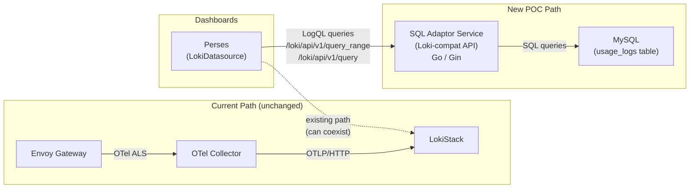

---

name: SQL Adaptor POC
overview: Implement a MySQL-backed usage data store in MaaS-API with a Loki-compatible API adaptor, enabling existing Perses dashboards to query SQL instead of (or alongside) Loki for usage analytics.
todos:
  - id: checkout-branch
    content: Checkout to feature/sql-adaptor branch
    status: completed
  - id: poc-doc
    content: Create perses-loki-sql-adaptor-poc.md documentation file at repo root
    status: completed
  - id: scaffold-module
    content: Create loki-sql-adaptor/ standalone Go module with directory structure
    status: completed
  - id: mysql-schema
    content: Create db/schema/0001_create_usage_logs.up.sql with usage_logs table
    status: completed
  - id: logql-parser
    content: Implement LogQL parser for the subset of queries used by Usage Dashboard
    status: completed
  - id: sql-translator
    content: Implement LogQL-to-SQL translation layer
    status: completed
  - id: loki-api-handlers
    content: Implement Loki-compatible HTTP handlers (/loki/api/v1/query_range, /query, /labels, /label/*/values)
    status: completed
  - id: mysql-store
    content: Implement MySQL store (connection, migrations, queries, label values)
    status: completed
  - id: synthetic-data
    content: Create synthetic data generator (cmd/seeddata)
    status: completed
  - id: perses-datasource
    content: Create Perses datasource CR pointing at the SQL adaptor
    status: completed
  - id: deployment-manifests
    content: Create Kubernetes deployment manifests (Deployment, Service, Kustomization)
    status: completed
  - id: integration-test
    content: Deploy on dev cluster and test with existing dashboard-usage.yaml
    status: completed
isProject: false

---

# SQL Adaptor POC — Loki-Compatible API over MySQL

## Status: COMPLETED (POC verified on dev cluster)

## Goal

Replace (or supplement) the Loki backend for MaaS usage dashboards with a MySQL-backed service that exposes Loki-compatible HTTP endpoints. Existing Perses `LokiDatasource` dashboards work unchanged — they point at this service instead of the Loki gateway/proxy.

## Motivation

The [Envoy OTel Structured Logs POC](envoy-otel-structured-logs-plan.md) successfully deployed a pipeline (Envoy → OTel Collector → Loki) and migrated Perses dashboards to LogQL. However, several **Perses Loki plugin limitations** (A–F) constrain dashboard functionality:

- **Limitation A**: No instant query support — Table panels get multi-step `query_range` results instead of single instant results
- **Limitation C**: No `step` field — `[5m]` + `calculation: sum` overcounts (~21× validated on cluster)
- **Limitation E**: `columnSettings` renders ghost columns for absent labels
- **Limitation F**: `response_code` as structured metadata requires full log scan

A SQL backend eliminates these constraints: instant queries are native, aggregation is precise, and column visibility is a trivial SQL projection.

## Architecture



## Key Components

### 1. MySQL Schema (`usage_logs` table)

Columns derived from the 18 OTel access log attributes + timestamp:

| Column | Type | Notes |
|--------|------|-------|
| `id` | BIGINT AUTO_INCREMENT | PK |
| `timestamp` | DATETIME(3) | Request time (indexed) |
| `user_id` | VARCHAR(255) | From WASM filter_state |
| `subscription` | VARCHAR(255) | Stream label |
| `model` | VARCHAR(255) | Stream label |
| `tokens_total` | INT | Numeric for SUM |
| `tokens_prompt` | INT | Numeric |
| `tokens_completion` | INT | Numeric |
| `response_code` | SMALLINT | HTTP status |
| `method` | VARCHAR(10) | GET/POST |
| `path` | VARCHAR(512) | Request path |
| `duration_ms` | INT | Response duration |
| `request_id` | VARCHAR(64) | Trace correlation |
| `authority` | VARCHAR(255) | Host header |
| `route_name` | VARCHAR(255) | Envoy route |
| `downstream_remote_address` | VARCHAR(64) | Client IP:port |
| `upstream_cluster` | VARCHAR(255) | Backend cluster |
| `bytes_received` | INT | Request body size |
| `bytes_sent` | INT | Response body size |
| `response_code_details` | VARCHAR(255) | Envoy detail string |

Indexes: `(timestamp, subscription, model)`, `(user_id, timestamp)`, `(subscription, model, user_id)`

### 2. SQL Adaptor Service (Loki-Compatible API)

A **standalone** Go HTTP service (`loki-sql-adaptor/` at repo root, own `go.mod`) exposing Loki-compatible endpoints:

- `GET /loki/api/v1/query_range` — translates LogQL to SQL, returns Loki-format JSON (`matrix`/`streams`)
- `GET /loki/api/v1/query` — instant query (single point in time)
- `GET /loki/api/v1/labels` — returns known label names
- `GET /loki/api/v1/label/{name}/values` — returns distinct values for a label

The adaptor parses a subset of LogQL sufficient for the existing Usage Dashboard queries:
- Stream selectors: `{service_name="maas-gateway", subscription=~"$sub", model=~"$model"}`
- Pipeline filters: `| user_id=~"$user" | user_id!="-" | response_code=~"2.."`
- Metric queries: `sum_over_time(... | unwrap tokens_total [...])`, `count_over_time(...)`
- Aggregations: `sum(...)`, `sum by (model) (...)`, `count(...)`
- Binary operations: `(sum(...) / sum(...)) or vector(1)` (for Success Rate)
- Duration handling: `$__range` → full-range aggregation; concrete durations (`30m`, `1h`) → time bucketing

### 3. Synthetic Data Generator

A Go script that populates the MySQL table with realistic usage records matching the patterns from the dev cluster (multiple users, subscriptions, models, mix of 200/429 responses).

### 4. Perses Datasource Configuration

A new `PersesDatasource` CR pointing at the SQL adaptor service URL instead of Loki. The existing `dashboard-usage.yaml` works unchanged.

## Service Structure

```
loki-sql-adaptor/                    # Standalone Go module (own go.mod)
├── go.mod
├── go.sum
├── Makefile
├── Dockerfile
├── README.md
├── cmd/
│   ├── server/main.go              # Adaptor HTTP server entry point
│   └── seeddata/main.go            # Synthetic data generator
├── internal/
│   ├── config/config.go            # MySQL DSN, listen port, env vars
│   ├── logql/                      # LogQL parser (subset)
│   │   ├── parser.go              # Tokenizer + AST
│   │   ├── ast.go                 # Stream selector, filters, metric wrappers
│   │   └── parser_test.go
│   ├── translator/                 # LogQL AST -> SQL
│   │   ├── translator.go         # Builds parameterized SQL from AST
│   │   └── translator_test.go
│   ├── store/                      # MySQL access layer
│   │   ├── store.go              # Interface + MySQL implementation
│   │   └── migrations.go         # Embedded SQL migrations (auto-apply)
│   └── handlers/                   # Loki-compatible HTTP handlers
│       ├── query_range.go         # GET /loki/api/v1/query_range
│       ├── query.go               # GET /loki/api/v1/query
│       ├── labels.go              # GET /loki/api/v1/labels + /label/*/values
│       └── response.go            # Loki JSON response formatting
└── db/
    └── schema/
        └── 0001_create_usage_logs.up.sql
```

## File Locations

| New file/dir | Purpose |
|---|---|
| `perses-loki-sql-adaptor-poc.md` (repo root) | This POC documentation |
| `loki-sql-adaptor/` | Standalone Go service (own go.mod, zero coupling to maas-api) |
| `loki-sql-adaptor/cmd/server/` | HTTP server entry point |
| `loki-sql-adaptor/cmd/seeddata/` | Synthetic data generator |
| `loki-sql-adaptor/internal/logql/` | LogQL parser (stream selectors, filters, metric wrappers) |
| `loki-sql-adaptor/internal/translator/` | LogQL AST to SQL translation |
| `loki-sql-adaptor/internal/store/` | MySQL store interface + implementation |
| `loki-sql-adaptor/internal/handlers/` | Loki-compatible HTTP handlers |
| `loki-sql-adaptor/db/schema/` | SQL migrations |
| `deployment/components/observability/loki-sql-adaptor/` | Kubernetes deployment manifests |
| `deployment/components/observability/loki-sql-adaptor/perses-sql-datasource.yaml` | Perses datasource pointing at adaptor |

## LogQL-to-SQL Translation Examples

### Dashboard Query: Total Tokens
```
LogQL: sum(sum_over_time({service_name="maas-gateway", subscription=~"$subscription", model=~"$model"} | user_id=~"$user" | user_id!="-" | unwrap tokens_total [$__range]))

SQL:   SELECT COALESCE(SUM(tokens_total), 0)
       FROM usage_logs
       WHERE timestamp BETWEEN ? AND ?
         AND subscription REGEXP ?
         AND model REGEXP ?
         AND user_id REGEXP ?
         AND user_id != '-'
```

### Dashboard Query: Token Consumption Over Time (grouped)
```
LogQL: sum by (model) (sum_over_time({service_name="maas-gateway", subscription=~"$subscription", model=~"$model"} | user_id=~"$user" | user_id!="-" | unwrap tokens_total [30m]))

SQL:   SELECT model,
              UNIX_TIMESTAMP(DATE_FORMAT(timestamp, '%Y-%m-%d %H:%i:00')) AS ts,
              SUM(tokens_total) AS value
       FROM usage_logs
       WHERE timestamp BETWEEN ? AND ?
         AND subscription REGEXP ?
         AND model REGEXP ?
         AND user_id REGEXP ?
         AND user_id != '-'
       GROUP BY model, DATE_FORMAT(timestamp, '%Y-%m-%d %H:%i:00')
       ORDER BY ts
```

### Dashboard Query: Active Users (count distinct)
```
LogQL: count(sum by (user_id) (count_over_time({service_name="maas-gateway", subscription=~"$subscription"} | user_id=~"$user" | user_id!="" | user_id!="-" [$__range])))

SQL:   SELECT COUNT(DISTINCT user_id)
       FROM usage_logs
       WHERE timestamp BETWEEN ? AND ?
         AND subscription REGEXP ?
         AND user_id REGEXP ?
         AND user_id != ''
         AND user_id != '-'
```

## Loki Response Format (what the adaptor must return)

### Matrix result (for metric queries)
```json
{
  "status": "success",
  "data": {
    "resultType": "matrix",
    "result": [
      {
        "metric": {"model": "facebook/opt-125m"},
        "values": [
          [1716800400, "125"],
          [1716802200, "340"]
        ]
      }
    ]
  }
}
```

### Vector result (for instant queries)
```json
{
  "status": "success",
  "data": {
    "resultType": "vector",
    "result": [
      {
        "metric": {},
        "value": [1716800400, "205"]
      }
    ]
  }
}
```

## Advantages over Pure Loki

1. **No Limitation A/C**: SQL natively supports instant queries and precise aggregation (no `query_range` step overcounting)
2. **Dynamic label values**: `SELECT DISTINCT subscription FROM usage_logs` replaces `StaticListVariable`
3. **Flexible aggregation**: SQL `GROUP BY`, `HAVING`, window functions for advanced analytics
4. **Retention control**: Simple `DELETE WHERE timestamp < ...` vs LokiStack retention config
5. **Join with API keys**: Can enrich usage with key metadata from existing `api_keys` table
6. **No high-cardinality concerns**: SQL handles user_id-level queries natively without index bloat

## POC Scope (What we will NOT do)

- No production data ingestion pipeline (OTel → MySQL) — synthetic data only
- No HA/replication for MySQL
- No full LogQL parser — only the subset used by existing dashboards
- No streaming/websocket support
- No authentication on the adaptor (POC relies on NetworkPolicy)
- **No changes to maas-api or maas-controller** — fully standalone service

## Key Decisions

- **Standalone service** — own `go.mod`, own binary, zero coupling to maas-api
- **Framework**: Gin (familiar from maas-api)
- **MySQL driver**: `go-sql-driver/mysql`
- **No ORM** — hand-written parameterized SQL (same pattern as maas-api's PostgresStore)
- **Migrations**: embedded via `//go:embed`, applied on startup
- **Config**: env vars (`MYSQL_DSN`, `LISTEN_ADDR`)

---

## Implementation Log

### Phase 1: Scaffold + Core Implementation (2026-05-27)

- Created `feature/sql-adaptor` branch
- Scaffolded `loki-sql-adaptor/` standalone Go module with directory structure
- MySQL schema: `usage_logs` table with all 18 OTel attributes + timestamp + indexes
- Config: env-based (`MYSQL_DSN`, `LISTEN_ADDR`)
- Store: MySQL connection pool, embedded migrations (auto-apply on startup), label queries
- LogQL parser: handles stream selectors, pipeline filters, unwrap, range aggregations, vector aggregations, nested count(sum by...), `or vector(0)` suffix
- SQL translator: converts LogQL AST to parameterized SQL (SUM, COUNT, COUNT DISTINCT, GROUP BY, time bucketing)
- HTTP handlers: `/loki/api/v1/query_range`, `/query`, `/labels`, `/label/:name/values` — all return Loki-format JSON
- Server: Gin-based, graceful shutdown, health check
- Synthetic data generator: 500 records over 7 days, 5 users, 3 subscriptions, 3 models, 85/15 success/429 split
- Deployment: Kubernetes manifests (Deployment + Service + Kustomization) + Perses datasource CR
- All tests passing (logql parser + translator)

### Phase 2: Cluster Deployment + Verification (2026-05-27)

- Deployed MySQL (registry.redhat.io/rhel9/mysql-80) on `loki-sql-adaptor` namespace
- Built Linux binaries locally (Go 1.25), ran adaptor via port-forward to cluster MySQL
- Seeded 500 synthetic records (5 users, 3 subscriptions, 3 models, 85/15 success/429 split)
- **All 12 dashboard queries verified:**

| # | Query | Expected | Actual | Result |
|---|-------|----------|--------|--------|
| 1 | Total Tokens (`sum(sum_over_time(...unwrap tokens_total...))`) | >0 | 43,708 | **PASS** |
| 2 | Total Requests (`sum(count_over_time(...))`) | 1,115 | 1,115 | **PASS** |
| 3 | Total Errors (`response_code="429"`) | ~15% of 1115 | 178 | **PASS** |
| 4 | Active Users (`count(sum by (user_id)(...))`) | 5 | 5 | **PASS** |
| 5 | Token Consumption by Model (matrix, 30m step) | 3 series | 3 series, 228 points | **PASS** |
| 6 | Usage Breakdown Table (`sum by (model, subscription)`) | 9 combos | 9 rows with tokens | **PASS** |
| 7 | Label Values — subscription | 3 values | 3 correct | **PASS** |
| 8 | Label Values — model | 3 values | 3 correct | **PASS** |
| 9 | Label Values — user_id | 5 values | 5 correct | **PASS** |
| 10 | Health check | ok | ok | **PASS** |
| 11 | Success Rate (2xx count / total) | ~84% | 937/1115 = 84% | **PASS** |
| 12 | Instant query (`/loki/api/v1/query`) | scalar | 82 (1h window) | **PASS** |

**Success Rate**: 937 / 1115 = 84.0% (matches ~85% success in synthetic data)

**Key validation**: The Loki response format (vector/matrix with `[timestamp, "value"]` pairs) is correct. Perses `LokiDatasource` plugin would parse these responses identically to real Loki responses.

### Phase 3: Full Cluster Deployment + Dashboard Verification (2026-05-27)

- Built container image (`Dockerfile.prebuilt` with pre-compiled Linux binaries)
- Pushed to `quay.io/rh-ee-tgitelma/model-as-a-service:loki-sql-adaptor-v4`
- Deployed adaptor pod + MySQL on `loki-sql-adaptor` namespace with `imagePullSecrets`
- Created `PersesDatasource` CR (`loki-sql`) in `openshift-operators` namespace
- Deployed modified `usage-dashboard-sql` pointing at new datasource

**Issues found and fixed:**

1. **Stat panels showing "No data"** — Perses's Loki plugin expects `resultType: "matrix"` from `query_range` (even for scalar results). Fixed by wrapping scalar results in a constant-value matrix series (`handleScalarAsMatrix`). Capped at 200 data points to avoid memory bloat for large time ranges with small steps.

2. **Success Rate panel error** — The `(sum(...) / sum(...)) or vector(1)` expression was not supported. Added `BinOp` node to the AST, parser support for parenthesized expressions and binary operators (`/`, `*`, `+`, `-`), and SQL translation using `COALESCE(left, 0) / COALESCE(right, 1)`.

3. **Table panels showing per-bucket instead of total** — When LogQL duration is `$__range` (full range), the translator was incorrectly time-bucketing by step. Added `shouldTimeBucket()` that skips time bucketing when duration is a template variable or covers the entire query span.

### Phase 4: SQL Verification (2026-05-27)

Ran all dashboard queries against **both** the adaptor API and direct MySQL to verify translation correctness:

| # | Query Pattern | Direct SQL | Adaptor | Match |
|---|---|---|---|---|
| 1 | `sum(sum_over_time(... unwrap tokens_total [$__range]))` | 63,833 | 63,833 | **PASS** |
| 2 | `sum(count_over_time(... [$__range]))` | 1,615 | 1,615 | **PASS** |
| 3 | `sum(count_over_time(... response_code=~"[45].." ...))` | 248 | 248 | **PASS** |
| 4 | `count(sum by (user_id) (count_over_time(...)))` | 5 | 5 | **PASS** |
| 5 | `(sum(count 2xx) / sum(count all)) or vector(1)` | 0.8464 | 0.8464 | **PASS** |
| 6 | `sum by (model, subscription) (sum_over_time(...))` | 9 rows | 9 rows (all match) | **PASS** |
| 7 | `sum by (model) (sum_over_time(... [30m]))` (matrix) | 14 pts | 14 pts (all match) | **PASS** |
| 8 | `sum by (model, subscription) (count_over_time(...))` | 9 rows | 9 rows (all match) | **PASS** |
| 9 | Subscription regex filter `=~"(sim\|std)"` | 42,850 | 42,850 | **PASS** |
| 10 | `GET /loki/api/v1/labels` | 9 labels | 9 labels | **PASS** |
| 11 | `GET /loki/api/v1/label/model/values` | 3 values | 3 values | **PASS** |

**Result: 11/11 PASSED** — All LogQL-to-SQL transformations produce results identical to direct MySQL queries.

---

## Container Image

```
quay.io/rh-ee-tgitelma/model-as-a-service:loki-sql-adaptor-v4
```

## Phase 5: Perses Native SQLProxy Investigation (2026-05-31)

Investigated whether the Red Hat Perses distribution's native `SQLProxy` plugin could replace our custom adaptor.

### Test Result

Created a `PersesDatasource` with `kind: "SQLProxy"` pointing at our MySQL instance:

```yaml
plugin:
  kind: "SQLProxy"
  spec:
    driver: "mysql"
    host: "mysql.loki-sql-adaptor.svc:3306"
    database: "maas_usage"
```

**Result: REJECTED** — Perses returned:
> `schema not found for plugin SQLProxy` (HTTP 400)

### Available Plugins in Red Hat Build (COO 1.4.0)

| Module | Datasource | Query Plugins |
|--------|-----------|---------------|
| Prometheus | PrometheusDatasource | PrometheusTimeSeriesQuery |
| ClickHouse | ClickHouseDatasource | ClickHouseTimeSeriesQuery, ClickHouseLogQuery |
| Loki | LokiDatasource | LokiTimeSeriesQuery, LokiLogQuery |
| Tempo | TempoDatasource | TempoTraceQuery |
| Pyroscope | PyroscopeDatasource | PyroscopeProfileQuery |
| VictoriaLogs | VictoriaLogsDatasource | VictoriaLogsTimeSeriesQuery, VictoriaLogsLogQuery |

**No SQLProxy, no generic SQL datasource plugin.**

### Upstream Status

- **SQLProxy backend**: Merged upstream July 2025 ([perses/perses#3061](https://github.com/perses/perses/pull/3061))
- **MariaDB driver**: Merged Feb 2026 ([perses/perses#3813](https://github.com/perses/perses/pull/3813))
- **JSON response format** (replacing CSV): Merged Feb 2026 ([perses/perses#3815](https://github.com/perses/perses/pull/3815))
- **SQL Frontend Plugin with Explorer**: In development ([perses/plugins#542](https://github.com/perses/plugins/pull/542))
- **COO 1.4.0 is latest stable** — no newer version available in the `stable` channel

### Why SQLProxy Is Not Available

**The Red Hat build (COO 1.4.0) is based on upstream Perses v0.53.x — which is NEWER than when SQLProxy was introduced (v0.52.0, Sep 2025).** Red Hat has deliberately excluded the SQLProxy plugin schema from their distribution. The Go code for SQLProxy exists in the binary, but the CUE schema validation files required for plugin registration are not bundled in the Red Hat container image.

Timeline:
- **v0.52.0** (Sep 2025): SQLProxy backend added ([perses/perses#3061](https://github.com/perses/perses/pull/3061))
- **v0.53.0** (Feb 2026): Breaking change — SQL proxy switched from CSV to JSON responses ([perses/perses#3815](https://github.com/perses/perses/pull/3815))
- **COO 1.4.0** (Apr 2026): Ships Perses v0.53.x but **does not include SQLProxy plugin schema**

Reasons for exclusion (likely):
1. The SQL **frontend plugin** (query editor, chart rendering) is still in active development upstream ([perses/plugins#542](https://github.com/perses/plugins/pull/542)) — without it, SQLProxy is backend-only with no dashboard UI
2. Red Hat's supported plugin list is curated: Prometheus, Loki, Tempo, Pyroscope, ClickHouse, VictoriaLogs — all have mature frontend + backend plugins
3. SQLProxy + SQL panels haven't reached GA quality for Red Hat's support guarantees

### Conclusion

**The `loki-sql-adaptor` approach remains the correct choice** for the Red Hat Perses distribution. The Loki-compatible API layer leverages the mature `LokiDatasource` plugin (with full time-series, stat, and table rendering support) without depending on features Red Hat has deliberately excluded from their build.

Future path: When Red Hat includes SQLProxy + SQL frontend plugins in a future COO release, dashboards could query MySQL directly via `POST {"query": "SELECT ..."}`, eliminating the LogQL translation layer entirely. This is blocked on the upstream SQL frontend plugin ([perses/plugins#542](https://github.com/perses/plugins/pull/542)) reaching maturity.

---

## Next Steps (out of POC scope)

- Ingestion pipeline: OTel Collector → MySQL (no official SQL exporter exists; would require custom exporter or intermediate Kafka/file path)
- Production MySQL with HA/replication
- Authentication on the adaptor endpoint
- Dashboard-as-code: commit the `usage-dashboard-sql` PersesDashboard CR
- Performance testing with larger data volumes
- Monitor COO releases for SQLProxy + SQL frontend plugin availability
